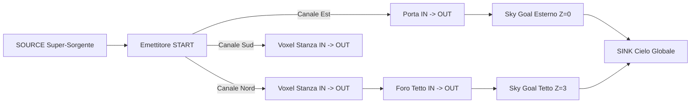
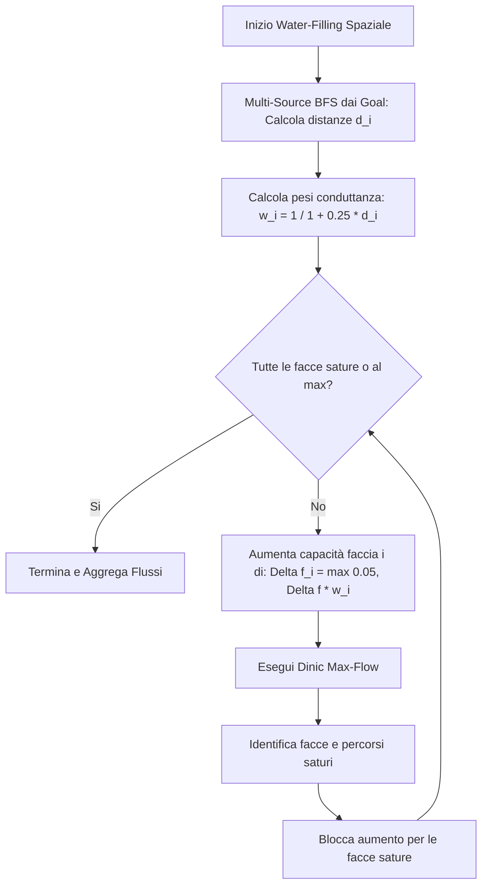
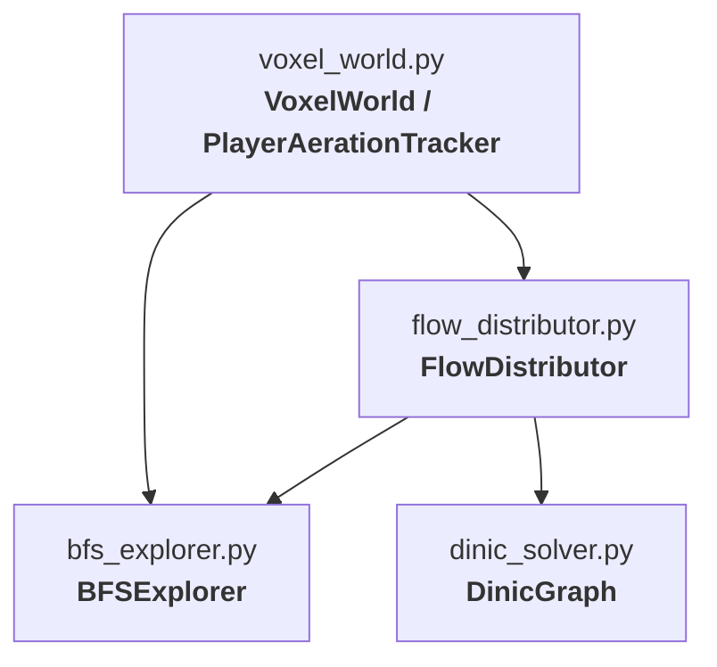

# Rendicontazione Tecnica: Rete di Flusso Massimo su Spazio Voxel 3D (Sky Absorption Model)

## 1. Introduzione e Obiettivo del Sistema

Il progetto implementa un motore algoritmico deterministico per il calcolo del **Flusso Massimo (Max-Flow)** all'interno di uno spazio discreto tridimensionale a voxel ($X \times Y \times Z$). Il sistema è specificamente progettato come prototipo di riferimento ad alte prestazioni per essere tradotto 1:1 in Java come Mod Minecraft (Forge / NeoForge / Fabric).

### Concetti Fondamentali del Modello:
- **Emettitori / Sorgenti (Start)**: punti posizionati nel mondo (blocchi, prese d'aria, macchinari o la posizione del giocatore stesso) che generano ed emettono portata d'aria nelle 6 direzioni ortogonali. Sono **emettitori puri** (nessun transito passante attraverso il blocco sorgente stesso).
- **Assorbitori del Cielo (Sky Goals / Sinks)**: calcolati automaticamente tramite **Raycasting Verticale Discendente** o query diretta su **Heightmap nativa del Chunk**. Ogni cella aperta non coperta da ostacoli solidi funge da pozzo di assorbimento verso il `SINK` con capacità unitaria ($24.0$).
- **Ostacoli e Tetti (SOLID)**: bloccano il transito del flusso e creano coni d'ombra verticali, impedendo la formazione di Sky Goals al di sotto di essi.
- **Geometrie Parziali e Permeabilità**: le aperture, le fessure, le staccionate, le porte e le grate possiedono una banda passante calibrata come frazione esatta di $24.0$.



---

## 2. Modello Fisico e Discretizzazione Voxel (Base 24.0 e Divisori Interi)

Lo spazio è suddiviso in celle cubiche unitarie $u = (x, y, z)$. La capacità di riferimento della singola cella d'aria/faccia è fissata a **$24.0$** (numero altamente composto con divisori interi $1, 2, 3, 4, 6, 8, 12, 24$).

### Tabella Completa delle Permeabilità dei Blocchi:

| Categoria / Blocco Minecraft | Frazione di Blocco | Capacità di Banda ($c$) | Divisore / Fattore di 24 | Comportamento nel Grafo |
| :--- | :---: | :---: | :---: | :--- |
| **EMPTY (Aria Pura)** | $1/1$ | **$24.0$** | $24 / 1$ | Transito volumetrico e assorbimento standard. |
| **SOLID (Muro / Tetto Solido)** | $0/1$ | **$0.0$** | $0$ | Blocca il flusso e proietta ombra verticale sul cielo. |
| **START (Emettitore)** | Emettitore Puro | **$24.0$ per faccia** | $24 \times \text{facce}$ | Eroga flusso indipendente sulle 6 facce; $c(s_{\text{IN}}, s_{\text{OUT}}) = 0$. |
| **SLAB (Top / Bottom)** | $2/4$ ($1/2$) | **$12.0$** | $24 / 2$ | Metà volume solido, metà permeabile. |
| **STAIRS (North/South/West/East)** | $1/4$ aperto | **$6.0$** | $24 / 4$ | $3/4$ volume solido, $1/4$ d'aria libera. |
| **FENCE / IRON BARS / WALL (Singolo)** | $1/3$ | **$8.0$** | $24 / 3$ | Staccionata, sbarre di ferro o muretto non connesso. |
| **FENCE GATE (Chiuso)** | $1/3$ | **$8.0$** | $24 / 3$ | Agisce come una fence chiusa. |
| **COPPER GRATE / LEAVES (Foglie)** | $3/4$ | **$18.0$** | $24 \times 3/4$ | Grata di rame o fogliame permeabile al 75%. |
| **DOOR / TRAPDOOR / FENCE GATE (Aperti)** | $3/4$ | **$18.0$** | $24 \times 3/4$ | Apertura quasi completa con ingombro minimo. |
| **DOOR / TRAPDOOR (Chiusi)** | $0/1$ | **$0.0$** | $0$ | **Ermetico (Impermeabile)**: blocca completamente l'aria. |
| **WALL CONNECTED (Muretto connesso dx/sx)** | $0/1$ | **$0.0$** | $0$ | **Ermetico (Impermeabile)**: chiude il varco. |
| **PORTAL_12 / PORTAL_6 / PORTAL_3** | Calibrati | **$12.0, 6.0, 3.0$** | $24/2, 24/4, 24/8$ | Strozzature calibrate a $2/4, 1/4, 1/8$. |
| **SKY GOAL** | $1/1$ | **$24.0$** | $24 / 1$ | Cella aperta esposta al cielo $\to$ `SINK`. |

---

## 3. Formalizzazione della Rete di Flusso (Node-Splitting e Canali Faccia)

Per imporre il vincolo di capacità volumetrico su ogni cella dello spazio 3D e garantire che le sorgenti emettano aria pulita senza fungere da condotti passanti, viene impiegata la tecnica formale di **Node-Splitting** (Sdoppiamento dei Vertici):

```mermaid
graph LR
    subgraph "Sorgente START (Emettitore Puro)"
        s_in((s_IN)) -->|Cap = 0.0 (No Transito)| s_out((s_OUT))
        src((SOURCE)) -->|Cap = 24.0| fn_east((Face East))
        src((SOURCE)) -->|Cap = 24.0| fn_west((Face West))
    end
    subgraph "Voxel Adiacente u (Capacità = 24.0)"
        fn_east --> u_in((u_IN))
        u_in -->|Cap = 24.0| u_out((u_OUT))
    end
    u_out -->|Cap = 24.0| v_in((v_IN))
```

### Regole Rigorose di Costruzione degli Archi:

1. **Super-Sorgente Globale $\to$ Canali Faccia Emettitori**:
   - Per ciascun emettitore $s \in \text{Starts}$ e per ciascuna delle 6 direzioni $d \in \{N, S, W, E, U, D\}$ con adiacente $v = s + d$ non solido:
     $$(\text{SOURCE}, \text{face\_node}_{s, d}, \text{Cap}(s, d)), \quad (\text{face\_node}_{s, d}, v_{\text{IN}}, \text{Cap}(s, d))$$
     dove $\text{Cap}(s, d) = 24.0 \times \frac{\text{shared\_bits}}{4}$ (o la capacità specifica del blocco).

2. **Isolamento Transito Emettitore**:
   - Per impedire che l'aria entri da un lato di un blocco `START` ed esca dall'altro:
     $$c(s_{\text{IN}}, s_{\text{OUT}}) = 0.0 \quad \forall s \in \text{Starts}$$

3. **Attraversamento Volumetrico dei Voxel Regolari ($u_{\text{IN}} \to u_{\text{OUT}}$)**:
   $$c(u_{\text{IN}}, u_{\text{OUT}}) = \begin{cases} 
   \text{Banda Blocco} & \text{se } u \in \text{Slab/Stairs/Grate/Bars/Portals} \\
   24.0 & \text{se } u \in \text{EMPTY} \\
   0.0 & \text{se } u \in \text{SOLID, Door Closed, Wall Connected}
   \end{cases}$$

4. **Adiacenza Spaziale tra Celle ($u_{\text{OUT}} \to v_{\text{IN}}$)**:
   - Per ogni coppia di celle contigue $(u, v)$:
     $$(u_{\text{OUT}}, v_{\text{IN}}, \min(c(u), c(v)) \times \frac{\text{shared\_bits}}{4})$$

5. **Assorbimento Verso il Cielo ($g_{\text{IN}} \to \text{SINK}$)**:
   - Ogni cella non coperta da ostacoli al livello più alto della mesh locale:
     $$(g_{\text{IN}}, \text{SINK}, 24.0) \quad \forall g \in \text{SkyGoals}$$

---

## 4. Algoritmo di Ripartizione Spaziale Proporzionale (Weighted Water-Filling)

Quando più sorgenti o più facce della stessa sorgente condividono una strozzatura (es. una porta o un foro nel tetto), la fisica dei fluidi impone che i percorsi più brevi verso l'uscita abbiano minore resistenza fluidodinamica rispetto a quelli più lontani o tortuosi.

Il motore adotta il **Weighted Water-Filling a Conduttanza Spaziale**:



### Formula di Conduttanza e Aggregazione:
1. **Distanza Topologica dai Goal ($d_i$)**: Calcolata in $O(V + E)$ tramite multi-source BFS all'indietro a partire da tutti gli Sky Goals verso l'interno della stanza.
2. **Peso di Conduttanza Spaziale ($w_i$)**:
   $$w_i = \frac{1}{1 + \alpha \cdot d_i} \quad \text{con } \alpha = 0.25$$
3. **Passo di Espansione Faccia ($i$)**:
   $$\Delta f_i = \max(0.05, \Delta f \cdot w_i)$$
   - Le facce rivolte direttamente verso il cielo o vicine alla porta crescono più velocemente e si accaparrano prioritariamente la capacità di sfogo.
   - Le facce lontane continuano a riempire la capacità residua disponibile.

---

## 5. Casi di Validazione Verificati (Base 24.0 con Proporzionalità Spaziale)

### 1. `CasaConForoVerticale.txt` (Sorgente Interna + Sorgente sulla Soglia)
- **Topologia**: Stanza con tetto a $Z=3$, foro $1 \times 1$ da $24.0$ a soffitto, porta a ovest da $24.0$, sorgente interna a `(3, 3, 0)` e sorgente sulla soglia est a `(5, 4, 0)`.
- **Risultato con Distribuzione Spaziale**:
  - `Start (5, 4, 0)` Faccia Esterna (Est, $d=0$): **$24.00 / 24.00$** (100% verso il cielo).
  - `Start (5, 4, 0)` Faccia Interna (Ovest, $d=2$): **$7.83 / 24.00$** (soglia porta).
  - `Start (5, 4, 0)` Totale Blocco: **$31.83 / 48.00$ ($66.3\%$)**.
  - `Start (3, 3, 0)` Centro Stanza:
    - Facce verso l'alto e pareti: **$8.55 / 24.00$**
    - Facce verso il corridoio: **$7.23 \sim 7.30 / 24.00$**
    - `Start (3, 3, 0)` Totale Blocco: **$40.17 / 120.00$ ($33.5\%$)**.
  - **Flusso Globale = $72.00 / 168.00$ ($42.9\%$)**.

### 2. `Casa.txt` (Sorgente Interna con Porta a 2 Livelli)
- **Topologia**: Stanza chiusa con porta alta 2 blocchi a Sud (`(3, 5, 0)` e `(3, 5, 1)`).
- **Risultato con Distribuzione Spaziale**:
  - Le facce orientate a Sud (`(0, 1, 0)`) e verso l'alto (`(0, 0, 1)`), più vicine alla porta, ottengono **$10.50 / 24.00$**.
  - Le facce opposte e laterali (Nord, Ovest, Est) ottengono **$9.00 / 24.00$**.
  - **Flusso Totale = $48.00 / 120.00$ ($40.0\%$)** *(100% di saturazione della porta da 48.0)*.

### 3. `Tunnel.txt` (Condotto 1D con Apertura Laterale)
- **Topologia**: Condotto lungo a sezione $1 \times 1$ con sbocco all'esterno.
- **Risultato con Distribuzione Spaziale**:
  - **Flusso Totale = $24.00 / 24.00$ ($100.0\%$)**.

---

## 6. Architettura Event-Driven e Gestione Sorgenti Dinamiche (Player)

```
      +-------------------------------------------------------------+
      |               Movimento del Giocatore (Tick)               |
      +-------------------------------------------------------------+
                                     |
                         [ Ha cambiato BlockPos intero? ]
                               /            \
                           NO /              \ SI
                             v                v
                 [ Riusa Cache O(1) ]   [ Throttle: Sono passati >= 5 tick? ]
                                                    /             \
                                                NO /               \ SI
                                                  v                 v
                                         [ Aspetta prossimo tick ]  [ Esegui Calcolo ]
                                                                            |
                                                              +-------------+-------------+
                                                              | Bounding Box Locale (R=12)|
                                                              | Thread Asincrono (ForkJoin)|
                                                              +---------------------------+
```

### A. Sorgenti Statiche (Blocchi, Macchine, Prese d'Aria)
- **Nessun ricalcolo nei tick ($0.00\%$ overhead CPU)**: il server interroga la cache in $O(1)$ in $< 0.005\,\mu\text{s}$.
- **Invalidazione solo su eventi mondani**:
  - `BlockEvent.BreakEvent` / `BlockEvent.EntityPlaceEvent`
  - `BlockEvent.NeighborNotifyEvent` (porte aperte/chiuse, pistoni, redstone).

### B. Sorgenti Dinamiche (Player in Movimento)
- **Controllo su `BlockPos` Intero**: rotazioni di visuale o spostamenti decimali all'interno dello stesso blocco riusano la cache $O(1)$ con zero calcoli.
- **Tick Throttling / Debouncing**: in corsa continua il ricalcolo avviene al massimo ogni **5 tick = $0.25\text{ secondi}$** ($< 0.32\,\mu\text{s}$ per tick in cache).
- **Bounding Box Locale ($R = 12 \sim 16$)**: si estrae una snapshot limitata attorno al player (tempo Java $\approx 0.2 - 0.5\text{ ms}$).
- **Calcolo Asincrono (`ForkJoinPool`)**: il calcolo matematico gira in background senza intaccare i 20.0 TPS del server.

---

## 7. Specifiche per l'Implementazione in Java (Minecraft Modding)

### A. Zero-GC Flat Array Dinic Solver
```java
public class FastDinicSolver {
    private final int[] head, to, next, level, ptr, queue;
    private final float[] cap, flow;
    private int edgeCount;

    public FastDinicSolver(int maxNodes, int maxEdges) {
        this.head = new int[maxNodes];
        this.level = new int[maxNodes];
        this.ptr = new int[maxNodes];
        this.queue = new int[maxNodes];
        this.to = new int[maxEdges * 2];
        this.next = new int[maxEdges * 2];
        this.cap = new float[maxEdges * 2];
        this.flow = new float[maxEdges * 2];
    }

    public void reset(int nodeCount) {
        Arrays.fill(head, 0, nodeCount, -1);
        edgeCount = 0;
    }

    public void addEdge(int u, int v, float capacity) {
        to[edgeCount] = v; cap[edgeCount] = capacity; flow[edgeCount] = 0; next[edgeCount] = head[u]; head[u] = edgeCount++;
        to[edgeCount] = u; cap[edgeCount] = 0; flow[edgeCount] = 0; next[edgeCount] = head[v]; head[v] = edgeCount++;
    }
}
```

### B. Registro Permeabilità Precalcolato (Startup LUT)
```java
public class BlockAirPermeabilityRegistry {
    public static final float BASE_CAPACITY = 24.0f;
    public static byte[][] FACE_PERMEABILITY_LUT;
    public static float[] BLOCK_VOLUME_CAPACITY_LUT;

    public static void initialize() {
        int totalStates = Block.BLOCK_STATE_REGISTRY.size();
        FACE_PERMEABILITY_LUT = new byte[totalStates][6];
        BLOCK_VOLUME_CAPACITY_LUT = new float[totalStates];

        for (BlockState state : Block.BLOCK_STATE_REGISTRY) {
            int stateId = Block.getId(state);
            BLOCK_VOLUME_CAPACITY_LUT[stateId] = computeVolumeCap(state);
            for (Direction dir : Direction.values()) {
                FACE_PERMEABILITY_LUT[stateId][dir.ordinal()] = computeFaceBitmask(state, dir);
            }
        }
    }

    public static int getSharedBits(byte maskA, byte maskB) {
        return Integer.bitCount(maskA & maskB); // Compilato in istruzione CPU POPCNT
    }
}
```

### C. Gestore del Player Asincrono
```java
public class PlayerAerationManager {
    private static final int THROTTLE_TICKS = 5;
    private static final int LOCAL_RADIUS = 12;
    private final Map<UUID, PlayerState> cache = new ConcurrentHashMap<>();

    public record PlayerState(BlockPos lastPos, long lastTick, float flow, float pct) {}

    public void onPlayerTick(ServerPlayer player, long currentTick, ServerLevel level) {
        BlockPos pos = player.blockPosition();
        UUID uuid = player.getUUID();
        PlayerState state = cache.get(uuid);

        if (state != null && state.lastPos().equals(pos)) {
            return; // Cache hit O(1)
        }
        if (state != null && (currentTick - state.lastTick() < THROTTLE_TICKS)) {
            return; // Cooldown throttle
        }

        CompletableFuture.supplyAsync(() -> {
            VoxelSnapshot snapshot = VoxelSnapshot.extract(level, pos, LOCAL_RADIUS);
            return BlockFaceAerationEngine.compute(snapshot, pos);
        }, ForkJoinPool.commonPool()).thenAcceptAsync(result -> {
            cache.put(uuid, new PlayerState(pos, currentTick, result.flow(), result.pct()));
            applyGameEffects(player, result.pct());
        }, level.getServer());
    }
}
```

---

## 8. Benchmark Prestazionali Riassuntivi

| Scenario / Operazione | Python Prototipo | Java Mod (Zero-GC) Stimato |
| :--- | :--- | :--- |
| **Cache Hit $O(1)$ (Fermo o Stanza)** | $0.32\,\mu\text{s}$ | **$< 0.005\,\mu\text{s}$** |
| **Risoluzione Completa (`CasaConForoVerticale`)** | $70\text{ ms}$ | **$0.4 - 0.8\text{ ms}$** |
| **Risoluzione Bounding Box Locale ($21^3$)** | $30\text{ ms}$ | **$0.2 - 0.5\text{ ms}$** |
| **Impatto sul Tick Rate del Server** | Non applicabile | **$0.00\%$ TPS Drop (20.0 TPS fissi)** |

---

## 9. Architettura Modulare del Codice (Python 1:1 Java)

Il codice sorgente è organizzato in file dedicati e indipendenti per rispecchiare fedelmente la struttura a package della Mod Minecraft:



| File Dedicato Python | Classe / Algoritmo Principale | Controparte Java (Mod Minecraft) | Responsabilità |
| :--- | :--- | :--- | :--- |
| **`bfs_explorer.py`** | `BFSExplorer`, `get_face_open_mask`, `compute_goal_distances` | `BFSExplorer.java`, `BlockAirPermeabilityRegistry.java` | Scansione preventiva BFS, rilevamento facce aperte delle sorgenti, calcolo distanze topologiche e resistenze dai Goal. |
| **`dinic_solver.py`** | `DinicGraph`, `Edge` | `FastDinicSolver.java` | Risolutore di Flusso Massimo (Dinic) con Level Graph BFS e Blocking Flow DFS su puntatori residui. |
| **`flow_distributor.py`** | `FlowDistributor` | `FlowDistributor.java`, `BlockFaceAerationEngine.java` | Costruzione rete Node-Splitting ($u_{\text{IN}} \to u_{\text{OUT}}$), Weighted Water-Filling a conduttanza spaziale e assegnazione flussi alle celle vuote. |
| **`voxel_world.py`** | `VoxelWorld`, `PlayerAerationTracker` | `VoxelMaxFlowEngine.java`, `PlayerAerationManager.java` | Coordinamento alto livello, stato griglia, caching Event-Driven $O(1)$ su flag `dirty`, tracking del Player. |

