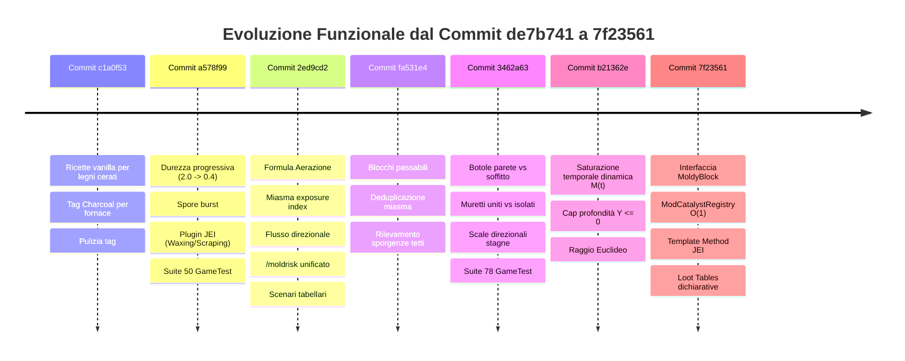
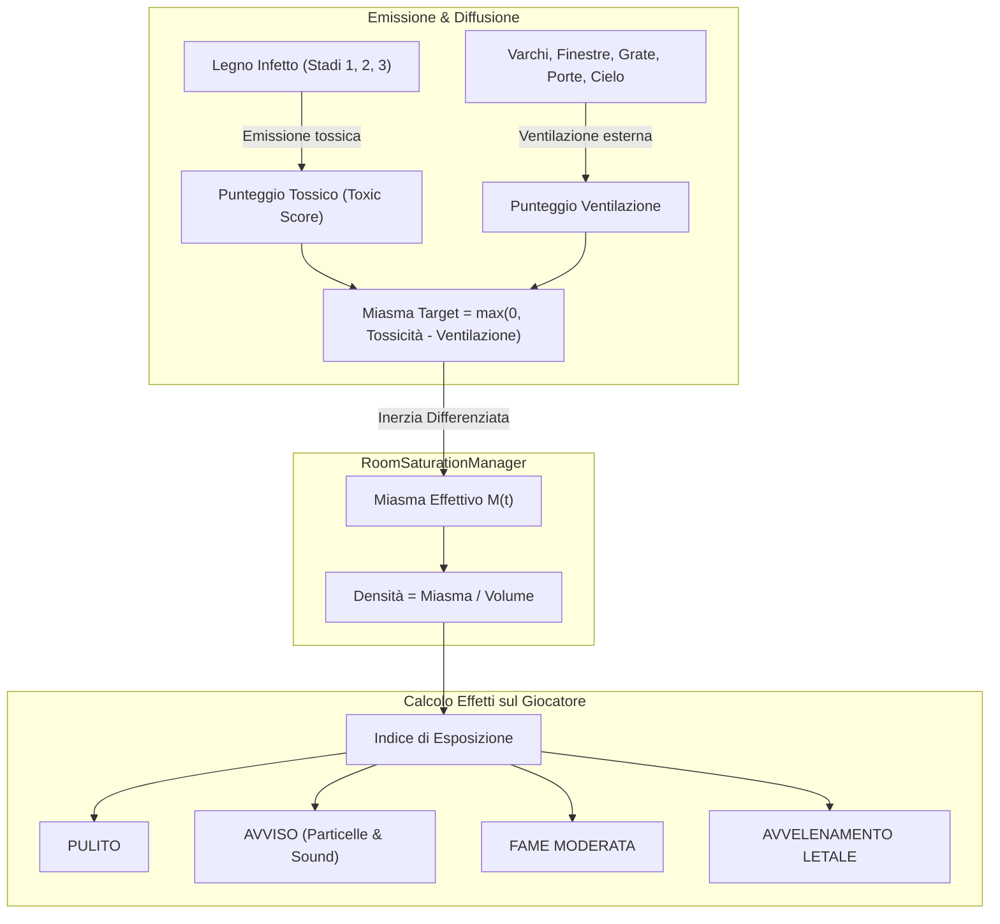
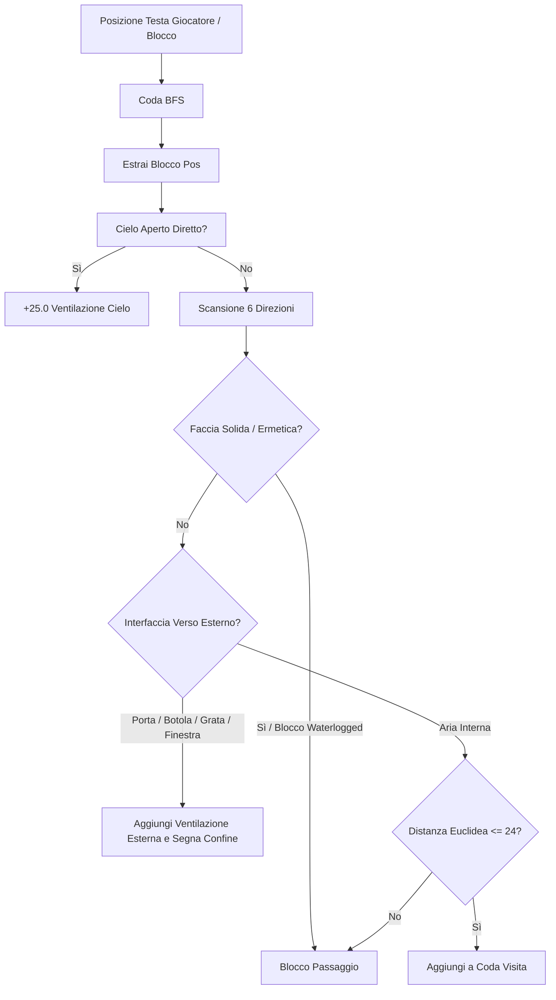
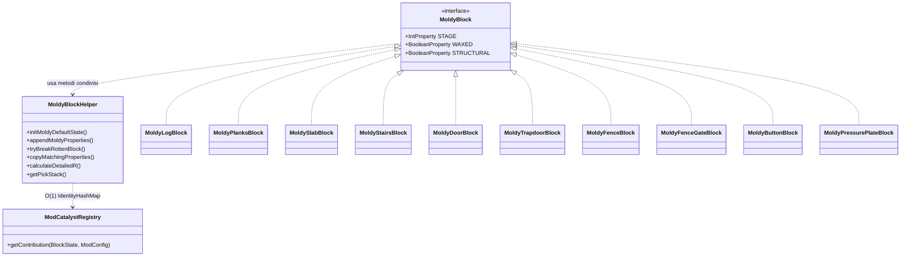

# 📋 Report Completo delle Differenze e Nuove Funzionalità
**Riferimento Base**: Commit `de7b741f2d04696dbeb8c184829f7fdee419f767` ➔ `c1a0f53` ➔ `a578f99` ➔ `2ed9cd2` ➔ `fa531e4` ➔ `3462a63` ➔ `b21362e` ➔ **`7f235615` (HEAD)**  
**Data**: 1 Settembre 2026  
**Mod Version**: Spores & Shadows 1.2.0 (Fabric 1.21.1)

---

## 📑 Indice dei Contenuti
1. [Sintesi Cronologica dei Commit](#1-sintesi-cronologica-dei-commit)
2. [Modello Fisico-Biologico di Aerazione e Miasma Unificato](#2-modello-fisico-biologico-di-aerazione-e-miasma-unificato)
3. [Algoritmo BFS Flood-Fill, Confini Ermetici & Flusso d'Aria Direzionale](#3-algoritmo-bfs-flood-fill-confini-ermetici--flusso-daria-direzionale)
4. [Saturazione Dinamica & Inerzia Temporale (`RoomSaturationManager`)](#4-saturazione-dinamica--inerzia-temporale-roomsaturationmanager)
5. [Matrice Completa dei Blocchi, Permeabilità e Orientamenti Spaziali](#5-matrice-completa-dei-blocchi-permeabilit%C3%A0-e-orientamenti-spaziali)
6. [Meccaniche di Gioco Avanzate: Durezza, Rottura, Spore, Combustibile & Compost](#6-meccaniche-di-gioco-avanzate-durezza-rottura-spore-combustibile--compost)
7. [Architettura dei Blocchi & Registri $O(1)$ (`MoldyBlock`, `ModCatalystRegistry`)](#7-architettura-dei-blocchi--registri-o1-moldyblock-modcatalystregistry)
8. [Integrazione JEI (Just Enough Items) & Data Generation Client](#8-integrazione-jei-just-enough-items--data-generation-client)
9. [Comandi Amministrativi e Diagnostica Avanzata (`/spores`, `/miasma`, `/moldrisk`)](#9-comandi-amministrativi-e-diagnostica-avanzata-spores-miasma-moldrisk)
10. [Configurazione Dinamica `ModConfig` (12 Categorie)](#10-configurazione-dinamica-modconfig-12-categorie)
11. [Equipaggiamento Protettivo: Maschera Antispore 3D (`spores--shadows:spore_mask`)](#11-equipaggiamento-protettivo-maschera-antispore-3d-sporesshadowsspore_mask)
12. [Incantesimo per Elmi: Filtrazione Spore (`spores--shadows:spore_filtration`)](#12--incantesimo-per-elmi-filtrazione-spore-sporesshadowsspore_filtration)
13. [Suite Completa di Collaudo Automatizzato GameTest](#13-suite-completa-di-collaudo-automatizzato-gametest-9696-passati)
14. [Strumentazione: Rilevatore di Spore (*Spore Detector*)](#14-strumentazione-rilevatore-di-spore-spore-detector)
15. [Algoritmo di Ventilazione Miasma: Rete a Zone, Colli di Bottiglia & Occlusione Geometrica](#15-algoritmo-di-ventilazione-miasma-rete-a-zone-colli-di-bottiglia--occlusione-geometrica)
16. [Suite di Collaudo Automatizzato](#16-suite-completa-di-collaudo-automatizzato-gametest-9696-passati)

---

## 1. Sintesi Cronologica dei Commit



---

## 2. Modello Fisico-Biologico di Aerazione e Miasma Unificato

L'intero sistema di calcolo del rischio biologico di muffa $R$ e la simulazione della tossicità dell'aria confinata sono stati unificati in un unico framework matematico e fisico coerente in `MoldyBlockHelper.java` e `ToxicAirEvent.java`.



### A. Formula Generale del Rischio di Infezione $R$
$$R = \Big( (H_{eff} \cdot L_{uv} \cdot S_{mat}) + \text{catalystBonus} + \text{miasmaBonus} \Big) \cdot T_{mult}$$

1. **Umidità Effettiva con Asciugatura da Aerazione ($H_{eff}$)**:
   $$H_{raw} = H_{base} + \text{depthModifier} + \text{localHumidityBonus}$$
   $$H_{eff} = \max\left(0.0, \, \min\left(1.0, \, H_{raw} - (\text{Aeration} \cdot \text{aeration\_drying\_bonus})\right)\right)$$
   * $\text{Aeration} \in [0.0, 1.0]$: valore di ventilazione calcolato mediando tutte le facce del blocco esposte ad aria o varchi comunicanti (`calculateBlockAirEvaluation`).
   * `aeration_drying_bonus` (default `0.50`): la ventilazione asciuga le superfici legnose, arrestando la formazione di muffa anche in assenza di luce.

2. **Modello Umidità Profondità con Cap Fisso a $Y \le 0$**:
   $$\text{depthModifier} = \begin{cases} 
   0.0 & \text{se } Y \ge 64 \\
   \min\left(0.40, \; \frac{64 - Y}{64} \times 0.40\right) & \text{se } Y < 64 
   \end{cases}$$
   * A tutte le quote ipogee $Y \le 0$ (fino al fondo del mondo a $Y=-64$), il bonus profondità rimane fisso al cap di $+0.40$, prevenendo soft-lock del gameplay nelle caverne di Deepslate.

3. **Pressione Aerea delle Spore da Miasma ($\text{miasmaBonus}$)**:
   $$\text{miasmaBonus} = \text{averageExposureIndex} \cdot \text{miasma\_spore\_multiplier}$$
   * I blocchi infetti in una stanza chiusa generano un miasma carico di spore che aumenta il rischio $R$ di tutti i blocchi di legno circostanti, anche a distanza e senza contatto fisico diretto.

4. **Indice di Esposizione e Densità Volumetrica**:
   $$\text{density} = \frac{\text{netMiasma}}{\text{volume}}$$
   $$\text{exposureIndex} = \text{density} \cdot \left(0.5 + 0.5 \cdot \min\left(2.0, \sqrt{\frac{\text{netMiasma}}{8.0}}\right)\right)$$
   * **Diluizione Volumetrica**: a parità di blocchi infetti, stanze più ampie disperdono il gas riducendo la densità locale e l'indice di esposizione rispetto a micro-celle sigillate.

5. **Soglie di Tossicità Atmosferica per il Giocatore**:
   * $\text{netMiasma} \ge \text{threshold\_poison} \, (16.0) \lor (\text{density} \ge 0.18 \land \text{netMiasma} \ge 10.0) \implies \mathbf{LETHAL\_POISON}$ (Veleno e Nausea).
   * $\text{netMiasma} \ge \text{threshold\_hunger} \, (8.0) \lor (\text{density} \ge 0.09 \land \text{netMiasma} \ge 4.0) \implies \mathbf{MODERATE\_HUNGER}$ (Fame e spossatezza).
   * $\text{netMiasma} \ge 2.66 \lor \text{density} \ge 0.045 \implies \mathbf{WARNING}$ (Particelle di micelio aeree e suoni organici).

---

## 3. Algoritmo BFS Flood-Fill, Confini Ermetici & Flusso d'Aria Direzionale

Il motore di propagazione in `ToxicAirEvent.java` esegue una scansione Flood-Fill 3D con limite volumetrico (`max_air_volume`, default 1024) e raggio euclideo sferico (`max_euclidean_radius`, default 24).



### Classificazione Ambientale delle Stanze:
1. **`CLEAN_OPEN_AIR`**: Spazio comunicante verso l'alto con il cielo aperto ($Miasma = 0$).
2. **`UNCONFINED_CAVERN`**: Volume $\ge 1024$ blocchi d'aria (caverna aperta senza tetto basso).
3. **`VENTILATED`**: Stanza chiusa ma dotata di varchi verso l'esterno (porte, botole aperte, grate di rame, finestre).
4. **`HERMETIC_SEALED`**: Stanza completamente sigillata senza alcun ricambio d'aria con l'esterno.

---

## 4. Saturazione Dinamica & Inerzia Temporale (`RoomSaturationManager`)

Per evitare variazioni istantanee e irrealistiche del miasma, la concentrazione gassosa è gestita dalla classe interna `RoomSaturationManager`:

$$M(t) = M_{prec} + \alpha \cdot (M_{target} - M_{prec})$$

* Se $M_{target} > M_{prec}$ (la stanza si sta intossicando): $\alpha = 1 - e^{-\Delta t \times \text{saturation\_speed\_multiplier}}$ (default `0.02`).
* Se $M_{target} < M_{prec}$ (la stanza viene aerata): $\alpha = 1 - e^{-\Delta t \times \text{dissipation\_speed\_multiplier}}$ (default `0.05`, purificazione più rapida).
* **Anchor Pos Deterministica**: La stanza calcola un punto di ancoraggio centrale (`anchorPos`) derivato dalle coordinate minime dell'involucro d'aria, garantendo continuità temporale tra tick successivi.

---

## 5. Matrice Completa dei Blocchi, Permeabilità e Orientamenti Spaziali

| Tipo di Blocco | Stato / Condizione | Comportamento Flusso Orizzontale | Comportamento Flusso Verticale | Punteggio Ventilazione Verso Esterno |
| :--- | :--- | :--- | :--- | :--- |
| **Blocco Solido** | Qualsiasi | **Ermetico** (Blocca) | **Ermetico** (Blocca) | $0.0$ |
| **Blocco Allagato (`waterlogged`)** | Qualsiasi | **Ermetico** (Sifone d'acqua) | **Ermetico** (Sifone d'acqua) | $0.0$ |
| **Grata di Rame (`GrateBlock`)** | Qualsiasi | **Permeabile** (Passa) | **Permeabile** (Passa) | $+15.0 / \text{blocco}$ |
| **Porta Legno/Ferro** | **Chiusa** | **Ermetica** (Blocca asse) | N/A | $0.0$ |
| **Porta Legno/Ferro** | **Aperta** | **Permeabile** (Passa) | N/A | $+15.0$ |
| **Botola (`TrapdoorBlock`)** | **Chiusa** | Permeabile lateralmente | **Ermetica** (Sigilla soffitto/pavimento) | $0.0$ |
| **Botola (`TrapdoorBlock`)** | **Aperta** | **Ermetica** lungo facing | Permeabile in verticale | $+15.0$ |
| **Staccionata / Cancelletto** | Aperto / Chiuso | **Permeabile** (Ventilato) | **Permeabile** (Ventilato) | $+3.0$ (fessura) |
| **Muretto (`WallBlock`)** | **Connesso** ad altri blocchi | **Ermetico** (Muro continuo) | Permeabile in verticale | $0.0$ |
| **Muretto (`WallBlock`)** | **Isolato** (Pilastro singolo) | **Permeabile** (Aria passa) | Permeabile in verticale | $+3.0$ |
| **Lastra (`SlabBlock`)** | Inferiore / Superiore | Permeabile attraverso fessura | **Ermetico** su faccia piena | $+3.0$ (fessura) |
| **Sbarre di Ferro (`Iron Bars`)** | Qualsiasi | **Permeabile** (Ventilato) | **Permeabile** (Ventilato) | $+3.0$ (fessura) |

---

## 6. Meccaniche di Gioco Avanzate: Durezza, Rottura, Spore, Combustibile & Compost

### A. Durezza Scalare & Inibizione Strumenti su Stadio 3
* **Stadio 1 (Tainted)**: Durezza $0.8\times$ (1.6s).
* **Stadio 2 (Moldy)**: Durezza $0.5\times$ (1.0s), blast resistance $0.5\times$.
* **Stadio 3 (Rotten)**: Durezza $0.2\times$ (0.4s), blast resistance $0.1\times$.
* **Inibizione Tool Efficiency (`AbstractBlockStateMixin.java`)**: Il legno completamente marcito ha una struttura cellulosica collassata: il breaking delta è forzato a 1.0 (si rompe alla stessa velocità sia a pugni che con un'ascia di diamante).

### B. Nuvola di Spore alla Rottura (`onBreak`)
* Distruggere blocchi marciti (Stadi 2 e 3) senza Silk Touch rilascia uno sbuffo denso di particelle `MYCELIUM` ed effetti sonori organici (`BlockMixin.java`).

### C. Ceratura (`Waxing`), De-Ceratura & Rimozione Muffa
* **Ceratura (Favo d'Api)**: Tasto destro con `Honeycomb` congela il decadimento, previene i controlli di random tick (risparmio CPU) e rinforza i blocchi Rotten garantendo il drop al 100% senza Silk Touch.
* **Raschiatura Cera (Ascia)**: Shift + Tasto destro con un'ascia rimuove lo strato di cera consumando 1 punto di durabilità.
* **Cura Muffa (Ascia)**: Shift + Tasto destro con un'ascia su legno non cerato infetto rimuove uno stadio di muffa ($3 \rightarrow 2 \rightarrow 1 \rightarrow 0$) consumando durabilità.

### D. Combustibile, Compostaggio & Redstone
* **Combustione in Fornace (`ModFuelRegistry.java`)**: Tempi di combustione ridotti progressivamente in base allo stadio di marcescenza.
* **Compostatore (`ModComposterRegistry.java`)**: Stadio 1 = 50%, Stadio 2 = 65%, Stadio 3 = 85% di probabilità di riempimento.
* **Inerzia Redstone**: Pulsanti e pedane marci subiscono un ritardo di disattivazione (`ButtonMixin.java`, `PressurePlateMixin.java`).

---

## 7. Architettura dei Blocchi & Registri $O(1)$ (`MoldyBlock`, `ModCatalystRegistry`)



1. **Interfaccia `MoldyBlock`**: Centralizza proprietà e logica condivisa su tutte le 10 classi di legno infettabile.
2. **`ModCatalystRegistry`**: Lookup $O(1)$ su base `IdentityHashMap<Block, CatalystType>` per comparazione per puntatori senza overhead di stringhe.
3. **Scope Pattern in `MoldyStructureContext`**: Interfaccia `StructureScope` (`AutoCloseable`) per la gestione deterministica e thread-safe del seed di struttura in worldgen con 4 categorie di decadimento.
4. **Ottimizzazione Zero-Allocation**: Costante immutabile statica `DIRECTIONS` e formula aritmetica diretta in `getPickStack`.

---

## 8. Integrazione JEI (Just Enough Items) & Data Generation Client

* **Plugin JEI (`SporesShadowsJEIPlugin.java`)**:
  * Categorie `WaxingRecipeCategory` e `ScrapingRecipeCategory` basate su `AbstractTwoInputRecipeCategory.java`.
  * Lettura $O(1)$ da `ModBlocks.MOLDY_ITEMS_BY_VANILLA` con zero allocazioni a runtime.
* **Pipeline di Data Generation**:
  * `ModLootTableProvider.java`: Loop dichiarativo compatto su tutti i blocchi registrati.
  * `ModRecipeProvider.java`: Ricette ibride a resa decrescente (Stadio 1 = 2 assi, Stadio 2 = 1 asse, Stadio 3 = 0 assi).
  * `ModBlockTagProvider.java`: Type-safe con `instanceof`.
  * Localizzazioni per 5 lingue (`en_us`, `it_it`, `es_es`, `de_de`, `fr_fr`).

---

## 9. Comandi Amministrativi e Diagnostica Avanzata (`/spores`, `/miasma`, `/moldrisk`)

* `/spores reload`: Ricaricamento dinamico a caldo della configurazione senza riavvio del server.
* `/miasma`: Diagnostica in tempo reale della stanza (volume, tipo ventilazione, toxic score, portata di ventilazione, miasma corrente $M(t)$ e target, indice di esposizione, stato di saturazione/purificazione).
* `/moldrisk [verbose]`: Ispezione analitica del blocco target con scomposizione di $H_{eff}$, $L_{uv}$, $S_{mat}$, $C_{bonus}$, $M_{bonus}$, $T_{mult}$.

---

## 10. Configurazione Dinamica `ModConfig` (12 Categorie)

1. `general`: `enable_mold_growth`, `infection_threshold` (default `0.50`), `scan_radius`, `structures_immune`, `axe_scrape_damage`.
2. `susceptibility`: Moltiplicatori per scortecciato (`1.4`), assi (`0.8`), default (`1.0`).
3. `catalysts`: Pesi per fango, micelio/podzol, funghi, spore blossom e legno contaminato.
4. `environment`: Umidità pioggia/secco, cap Y=0, bonus acqua/calderoni, essiccamento aerazione, pressione spore miasma, temperature critiche e gradienti quota.
5. `drops`: Probabilità di drop stadi 2 e 3.
6. `structures`: Categorie 1-4 per le percentuali di decadimento in worldgen.
7. `furnace_multipliers`: Moltiplicatori combustibile fornace per stadi 0, 1, 2, 3.
8. `flammability`: Toggle e probabilità di innesco e propagazione fiamme.
9. `blast_resistance`: Toggle e moltiplicatori blast resistance per stadi 1, 2, 3.
10. `hardness`: Toggle, moltiplicatori durezza e toggle nuvola di spore alla rottura.
11. `toxicity`: Parametri temporali, volumi massimi, raggio euclideo, moltiplicatori saturazione/dissipazione, punteggi di ventilazione, soglie status effect, `enable_spore_mask_protection` (default: `true`) e `spore_mask_damage_per_exposure` (default: `1`).
12. `client`: `mold_z_offset` per prevenire lo Z-fighting grafico con Iris/Sodium.

---

## 11. Equipaggiamento Protettivo: Maschera Antispore (*Spore Mask*)

È stato introdotto un nuovo equipaggiamento biologico dedicato alla sopravvivenza in ambienti miasmatici:

### A. Specifiche Tecniche & Meccaniche
* **Identificativo**: `spores--shadows:spore_mask` (Classe [`SporeMaskItem.java`](file:///C:/Users/r.pirosu/Desktop/spores--shadows-template-1.21.1/src/main/java/moldmod/item/SporeMaskItem.java)).
* **Slot Equipaggiamento**: `EquipmentSlot.HEAD` (copricapo/elmo).
* **Protezione Fisica**: $+1$ Punto Armatura ($0.5$ scudo), pari all'elmo di cuoio vanilla.
* **Durabilità**: $165$ usi base.
* **Protezione Miasma Attiva**:
  * Neutralizza al $100\%$ gli effetti nocivi del Miasma ([`POISON`](file:///), [`NAUSEA`](file:///), [`HUNGER`](file:///)) durante il respiro in stanze sature di gas.
  * Consuma $1$ punto di durabilità (con rispetto dell'incantesimo *Unbreaking*) ad ogni intervallo di esposizione attiva.
  * Emette uno sbuffo di particelle d'aria purificata (`CLOUD`) attorno alla testa del giocatore.

### B. Manutenzione del Filtro con Lana (`#minecraft:wool`)
* **Riparazione all'Incudine**: L'ingrediente di riparazione registrato nel tag e in `canRepair` è qualsiasi blocco di **Lana (`#minecraft:wool`)**, simulando la sostituzione e l'aggiornamento della cartuccia filtrante.
* **Compatibilità Strumenti**: Pienamente compatibile con **Incudine** (unione maschere, riparazione lana, rinomina), **Mola** (disincantamento con recupero XP, riparazione combinata) e **Crafting Grid Repair** ($+5\%$ bonus durabilità).

### C. Incantabilità Speciale della Maschera Antispore (Simile alle Cesoie Vanilla)
* **Tavolo degli Incantesimi (`Enchanting Table`)**: ❌ **Disabilitato** (`getEnchantability() == 0`). La maschera non compare negli slot del tavolo per l'incantamento con EXP e lapislazzuli.
* **Mola (`Grindstone`)**: ✔️ **Abilitato** (rimozione incantesimi e riparazione combinata).
* **Incudine con Libri Incantati (`Anvil`)**: ✔️ **Abilitato Esclusivo** (garantito a basso livello tramite [`EnchantmentMixin.java`](file:///C:/Users/rcky0/Desktop/spores--shadows/src/main/java/moldmod/mixin/EnchantmentMixin.java) intercettando `isAcceptableItem`). Supporta unicamente:
  1. *Unbreaking* (Indistruttibilità I–III per ridurre il consumo del filtro)
  2. *Mending* (Ripristino con esperienza)
  3. *Curse of Vanishing* (Maledizione della Scomparsa)
* **Incantesimi Rifiutati all'Incudine**: Rifiuta categoricamente *Protection* (tutte le 4 varianti), *Aqua Affinity*, *Respiration*, *Thorns*, *Curse of Binding* e *Spore Filtration* (poiché possiede già filtrazione biologica nativa).

### D. Ricetta Sagomata al Banco da Lavoro
```text
[ Cuoio ] [ Pannello di Vetro ] [ Cuoio ]
[ Rame  ] [       Lana        ] [ Rame  ]
[   -   ] [    Favo d'Api     ] [   -   ]
```

### E. Integrazioni con Altre Mod (JEI & Jade Aggiornati)
* **JEI / EMI / REI**:
  * Scheda informativa `addIngredientInfo` per la Maschera Antispore con spiegazione delle restrizioni di incantabilità e riparazione.
  * Scheda informativa `addIngredientInfo` per l'incantesimo *Filtrazione Spore* (`spores--shadows:spore_filtration`) su tutti gli elmi convenzionali.
  * Ricetta visuale all'**Incudine** (`RecipeTypes.ANVIL`) per la sostituzione del filtro con tutte le 16 varianti di colore della Lana (`#minecraft:wool`).
* **Jade / WTHIT**:
  * Provider entità dedicato ([`SporeProtectionEntityProvider.java`](file:///C:/Users/rcky0/Desktop/spores--shadows/src/main/java/moldmod/integration/jade/SporeProtectionEntityProvider.java)): visualizza in tempo reale sul tooltip quando si punta un giocatore o un'entità con protezione attiva:
    * `Protezione Spore: Attiva (Maschera Antispore)`
    * `Filtrazione Spore: Livello X` per elmi incantati.
  * Riconoscimento blocchi marci e rischio di infezione in tempo reale.
* **Cloth Config & ModMenu**: Voci dedicate in categoria `toxicity` con supporto hot-reload via `/spores reload`.
* **Polymer Framework**: Generazione procedurale modello `models/item/spore_mask.json` nel Resource Pack virtuale e fallback trasparente su `Items.LEATHER_HELMET` per client vanilla.

---

### F. Personalizzazione del Render della Maschera Indossata sul Giocatore (Dual-Layer 3D Head Armor)
* **Architettura Dual-Layer Senza Soluzione di Continuità ([`SporeMaskModel.java`](file:///C:/Users/rcky0/Desktop/spores--shadows/src/client/java/moldmod/client/render/SporeMaskModel.java))**:
  * **Strato Base (`HEAD`, Dilation $0.5$F, UV $0,0 \to 32,16$)**: Passamontagna in cuoio marrone (`#684120`), cinturini di serraggio neri incrociati sul retro con anello centrale in rame, visore gommato e protezione sottomento/collo.
  * **Strato Rilievo 3D Esterno (`HAT`, Dilation $0.85$F, UV $32,0 \to 64,16$)**: Geometria concentrica a rilievo continuo per lenti antiriflesso ciano con bagliore speculare bianco, ponte nasale in rame, beccuccio di aspirazione frontale con griglia in lana filtrante e bombolette/valvole laterali bilaterali in rame (`#B05624`).
* **Renderer Dedicato ([`SporeMaskArmorRenderer.java`](file:///C:/Users/rcky0/Desktop/spores--shadows/src/client/java/moldmod/client/render/SporeMaskArmorRenderer.java))**:
  * Implementato tramite `ArmorRenderer` di Fabric API e registrato all'avvio client in [`SporesShadowsClient.java`](file:///C:/Users/rcky0/Desktop/spores--shadows/src/client/java/moldmod/client/SporesShadowsClient.java).
  * Sincronizzazione precisa con `contextModel.copyBipedStateTo(this.model)` per pitch, yaw, roll, sneaking, nuoto e volo dell'entità sia in prima che in terza persona.
* **Script di Generazione Texture Dedicato ([`scripts/generate_mask_texture.py`](file:///C:/Users/rcky0/Desktop/spores--shadows/scripts/generate_mask_texture.py))**:
  * Creato script Python autonomo (pure Python con modulo `zlib`/`struct` standard, senza dipendenze esterne obbligatorie) per generare la texture $64\times32$ RGBA con palette esatta e UV 100% allineati tra i due strati.
* **Materiale Armatura Dedicato (`ModItems.SPORE_MASK_ARMOR_MATERIAL`)**:
  * Registrato in `Registries.ARMOR_MATERIAL` tramite `Registry.registerReference`.
  * Definisce `ArmorMaterial.Layer` collegato all'identificatore `spores--shadows:spore_mask`.

---

## 12. ✨ Incantesimo per Elmi: Filtrazione Spore (`spores--shadows:spore_filtration`)

Introdotto un **Incantesimo Data-Driven per Elmi** per permettere la purificazione biologica su armature convenzionali di alto livello:

### A. Specifiche dell'Incantesimo
* **Identificativo**: `spores--shadows:spore_filtration` (Registro: `ModEnchantments.SPORE_FILTRATION`).
* **Item Supportati**: Tutti gli elmi convenzionali (`#spores--shadows:enchantable/filtration_helmets`: Cuoio, Maglia, Ferro, Oro, Diamante, Netherite, Tartaruga).
* **Livelli Disponibili**: I, II, III.
* **Compatibilità**: Pienamente compatibile con *Respiration* (Respirazione subacquea), *Aqua Affinity*, *Protection* e *Unbreaking*.
* **Ottenimento**: Disponibile all'Enchanting Table (`#minecraft:enchantment/in_enchanting_table`), scambio con villici (`#minecraft:enchantment/on_traded_equipment`), libri del bottino (`#minecraft:enchantment/non_treasure`) e applicazione all'Incudine.

#### B. Meccanica di Filtraggio & Scalabilità Durabilità
* Neutralizza al $100\%$ gli effetti nocivi del Miasma ([`POISON`](file:///), [`NAUSEA`](file:///), [`HUNGER`](file:///)) emettendo particelle `ParticleTypes.CLOUD` e suoni filtrati.
* **Consumo Durabilità Scalare per Esposizione**:
  * **Livello I**: Consuma $2$ punti durabilità per esposizione.
  * **Livello II**: Consuma $1$ punto durabilità per esposizione.
  * **Livello III**: $50\%$ di probabilità di non consumare durabilità (massima efficienza di filtraggio).

---

## 14. Strumentazione: Rilevatore di Spore (*Spore Detector*)

Introdotto il nuovo blocco e item tecnologico in stile steampunk/vintage (rame, ottone e fiala di vetro graduata):

1. **Modelli 3D & Texture Simmetriche**:
   * Blocco `WallMountedBlock` orientabile a pavimento (`floor`), parete (`wall`) e soffitto (`ceiling`).
   * 4 stadi visivi dinamici per livello di tossicità (0 = Spento/Verde, 1 = Giallo, 2 = Arancione, 3 = Rosso/Lethal).
   * Modello item dinamico in mano con `ModelPredicateProviderRegistry` (aggiornamento in tempo reale del livello del liquido nella fiala).
   * Feedback sonoro a impulsi stile contatore Geiger (`spore_detector_click`) quando tenuto in mano.
2. **Interattività e Diagnostica Privata in Chat**:
   * Facendo clic destro in aria con l'item o sul blocco piazzato nel mondo, il giocatore riceve un resoconto diagnostico completo (volume analizzato, punteggio di ventilazione, miasma attuale, densità di spore e stato di saturazione/dissipazione) stampato privatamente nella chat (`sendMessage(..., false)`).
3. **Emissione Redstone Proporzionale**:
   * Emette un segnale di Pietrarossa direttamente proporzionale allo stadio di tossicità rilevato:
     * **Stadio 0 (Clean)**: Segnale `0` (Spento)
     * **Stadio 1 (Warning)**: Segnale `5` (5 blocchi di cavo)
     * **Stadio 2 (Moderate Hunger)**: Segnale `10` (10 blocchi di cavo)
     * **Stadio 3 (Lethal Poison)**: Segnale `15` (Massima potenza)
4. **Integrazioni Ecosistema**:
   * Ricetta di crafting a forma di fiala e barometro in rame.
   * Plugin dedicato per **Jade** (visualizzazione HUD di livello e stato).
   * Scheda informativa per **JEI** (Just Enough Items).
   * Inserito nei tab della Modalità Creativa (*Strumenti*, *Pietrarossa*, *Blocchi Funzionali*).
   * Localizzazione completa in 5 lingue (IT, EN, FR, DE, ES).

---

## 15. Algoritmo di Ventilazione Miasma: Rete a Zone, Colli di Bottiglia & Occlusione Geometrica

> [!WARNING]
> **Nota di Sviluppo (In Lavorazione / Da Rifinire)**: L'architettura dell'algoritmo di calcolo del miasma, delle aperture a colli di bottiglia e della rete a zone è stata implementata e integrata nel motore BFS. Il sistema richiede tuttavia un ciclo finale di rifinitura, collaudo approfondito in-game e ottimizzazione su scenari di costruzione complessi prima della chiusura definitiva.

### A. Modello a Zone e Colli di Bottiglia Inter-Stanza
* **Suddivisione Topologica**: L'ambiente non viene più trattato come una massa uniforme indifferenziata. Lo spazio esplorato viene segmentato in **Zone (Stanze)** collegate da **Portali / Varchi**.
* **Capacità di Portale ($C_{\text{portale}}$)**:
  * Ogni varco di transizione possiede una capacità massima di flusso d'aria proporzionale alla sua area geometrica effettiva:
    * Buco $1\times 1 \implies C = 25.0$
    * Porta / Varco $2\times 1 \implies C = 50.0$
    * Arco $2\times 2 \implies C = 100.0$
    * Mezza Lastra ($1/2$ Slab) $\implies C = 12.5$
    * Quarto di Scala ($1/4$ Stair) $\implies C = 6.25$
    * Grata di Rame $\implies C = 15.0$
    * Staccionata / Sbarre di Ferro $\implies C = 15.0$
* **Regola del Minimo di Flusso Inter-Stanza**:
  $$V_{\text{trasferita}} = \min(C_{\text{portale}}, V_{\text{stanza\_adiacente}})$$
  $$V_{\text{totale\_stanza}} = V_{\text{diretta\_esterno}} + \sum \min(C_{\text{portale}}, V_{\text{figlia}})$$
  * Se la Stanza B ha un'ampia finestra esterna ($100$) ma comunica con la Stanza A tramite un buco $1\times 1$ ($25$), la Stanza A riceve solo $25$ di ventilazione.
  * Se la Stanza B ha una piccola finestra ($25$) e l'apertura verso la Stanza A è un grande arco $2\times 2$ ($100$), la Stanza A riceve la ventilazione ridotta di B ($25$).
  * Tutti i varchi diretti verso l'esterno all'interno della stessa stanza si sommano linearmente.

### B. Risoluzione dei Colli di Bottiglia su Tettoie e Porticati
* Le aperture nei muri esterni non espandono più la BFS all'esterno sotto le tettoie aggettanti: l'apertura viene sigillata come confine di ventilazione e conteggiata una sola volta.
* Il raycast esterno [`isVentilatedToOutside`](file:///src/main/java/moldmod/event/ToxicAirEvent.java) analizza fino a 5 blocchi di profondità e i lati perpendicolari per rilevare lo sbocco a cielo aperto.

### C. Occlusione Geometrica a 4 Quadranti (Lastre & Scale)
* Ogni faccia di contatto è mappata su 4 quadranti ($0.5 \times 0.5$ voxel) nello spazio 3D reale:
  * **Slab Bassa adiacente a Slab Alta**: L'intersezione delle aree aperte è `0b0011 & 0b1100 = 0`, bloccando ermeticamente il passaggio d'aria.
  * **Scale ad Angolo e Profili a $1/4$**: Calcolo basato sugli 8 ottanti per risolvere con precisione geometrica qualsiasi accostamento di gradini, lastre o blocchi pieni.

### D. Terminazione Immediata a Cielo Aperto
* Quando un ramo della BFS raggiunge un blocco comunicante direttamente con il cielo aperto (`!isCoveredByCeiling`), accredita la ventilazione e **interrompe immediatamente il ramo** (`continue`), prevenendo la dispersione dell'algoritmo nell'atmosfera esterna.

---

## 16. Suite Completa di Collaudo Automatizzato GameTest (96/96 Passati)

Tutti i comportamenti sono convalidati da **21 classi di test** automatizzati:

| # | File di Test | Argomento e Meccanica Verificata |
| :--- | :--- | :--- |
| 1 | `SporeFiltrationEnchantmentTests.java` | 7 test su risoluzione incantesimo, protezione veleno, scalabilità durabilità (Liv I vs II), elmi non incantati, coesistenza con Respiration, restrizioni incantabilità maschera e validazione interazione `AnvilScreenHandler` (rifiuto Protection/Filtration, accettazione Unbreaking/Mending/Vanishing e riparazione lana). |
| 2 | `SporeMaskTests.java` | Proprietà elmo, +1 armatura, riparazione lana filtro, incantabilità disabilitata al tavolo, usura durabilità e layer armatura 3D. |
| 3 | `ToxicAirTests.java` | 32 test su BFS, porte/botole/grate/cielo, calcolo volumetrico e caverne non confinate (`UNCONFINED_CAVERN`). |
| 4 | `DynamicMiasmaSaturationTests.java` | Inerzia temporale $M(t)$, saturazione e dissipazione differenziata con modello colli di bottiglia e porte a due blocchi. |
| 5 | `MoldyMathTests.java` | 14 test su formule matematiche $R$, $H_{eff}$, $M_{bonus}$, temperature e cap $Y \le 0$. |
| 6 | `MoldyHardnessAndMiningSpeedTests.java` | Durezza progressiva e tempo di rottura pugno vs ascia su rotten. |
| 7 | `MoldyFuelAndSmeltingTests.java` | Tempi di combustione in fornace scalati per tutti i legni. |
| 8 | `MoldyFlammabilityTests.java` | Innesco e diffusione fiamme (Overworld e ignifughi Nether). |
| 9 | `MoldyInteractionTests.java` | Ceratura favo, scraping ascia, usura durabilità e preservazione stati. |
| 10 | `MoldyDropAndLootTests.java` | Drop condizionali con Silk Touch, sbriciolamento e garanzia ceratura. |
| 11 | `MoldyComposterTests.java` | Percentuali di compostaggio stadi 1, 2, 3. |
| 12 | `MoldyCraftingYieldsTests.java` | Rese di crafting decrescenti per assi, stick e derivati. |
| 13 | `MoldyBlastResistanceTests.java` | Resistenza alle esplosioni scalata per stadio. |
| 14 | `MoldyRedstoneTests.java` | Ritardo di disattivazione meccanica su pedane e pulsanti marci. |
| 15 | `MoldyScenariosTableTests.java` | Test parametrici su scenari realistici (cantine, miniere, rive). |
| 16 | `ModCommandsTests.java` | Esecuzione e parsing comandi (`/spores reload`, `/miasma`). |
| 17 | `StructureDegradationTest.java` | Generazione e decadimento strutture naturali. |
| 18 | `MoldyInfectionRuleTests.java` | Regole biologiche di transizione di stadio e `structures_immune = false`. |
| 19 | `MoldyVariantsCountTest.java` | Integrità e conteggio varianti registrate. |
| 20 | `MoldyWoodTestHelper.java` | Classi di supporto per test automatici. |
| 21 | `SporesShadowsTests.java` | Suite principale GameTest. |

---
*Stato: **96/96 GameTest superati con successo (`BUILD SUCCESSFUL`)**.*
