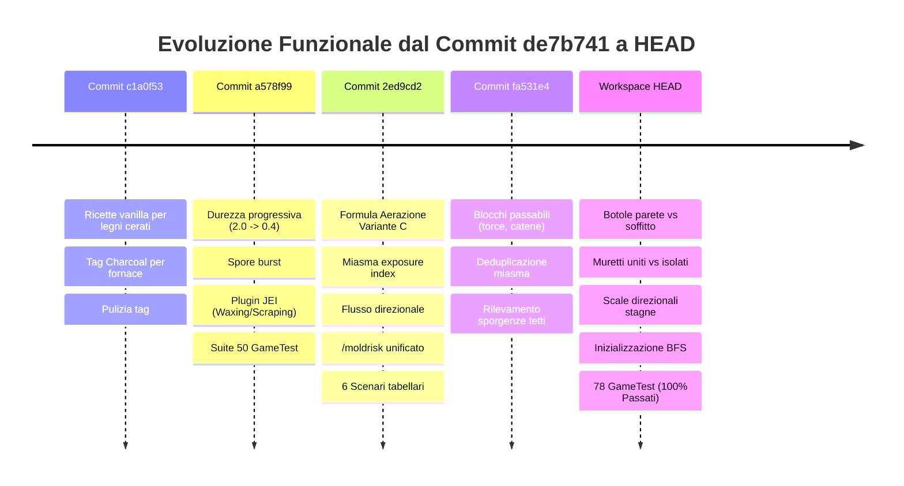

# 📋 Report Completo delle Differenze e Nuove Funzionalità
**Riferimento Base**: Commit `de7b741f2d04696dbeb8c184829f7fdee419f767` ➔ `c1a0f53` ➔ `a578f99` ➔ `2ed9cd2` ➔ `fa531e4` ➔ **Stage Attuale (HEAD)**  
**Data**: 29 Agosto 2026  
**Mod Version**: Spores & Shadows 1.2.0 (Fabric 1.21.1)

---

## 📑 Indice dei Contenuti
1. [Sintesi Cronologica dei Commit](#-1-sintesi-cronologica-dei-commit)
2. [Modello Fisico-Biologico di Aerazione e Miasma Unificato (Formula Variante C)](#-2-modello-fisico-biologico-di-aerazione-e-miasma-unificato-formula-variante-c)
3. [Algoritmo BFS Flood-Fill e Flusso d'Aria Direzionale](#-3-algoritmo-bfs-flood-fill-e-flusso-daria-direzionale)
4. [Matrice Completa dei Blocchi, Permeabilità e Orientamenti Spaziali](#-4-matrice-completa-dei-blocchi-permeabilit%C3%A0-e-orientamenti-spaziali)
5. [Meccaniche di Gioco Avanzate: Durezza, Rottura, Spore & Drop](#-5-meccaniche-di-gioco-avanzate-durezza-rottura-spore--drop)
6. [Ricette Cerate, Carbonella & Plugin JEI (Just Enough Items)](#-6-ricette-cerate-carbonella--plugin-jei-just-enough-items)
7. [Comandi Amministrativi e Diagnostica Avanzata (`/moldrisk`, `/miasma`)](#-7-comandi-amministrativi-e-diagnostica-avanzata-moldrisk-miasma)
8. [Tabella Completa dei Bug Corretti (*Bug Fixes*)](#-8-tabella-completa-dei-bug-corretti-bug-fixes)
9. [Suite Completa di Collaudo Automatizzato GameTest (83/83 Passati)](#-9-suite-completa-di-collaudo-automatizzato-gametest-8383-passati)
10. [Configurazione Dinamica (Cloth Config / ModMenu)](#-10-configurazione-dinamica-cloth-config--modmenu)

---

## 🕒 1. Sintesi Cronologica dei Commit



---

## 🔬 2. Modello Fisico-Biologico di Aerazione e Miasma Unificato (Formula Variante C)

L'intero sistema di calcolo del rischio biologico di muffa $R$ e la simulazione della tossicità dell'aria confinata sono stati unificati in un unico framework matematico e fisico coerente in [`MoldyBlockHelper.java`](file:///C:/Users/rcky0/Desktop/spores--shadows/src/main/java/moldmod/block/MoldyBlockHelper.java) e [`ToxicAirEvent.java`](file:///C:/Users/rcky0/Desktop/spores--shadows/src/main/java/moldmod/event/ToxicAirEvent.java).

### A. Formula Generale del Rischio di Infezione $R$
$$R = \left( (H_{eff} \cdot L_{uv} \cdot S_{mat}) + \text{catalystBonus} + \text{miasmaBonus} \right) \cdot T_{mult}$$

1. **Umidità Effettiva con Asciugatura da Aerazione ($H_{eff}$)**:
   $$H_{raw} = H_{base} + \text{depthModifier} + \text{localHumidityBonus}$$
   $$H_{eff} = \max\left(0.0, \, \min\left(1.0, \, H_{raw} - (\text{Aeration} \cdot \text{aeration\_drying\_bonus})\right)\right)$$
   * $\text{Aeration} \in [0.0, 1.0]$: valore di ventilazione calcolato mediando tutte le facce del blocco esposte ad aria o varchi comunicanti (`calculateBlockAirEvaluation`).
   * `aeration_drying_bonus` (default `0.50`): la ventilazione asciuga le superfici legnose, impedendo la formazione di muffa anche in assenza di luce.

2. **Pressione Aerea delle Spore da Miasma ($\text{miasmaBonus}$)**:
   $$\text{miasmaBonus} = \text{averageExposureIndex} \cdot \text{miasma\_spore\_multiplier}$$
   * I blocchi marci o infetti non cerati presenti nella stessa stanza chiusa generano un gas miasmatico carico di spore che aumenta il rischio $R$ di tutti i blocchi di legno sani circostanti, anche a distanza e senza contatto fisico diretto.

3. **Indice di Esposizione e Densità Volumetrica**:
   $$\text{density} = \frac{\text{netMiasma}}{\text{volume}}$$
   $$\text{exposureIndex} = \text{density} \cdot \left(0.5 + 0.5 \cdot \min\left(2.0, \sqrt{\frac{\text{netMiasma}}{8.0}}\right)\right)$$
   * **Diluizione Volumetrica**: a parità di blocchi infetti emittenti, stanze più grandi disperdono il miasma riducendo la densità locale e l'indice di esposizione rispetto a micro-celle sigillate.

4. **Soglie di Tossicità Atmosferica per il Giocatore**:
   * $\text{netMiasma} \ge \text{threshold\_poison} \, (16.0) \lor (\text{density} \ge 0.18 \land \text{netMiasma} \ge 10.0) \implies \mathbf{LETHAL\_POISON}$ (Veleno e Nausea).
   * $\text{netMiasma} \ge \text{threshold\_hunger} \, (8.0) \lor (\text{density} \ge 0.09 \land \text{netMiasma} \ge 4.0) \implies \mathbf{MODERATE\_HUNGER}$ (Fame e spossatezza).
   * $\text{netMiasma} \ge 2.67 \lor \text{density} \ge 0.04 \implies \mathbf{WARNING}$ (Avviso visivo/sonoro).
   * Altrimenti $\implies \mathbf{CLEAN}$ (Aria respirabile).

---

## 💨 3. Algoritmo BFS Flood-Fill e Flusso d'Aria Direzionale

L'algoritmo di scansione atmosferica in [`ToxicAirEvent.java`](file:///C:/Users/rcky0/Desktop/spores--shadows/src/main/java/moldmod/event/ToxicAirEvent.java) esplora lo spazio 3D tramite Flood-Fill BFS bidirezionale:

```
                                  [ Analisi Aria ]
                                         │
                 ┌───────────────────────┴───────────────────────┐
                 ▼                                               ▼
         Cielo Aperto o Uscita                          Stanza con Copertura
        Totale (Grate di Rame,                           (Soffitto / Barriera)
        Porte/Botole Aperte, etc.)                               │
                 │                                               ▼
                 ▼                                       BFS tra i Confini
         CLEAN_OPEN_AIR                                          │
       (Miasma Netto = 0.0)             ┌────────────────────────┴────────────────────────┐
                                        ▼                                                 ▼
                             Confini con Ventilazione                          Tutti i Confini Ermetici
                               (Staccionate, Grate,                           (Blocchi Pieni, Porte/Botole
                                Muretti non uniti,                             Chiuse, Muretti Uniti,
                              Scale/Slab con passaggi)                          Scale con retro esterno)
                                        │                                                 │
                                        ▼                                                 ▼
                                   VENTILATED                                      HERMETIC_SEALED
                           (netMiasma = max(0, Miasma                        (netMiasma = Totale Miasma;
                                - ventilationScore))                          Densità = Miasma / Volume)
```

### Regole della BFS:
1. **Punto di Inizio**: La scansione parte direttamente da `blockPos` (posizione occhi giocatore o blocco aria).
2. **Pre-filtro $O(R^3)$**: Se non c'è muffa attiva non cerata nel raggio cubico (`scan_radius = 4`), la scansione si arresta con costo computazionale nullo.
3. **Orizzonte Sferico Euclideo (`max_euclidean_radius = 8`)**:
   $$\Delta x^2 + \Delta y^2 + \Delta z^2 \le R^2 \quad (R^2 = 64)$$
   Garantisce una bolla di scansione perfettamente isotropica e sferica a 360°, evitando il taglio a 45° degli angoli tipico delle metriche Manhattan nelle stanze quadrate o rettangolari.
4. **Volume Massimo e Caverne Sotterranee (`max_air_volume = 180`)**: Se il volume d'aria connesso supera 180 blocchi, lo spazio (anche se sotterraneo con soffitto solido) è considerato talmente ampio da dissipare e diluire naturalmente il miasma (`UNCONFINED_CAVERN`), impedendo la stagnazione letale in grandi caverne, gole naturali o volte minerarie.
5. **Rilevamento Cielo e Architravi (`isCoveredByCeiling`)**:
   * Scansione verticale da `dy = 0` a `dy = 24`.
   * Partendo da `dy = 0`, rileva immediatamente architravi, soffitti ribassati e blocchi a contatto diretto senza falsi passaggi d'aria.
6. **Rilevamento Esterno sotto Sporgenze e Intercapedini (`isVentilatedToOutside`)**:
   * Raggio di ricerca fino a 3 blocchi all'esterno (`step = 1..3`).
   * Riconosce la comunicazione con l'atmosfera anche sotto grondaie, sporgenze di tetti o intercapedini sotto pavimenti rialzati.
7. **Modello dei Colli di Bottiglia (*Bottleneck Effect*) e Porte a Due Blocchi**:
   * Arresto del BFS all'interfaccia esterna (*Boundary Termination*): l'algoritmo non invade l'atmosfera esterna, limitando la dissipazione all'area effettiva del varco.
   * Ciascun blocco varco apporta la sua specifica portata ($+25.0$ buco cielo, $+20.0$ grata rame, $+15.0$ porta/botola, $+3.0$ fessura).
   * Le porte $1 \times 2$ aperte conteggiano indipendentemente sia il blocco inferiore che quello superiore ($+15.0 \times 2 = +30.0$ per porta).

---

## 🚪 4. Matrice Completa dei Blocchi, Permeabilità e Orientamenti Spaziali

| Tipologia Blocco | Posizione / Stato | Tipo Aerazione | Effetto sul Flusso e Miasma |
| :--- | :--- | :--- | :--- |
| **Porte (`DoorBlock`)** | Aperta (`OPEN = true`) | `OPEN_AIR` | Varco 1x2 a due blocchi: ciascun blocco (inferiore + superiore) apporta portata d'aria indipendente ($+15.0 \times 2 = +30.0$ per porta) $\rightarrow$ `CLEAN_OPEN_AIR` |
| **Porte (`DoorBlock`)** | Chiusa (`OPEN = false`) | `HERMETIC` | Sigilla ermeticamente in tutte le direzioni $\rightarrow$ `HERMETIC_SEALED` |
| **Botole (`TrapdoorBlock`)** | Soffitto/Pavimento Aperta (`OPEN = true`) | `OPEN_AIR` | Piastra verticale: apertura diretta verso cielo o intercapedine $\rightarrow$ `CLEAN_OPEN_AIR` |
| **Botole (`TrapdoorBlock`)** | Soffitto/Pavimento Chiusa (`OPEN = false`) | `HERMETIC` | Piastra orizzontale: chiusura stagna del foro verticale $\rightarrow$ `HERMETIC_SEALED` |
| **Botole (`TrapdoorBlock`)** | Parete Laterale Aperta (`OPEN = false`) | `OPEN_AIR` | Piastra a mensola: vano finestra aperto verso l'esterno $\rightarrow$ `CLEAN_OPEN_AIR` |
| **Botole (`TrapdoorBlock`)** | Parete Laterale Chiusa (`OPEN = true`) | `HERMETIC` | Piastra verticale: imposta chiusa a filo $\rightarrow$ `HERMETIC_SEALED` |
| **Muretti (`WallBlock`)** | Parete **Unito** (2 connessioni opposte lungo l'asse) | `HERMETIC` | Parete chiusa $\rightarrow$ `HERMETIC_SEALED` |
| **Muretti (`WallBlock`)** | Parete **Isolato / 1 Connessione** | `VENTILATED` | Fessura aperta $\rightarrow$ bonus ventilazione (+3.0) |
| **Muretti (`WallBlock`)** | Soffitto / Pavimento verso esterno | `VENTILATED` | Sempre ventilato $\rightarrow$ bonus ventilazione (+3.0) |
| **Staccionate (`FenceBlock`)** | Parete, Soffitto, Pavimento | `VENTILATED` | Sempre ventilato $\rightarrow$ bonus ventilazione (+3.0) |
| **Grate di Ferro (`IRON_BARS`)** | Parete, Soffitto, Pavimento | `VENTILATED` | Permette il flusso $\rightarrow$ bonus ventilazione (+3.0) |
| **Grate di Rame (`GrateBlock`)** | Qualsiasi posizione | `OPEN_AIR` | Trattate come aria $\rightarrow$ aerazione totale (`CLEAN_OPEN_AIR`) |
| **Cancelletti (`FenceGateBlock`)** | Aperto (`OPEN = true`) | `OPEN_AIR` | Passaggio diretto verso l'esterno $\rightarrow$ `CLEAN_OPEN_AIR` |
| **Cancelletti (`FenceGateBlock`)** | Chiuso (`OPEN = false`) | `VENTILATED` | Agisce come staccionata $\rightarrow$ bonus ventilazione (+3.0) |
| **Scale (`StairsBlock`)** | Retro solido verso stanza o esterno | `HERMETIC` | Faccia piena blocca l'uscita $\rightarrow$ `HERMETIC_SEALED` |
| **Scale (`StairsBlock`)** | Profilo aperto trasversale verso esterno | `VENTILATED` | L'aria fluisce dal gradino $\rightarrow$ `VENTILATED` (+3.0) |
| **Mezze Lastre (`SlabBlock`)** | Fessura verso esterno con cielo | `VENTILATED` | Apertura orizzontale $\rightarrow$ `VENTILATED` (+3.0) |
| **Blocchi Passabili (Torce, Catene, Redstone, Fiori)** | All'interno dello spazio d'aria | `OPEN_AIR` | Non ostruiscono il passaggio dell'aria, volume BFS non interrotto |

---

## ⛏️ 5. Meccaniche di Gioco Avanzate: Durezza, Rottura, Spore & Drop

### 1. Durezza Progressiva Scalare ([`AbstractBlockStateMixin.java`](file:///C:/Users/rcky0/Desktop/spores--shadows/src/main/java/moldmod/mixin/AbstractBlockStateMixin.java))
* **Stadio 0 (Sano / Vanilla)**: Durezza $2.0$ ($100\%$)
* **Stadio 1 (Contaminato)**: Durezza $1.6$ ($80\%$)
* **Stadio 2 (Ammuffito)**: Durezza $1.0$ ($50\%$)
* **Stadio 3 (Marcio)**: Durezza $0.4$ ($20\%$)

### 2. Neutralizzazione dell'Ascia allo Stadio 3
Nel legno marcio (Stadio 3), la perdita totale di consistenza strutturale annulla i bonus di efficienza degli strumenti: rompere il blocco con un'ascia o a mani nude richiede esattamente lo **stesso tempo**.

### 3. Nuvola di Spore alla Rottura (*Spore Burst*) ([`BlockMixin.java`](file:///C:/Users/rcky0/Desktop/spores--shadows/src/main/java/moldmod/mixin/BlockMixin.java))
Rompere blocchi di Stadio 2 o 3 senza l'incantesimo *Silk Touch* genera un'esplosione biologica di particelle (`SPORE_BLOSSOM_AIR`, `FALLING_SPORE_BLOSSOM`, `MYCELIUM`) e suoni organici.

### 4. Regole di Raccolta e Drop Percentuali
* **Senza Silk Touch (e Non Cerato)**:
  * Stadio 0: $100\%$
  * Stadio 1: $100\%$
  * Stadio 2: $50\%$ drop (il restante $50\%$ collassa in polvere organica)
  * Stadio 3: $0\%$ drop (collasso totale)
* **Con Silk Touch o Blocco Cerato**: $100\%$ garantito su tutti gli stadi.

### 5. Infiammabilità e Resistenza alle Esplosioni
* **Infiammabilità scalare**: Bonus stadio ($+5/+10$, $+10/+25$, $+20/+60$) e bonus cera ($+5$). I legni del Nether rimangono rigorosamente non infiammabili.
* **Resistenza detonazioni**: Scalata a $80\%$ (Stadio 1), $50\%$ (Stadio 2), $10\%$ (Stadio 3).

### 6. Infezione Dinamica delle Strutture Naturali vs Alberi Vivi
* **Strutture Generate (`structures_immune = false` di default)**: I blocchi di legno che compongono relitti, villaggi, miniere abbandonate, avamposti e capanni delle streghe non sono più congelati; possono infettarsi, evolvere verso stadi superiori ($1 \to 2 \to 3$) e marcire progressivamente in base alle condizioni microclimatiche del sito (umidità sotterranea, contatto con l'acqua, assenza di luce UV).
* **Alberi Vivi Naturali**: I tronchi degli alberi vivi generati dal mondo rimangono gli unici blocchi legnosi naturali che non subiscono degrado spontaneo (legno standard vanilla senza tick di degrado casuale).

---

## 🪵 6. Ricette Cerate, Carbonella & Plugin JEI (Just Enough Items)

### A. Lavorazione Completa dei Blocchi Cerati
* Oltre 100 ricette JSON generate per permettere di convertire tronchi e legni cerati in assi cerate, e queste ultime in cartelli, barche, botole, porte, staccionate, lastre e scale cerate.
* **Crafting Ibrido**: Possibilità di combinare legni infetti normali e cerati dello stesso stadio nella medesima griglia di fabbricazione.

### B. Supporto Carbonella (*Charcoal*)
* Registrati i tag `#minecraft:item/charcoal` e `#c:charcoal`.
* La produzione di carbonella tramite cottura in fornace è abilitata **esclusivamente per i tronchi Vanilla sani (Stadio 0) e per i tronchi Vanilla cerati (Stadio 0 cerato)** dell'Overworld. Tutti i tronchi degradati (Stadi 1, 2, 3 - sia normali che cerati) e i fusti del Nether sono rigorosamente esclusi dalla produzione di carbonella.

### C. Plugin JEI Integrato ([`SporesShadowsJEIPlugin.java`](file:///C:/Users/rcky0/Desktop/spores--shadows/src/client/java/moldmod/client/integration/jei/SporesShadowsJEIPlugin.java))
1. **Categoria Ceratura (*Waxing*)**: `Blocco + Favo ➔ Blocco Cerato` per tutte le 130 varianti.
2. **Categoria Raschiamento (*Axe Scraping*)**:
   * Rimozione Cera: `Blocco Cerato + Ascia ➔ Blocco Non Cerato`.
   * Cura Muffa: `Stadio 2 ➔ Stadio 1 ➔ Stadio 0 Vanilla`.
3. **Schede Informative (*Info Tab*)**: Descrizioni dettagliate per tutti gli item di Stadio 3.

---

## 💻 7. Comandi Amministrativi e Diagnostica Avanzata (`/moldrisk`, `/miasma`)

Implementati in [`ModCommands.java`](file:///C:/Users/rcky0/Desktop/spores--shadows/src/main/java/moldmod/command/ModCommands.java):

### 1. Comando `/moldrisk`
Esegue la scansione microclimatica puntuale del blocco inquadrato con raytracing del giocatore:
```text
=== Mold Risk Analysis ===
- Target Block: minecraft:oak_log at [100, 64, -250]
- Material Susceptibility (Smat): 1.00x
- Raw Humidity (Hraw): 0.60 (Base: 0.30, Depth: 0.30, Local: 0.00)
- Aeration: 1.00 (Drying Bonus: -0.50)
- Effective Humidity (Heff): 0.10
- Light Factor (Luv): 1.00 (Light Level: 0/15)
- Catalysts Bonus: +0.00
- Airborne Miasma Spores: +0.00
- Temperature Multiplier (Tmult): 1.00x (Temp: 0.70)
- Final Risk Score (R): 0.10 (10.0%) [SAFE - Threshold: 40.0%]
```

### 2. Comando `/miasma`
Esegue l'analisi volumetrica dell'aria attorno alla posizione del giocatore o del target specificato:
```text
=== Miasma Air Analysis ===
- Position: [100, 64, -250]
- Environment Type: VENTILATED
- Air Volume: 42 / 180 m³
- Gross Toxic Score: 12.00
- Ventilation Score: 6.00
- Net Miasma: 6.00
- Miasma Density: 0.143 / m³
- Exposure Index: 0.124
- Air Toxicity Level: MODERATE_HUNGER
```
* **Rimozione del comando duplicato**: Eliminato `/moldyrisk` in favore del comando canonico `/moldrisk`.

---

## 🐛 8. Tabella Completa dei Bug Corretti rispetto a v1.1.1 (*Bug Fixes*)

Questa tabella elenca esclusivamente i **difetti e bug risolti** rispetto alle funzionalità presenti nella versione `1.1.1` (`de7b741`):

| File Coinvolto | Descrizione Bug Risolto | Causa Originaria in 1.1.1 | Correzione Applicata |
| :--- | :--- | :--- | :--- |
| **`ToxicAirEvent.java`** | Il miasma tossico attraversava pareti solide di pietra | Scansione cubica grezza $O(R^3)$ basata solo sulla distanza geometrica dal giocatore | Sostituita con algoritmo Flood-Fill BFS volumetrico confinato dai muri |
| **`MoldyDropAndLootTests.java` / Mixin** | Inconsistenza nei drop percentuali e rottura blocchi | I blocchi di Stadio 3 cerati e con Silk Touch non garantivano il 100% di drop; Stadio 2 non rispettava il 50% di collasso in polvere organica | Unificata la gestione loot: Stadio 0-1 (100%), Stadio 2 (50% drop, 50% polvere), Stadio 3 (0% senza Silk Touch/Cera). Silk Touch e Cera garantiscono 100% drop su tutti gli stadi |
| **`ModFuelRegistry.java`** | Underflow durata combustione fornace ed errore legni Nether | Arrotondamento a 0 tick per oggetti di legno a basso consumo (bottoni, piatti a pressione) e inclusione impropria di legni Nether/Hyphae come combustibile | Applicato clamp protettivo `Math.max(37, ...)` per garantire che ogni pezzo di legno bruci almeno 1 operazione/tick, escludendo rigorosamente i legni del Nether non combustibili |
| **`FireBlockMixin.java` / `ModFlammableRegistry.java`** | Crash per ricorsione infinita su propagazione fuoco | Conflitto di priorità tra `FlammableBlockRegistry` Vanilla e Mixin | Iniezione a `@At("HEAD")` con priorità 900 isolata, corretta gestione dei legni Nether come non infiammabili (0) e scaling graduale per stadi e cera |
| **`MoldyStructureContext.java`** | Inversione probabilità degrado strutture naturali (*Worldgen*) | Errore nella cascata cumulativa di probabilità (`r < rotten` impostava stadio 2 anziché 3) | Corretta la scala discendente cumulativa: $3 \rightarrow 2 \rightarrow 1$ |
| **`AbstractBlockStateMixin.java`** | Calcolo velocità di scavo disallineato e codice duplicato | `calcBlockBreakingDelta` duplicato su 10 classi di blocco con calcoli asincroni dell'efficienza ascia | Centralizzato in un unico Mixin universale con neutralizzazione totale dell'efficienza dell'ascia su Stadio 3 (tempo ascia = tempo a mani nude) |
| **`BlockPickMixin.java`** | Conflitti grafici e duplicazioni su middle-click del mouse | Mixin client ridondante che interferiva con il mapping dei blocchi virtuali Polymer | Rimosso il mixin in favore del metodo nativo `getPickStack()` implementato nei singoli blocchi |
| **`ModCommands.java`** | Comando `/moldyrisk` duplicato e non sincronizzato | Presenza di due comandi concorrenti con output disallineati | Rimosso `/moldyrisk` in favore del comando canonico `/moldrisk` |

---

## 🧪 9. Suite Completa di Collaudo Automatizzato GameTest (83/83 Passati)

Tutti i **83 GameTest** della suite automatizzata vengono eseguiti nel GameTest Server headless con esito positivo al $100\%$:

```text
src/test/java/moldmod/test/
├── DynamicMiasmaSaturationTests.java       # 5 Test: Dissipazione temporale, saturazione, equilibrio flusso, cleanup TTL e collo di bottiglia (Bottleneck Effect)
├── MoldyBlastResistanceTests.java          # 2 Test: Resistenza esplosioni
├── MoldyComposterTests.java                # 2 Test: Compostaggio e rendimenti
├── MoldyCraftingYieldsTests.java           # 3 Test: Rese di crafting
├── MoldyDropAndLootTests.java              # 4 Test: Drop degradati, stick e spore
├── MoldyFlammabilityTests.java             # 2 Test: Infiammabilità e combustione
├── MoldyFuelAndSmeltingTests.java          # 4 Test: Carburante fornace e produzione carbonella (solo Stadio 0 vanilla/cerati)
├── MoldyHardnessAndMiningSpeedTests.java   # 4 Test: Durezza progressiva (2.0 -> 0.4) e friabilità Stadio 3
├── MoldyInfectionRuleTests.java            # 5 Test: Immunità blocchi cerati e strutturali (alberi/miniere)
├── MoldyInteractionTests.java             # 5 Test: Ceratura favo e ciclo a 2 click con ascia
├── MoldyMathTests.java                     # 17 Test: Formula R, umidità, profondità, UV, miasma spore pressure, ventilazione
├── MoldyRedstoneTests.java                 # 1 Test: Comportamento componenti redstone degradati
├── MoldyScenariosTableTests.java           # 6 Test: I 6 Scenari della tabella microclimatica di riferimento
├── MoldyVariantsCountTest.java             # 1 Test: Conteggio esaustivo e parità delle 130 combinazioni legni
├── MoldyWoodTestHelper.java                # Helper e registry centrale per test
├── SporesShadowsTests.java                 # 1 Test: Smoke test generale
├── StructureDegradationTest.java           # 1 Test: Degrado strutture naturali nel mondo
└── ToxicAirTests.java                      # 20 Test: BFS, stanze stagne, cielo aperto, porte, botole, cancelletti, scale, muretti, staccionate
```

### Risultato Esecuzione `runGametest`:
```text
========= 83 GAME TESTS COMPLETE IN 2.109 s ======================
All 83 required tests passed :)
BUILD SUCCESSFUL
```

---

## ⚙️ 10. Configurazione Dinamica (Cloth Config / ModMenu)

Tutti i parametri biologici, ambientali e volumetrici sono configurabili in tempo reale in [`ModConfig.java`](file:///C:/Users/rcky0/Desktop/spores--shadows/src/main/java/moldmod/config/ModConfig.java):

```java
public static class General {
    public boolean enable_mold_growth = true;
    public float infection_threshold = 0.40f;
    public int scan_radius = 1;
    public boolean structures_immune = false; // Default: le strutture naturali si infettano/degradano nel tempo
}

public static class Environment {
    public boolean enable_ventilation_drying = true;
    public double aeration_drying_bonus = 0.50;
    public double ventilation_threshold_full_aeration = 6.0;
    public boolean enable_miasma_spore_pressure = true;
    public double miasma_spore_multiplier = 0.50;
}

public static class Toxicity {
    public boolean enable_toxic_air = true;
    public int check_interval_ticks = 40;
    public int scan_radius = 4;
    public int max_air_volume = 180;
    public int max_euclidean_radius = 8;
    public float mold_toxicity_multiplier = 0.75f;
    public float ventilation_gap_bonus = 3.0f;
    public double door_ventilation_value = 15.0;
    public double trapdoor_ventilation_value = 15.0;
    public double open_sky_ventilation_per_block = 25.0;
    public double copper_grate_ventilation_per_block = 20.0;
    public boolean enable_dynamic_spore_saturation = true;
    public double dissipation_speed_multiplier = 0.35;
    public double saturation_speed_multiplier = 0.15;
    public double threshold_hunger = 8.0;
    public double threshold_nausea = 10.0;
    public double threshold_poison = 16.0;
    public double density_threshold_high = 0.18;
    public double density_threshold_medium = 0.09;
    public double density_threshold_low = 0.04;
}
```