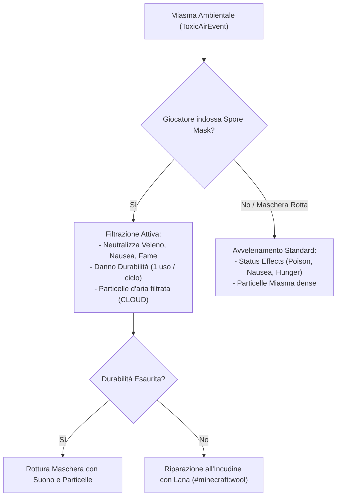
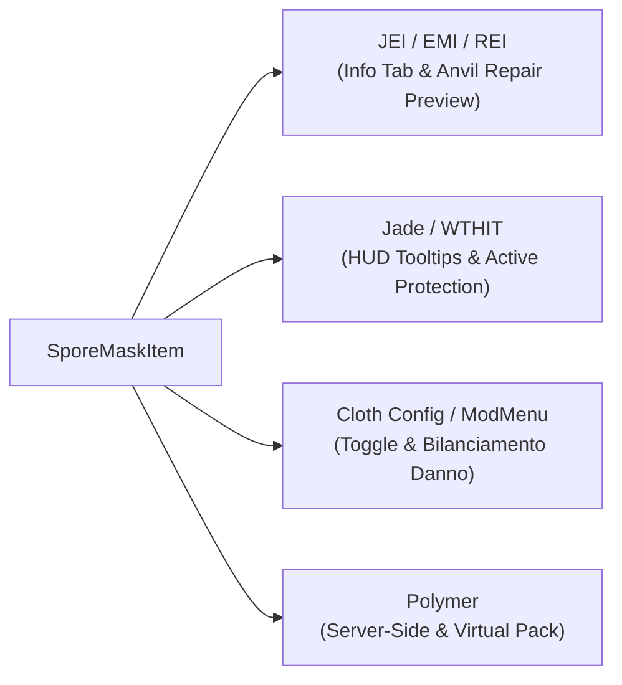
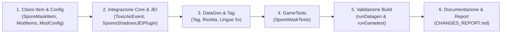

# 📋 Piano di Implementazione: Maschera Antispore / Respiratore (*Spore Mask*)

**Feature Reference**: [TODO.md](file:///C:/Users/r.pirosu/Desktop/spores--shadows-template-1.21.1/docs/TODO.md) — Punto 2: *Equipaggiamento Protettivo: Maschera Antigas / Respiratore*  
**Versione Target**: Spores & Shadows 1.2.0 (Fabric 1.21.1)

---

## 📑 Indice del Piano
1. [Obiettivi & Panoramica](#1-obiettivi--panoramica)
2. [Specifiche Tecniche dell'Item](#2-specifiche-tecniche-dellitem)
3. [Meccanica del Filtro & Riparazione](#3-meccanica-del-filtro--riparazione)
4. [Integrazione con il Motore Miasma (`ToxicAirEvent`)](#4-integrazione-con-il-motore-miasma-toxicairevent)
5. [Integrazione con Incantesimi & Postazioni di Lavoro](#5-integrazione-con-incantesimi--postazioni-di-lavoro)
6. [Compatibilità & Integrazione con Altre Mod (JEI, Jade, Cloth Config, Polymer)](#6-compatibilità--integrazione-con-altre-mod-jei-jade-cloth-config-polymer)
7. [Pipeline di DataGen, Ricetta & Localizzazione](#7-pipeline-di-datagen-ricetta--localizzazione)
8. [Suite di Collaudo Automatizzato GameTest](#8-suite-di-collaudo-automatizzato-gametest)
9. [Fasi di Esecuzione Dettagliate](#9-fasi-di-esecuzione-dettagliate)

---

## 1. Obiettivi & Panoramica

L'obiettivo è introdurre la **Maschera Antispore** (*Spore Mask*), un copricapo speciale equipaggiabile nello slot testa (`EquipmentSlot.HEAD`) che protegge completamente il giocatore dagli effetti nocivi del Miasma gassoso (*Fame*, *Nausea*, *Veleno Letale*) nelle stanze infette e non ventilate.

La maschera introduce una meccanica di sopravvivenza attiva:
* **Filtrazione attiva**: neutralizza le tossine nell'aria consumando progressivamente durabilità.
* **Manutenzione tematica**: si ripara all'incudine sostituendo il filtro esausto con **Lana (`#minecraft:wool`)**.
* **Compatibilità totale**: funziona con tutti gli incantesimi per elmi, tavolo degli incantesimi, mola e Polymer.



---

## 2. Specifiche Tecniche dell'Item

| Proprietà | Valore / Configurazione | Note di Design |
| :--- | :--- | :--- |
| **Identificativo Registrazione** | `spores--shadows:spore_mask` | Registrato in `Registries.ITEM`. |
| **Classe Java** | `moldmod.item.SporeMaskItem` | Estende `ArmorItem`, implementa `PolymerItem`. |
| **Slot Equipaggiamento** | `ArmorItem.Type.HELMET` (`EquipmentSlot.HEAD`) | Equipaggiabile come copricapo. |
| **Punti Armatura (Defense)** | **+1 Armatura** ($0.5$ scudo) | Pari all'elmo di cuoio vanilla (respiratore leggero). |
| **Durabilità Base** | **165 usi** | Bilanciata per esplorazioni prolungate. |
| **Enchantability** | **15** | Consente incantesimi di livello avanzato all'Enchanting Table. |
| **Materiale Armatura** | `SPORE_MASK_MATERIAL` | Registrato in `Registries.ARMOR_MATERIAL`. |
| **Suono Equipaggiamento** | `SoundEvents.ITEM_ARMOR_EQUIP_LEATHER` | Feedback audio organico in cuoio e tessuto. |
| **Fallback Polymer Client** | `Items.LEATHER_HELMET` | Compatibilità server-side per client vanilla. |

---

## 3. Meccanica del Filtro & Riparazione

1. **Ingrediente di Riparazione (Lana)**:
   * Nel materiale `SPORE_MASK_MATERIAL` e nel metodo `canRepair(ItemStack, ItemStack)` viene impostato il tag `#minecraft:wool`.
   * Qualsiasi blocco di lana (bianca, nera, colorata) funge da **filtro ricambiabile**.
2. **Supporto Postazioni Vanilla**:
   * **Incudine (Anvil)**: Riparazione consumando unità di lana; unione di due maschere usate; applicazione di libri incantati e rinomina.
   * **Mola (Grindstone)**: Disincantamento con recupero di XP; riparazione combinando due maschere usate senza costo in livelli.
   * **Banco da Lavoro (Crafting Grid Repair)**: Unione di due maschere usate nella griglia $2\times2$ o $3\times3$ con il consueto bonus vanilla $+5\%$.

---

## 4. Integrazione con il Motore Miasma (`ToxicAirEvent`)

All'interno di [`ToxicAirEvent.checkRoomMiasma`](file:///C:/Users/r.pirosu/Desktop/spores--shadows-template-1.21.1/src/main/java/moldmod/event/ToxicAirEvent.java#L216):

```java
ItemStack headStack = player.getEquippedStack(EquipmentSlot.HEAD);
boolean hasSporeMask = config.toxicity.enable_spore_mask_protection && headStack.isOf(ModItems.SPORE_MASK);

switch (result.level) {
    case LETHAL_POISON -> {
        if (hasSporeMask) {
            headStack.damage(config.toxicity.spore_mask_damage_per_exposure, player, EquipmentSlot.HEAD);
            world.spawnParticles(player, ParticleTypes.CLOUD, false, 
                    player.getX(), player.getEyeY() - 0.1, player.getZ(), 2, 0.1, 0.1, 0.1, 0.01);
            MoldyBlockHelper.grantAdvancement(player, "spore_mask_protection");
            spawnLightParticles(world, player, result);
        } else {
            player.addStatusEffect(new StatusEffectInstance(StatusEffects.POISON, config.toxicity.duration_poison_ticks, config.toxicity.poison_amplifier, false, false, true));
            player.addStatusEffect(new StatusEffectInstance(StatusEffects.NAUSEA, config.toxicity.duration_nausea_ticks, config.toxicity.nausea_amplifier, false, false, true));
            MoldyBlockHelper.grantAdvancement(player, "toxic_air");
            spawnDenseParticles(world, player, result);
        }
    }
    case MODERATE_HUNGER -> {
        if (hasSporeMask) {
            headStack.damage(config.toxicity.spore_mask_damage_per_exposure, player, EquipmentSlot.HEAD);
            world.spawnParticles(player, ParticleTypes.CLOUD, false, 
                    player.getX(), player.getEyeY() - 0.1, player.getZ(), 1, 0.1, 0.1, 0.1, 0.01);
            MoldyBlockHelper.grantAdvancement(player, "spore_mask_protection");
        } else {
            player.addStatusEffect(new StatusEffectInstance(StatusEffects.HUNGER, config.toxicity.duration_hunger_ticks, config.toxicity.hunger_amplifier, false, false, true));
            spawnLightParticles(world, player, result);
        }
    }
    case WARNING -> spawnWarningParticles(world, player, result);
    case CLEAN -> {}
}
```

* **Danno con Incantesimi**: `ItemStack.damage(int, ServerPlayerEntity, EquipmentSlot)` calcola automaticamente la riduzione d'usura fornita dall'incantesimo **Indistruttibilità (*Unbreaking*)**.
* **Gestione Rottura**: Quando la durabilità scende a 0, Minecraft distrugge automaticamente l'oggetto con suono e particelle di rottura; al successivo ciclo di miasma il giocatore non avrà più protezione e subirà i normali effetti tossici.

---

## 5. Integrazione con Incantesimi & Postazioni di Lavoro

Per garantire la piena compatibilità con l'**Enchanting Table** in Minecraft 1.21.1, l'item viene registrato nei tag:
* `#minecraft:head_armor`
* `#minecraft:enchantable/head_armor`
* `#minecraft:enchantable/durability`
* `#minecraft:enchantable/vanishing`

### Incantesimi Supportati:
* 🛡️ **Protezione Generale & Specifica**: *Protection*, *Fire Protection*, *Blast Protection*, *Projectile Protection*.
* 💎 **Indistruttibilità (*Unbreaking*)**: Riduce drasticamente il consumo del filtro in ambienti miasmatici.
* 🔄 **Ripristino (*Mending*)**: Ripara la maschera raccogliendo sfere di esperienza.
* 🌊 **Respirazione (*Respiration*) & Affinità all'Acqua (*Aqua Affinity*)**.
* 🌵 **Spine (*Thorns*)**.
* 👻 **Maledizione della Scomparsa / Legame (*Curse of Vanishing / Binding*)**.

---

## 6. Compatibilità & Integrazione con Altre Mod (JEI, Jade, Cloth Config, Polymer)



### A. Integrazione JEI (Just Enough Items) / EMI / REI
* **Scheda Informativa Dedicata (`addIngredientInfo`)**:
  * Registrata in [`SporesShadowsJEIPlugin.java`](file:///C:/Users/r.pirosu/Desktop/spores--shadows-template-1.21.1/src/client/java/moldmod/client/integration/jei/SporesShadowsJEIPlugin.java).
  * Premendo `U` (Usi) o `R` (Ricette) sull'oggetto, visualizza:
    * Protezione totale da Miasma, Veleno, Nausea e Fame.
    * Sostituzione del filtro / Riparazione all'Incudine tramite **Lana (`#minecraft:wool`)**.
    * Piena compatibilità con Enchanting Table (*Unbreaking*, *Mending*, *Protection*, *Respiration*).
* **Ricetta Sagomata nel Crafting Grid JEI**: Visualizzazione immediata di tutti i materiali richiesti (Cuoio, Vetro, Rame, Lana, Favo).
* **Anteprima Riparazione Anvil**: Riconoscimento automatico della combinazione `Maschera Danneggiata + Lana` nella schermata dell'incudine JEI.

### B. Integrazione Jade / WTHIT (HUD Tooltips & Entity View)
* **Tooltip Dettagliato in Inventario**: Visualizzazione dinamica di Punti Armatura (+1), Durabilità residua e indicazione di protezione biologica attiva.
* **Riconoscimento Entity / ArmorStand**: Quando il giocatore inquadra un supporto per armature o un altro giocatore con la Maschera Antispore equipaggiata, Jade visualizza l'icona dell'oggetto e il nome localizzato.
* **Componente di Stato Ambientale**: Jade riconosce se il giocatore è immune al miasma grazie alla maschera equipaggiata.

### C. Integrazione Cloth Config & ModMenu
Aggiunta di nuove opzioni configurabili in [`ModConfig.java`](file:///C:/Users/r.pirosu/Desktop/spores--shadows-template-1.21.1/src/main/java/moldmod/config/ModConfig.java) nella categoria `toxicity`:
* `enable_spore_mask_protection` (default: `true`): toggle generale per abilitare/disabilitare la protezione da miasma.
* `spore_mask_damage_per_exposure` (default: `1`): punti di durabilità consumati dalla maschera ad ogni ciclo di esposizione al gas tossico.
* **Supporto Hot-Reload**: Le modifiche ai valori hanno effetto immediato senza riavvio tramite il comando `/spores reload`.

### D. Integrazione Polymer & Strategia Texture (Asset & Fallback)
* **Grafica Primaria Personalizzata**:
  * File texture pixel art dedicato $16\times16$ in `src/main/resources/assets/spores--shadows/textures/item/spore_mask.png` (struttura in cuoio scuro, visore riflettente in vetro e bocchetta/filtro frontale circolare in rame e lana).
  * Modello JSON generato in [`MoldyResourceGenerator.java`](file:///C:/Users/r.pirosu/Desktop/spores--shadows-template-1.21.1/src/main/java/moldmod/resource/MoldyResourceGenerator.java) (`models/item/spore_mask.json`) e caricato nel Virtual Resource Pack di Polymer in RAM.
* **Fallback Nativo Vanilla Trasparente**:
  * Metodo `PolymerItem.getPolymerItem(...)` che restituisce `Items.LEATHER_HELMET`.
  * I client vanilla senza il resource pack opzionale possono vedere, equipaggiare e usare l'oggetto senza crash né problemi di compatibilità.

---

## 7. Pipeline di DataGen, Ricetta & Localizzazione

### A. Ricetta Sagomata al Banco da Lavoro
```text
[ Cuoio ] [ Pannello di Vetro ] [ Cuoio ]
[ Rame  ] [       Lana        ] [ Rame  ]
[   -   ] [    Favo d'Api     ] [   -   ]
```
* **Ingredienti**: 2 Cuoio, 1 Pannello di Vetro (`Items.GLASS_PANE`), 2 Lingotti di Rame (`Items.COPPER_INGOT`), 1 Lana (`ItemTags.WOOL`), 1 Favo d'Api (`Items.HONEYCOMB`).

### B. Localizzazioni Multilingua (5 Lingue)
* 🇬🇧 `en_us`: `"item.spores--shadows.spore_mask": "Spore Mask"`
* 🇮🇹 `it_it`: `"item.spores--shadows.spore_mask": "Maschera Antispore"`
* 🇪🇸 `es_es`: `"item.spores--shadows.spore_mask": "Máscara Antiesporas"`
* 🇫🇷 `fr_fr`: `"item.spores--shadows.spore_mask": "Masque Anti-Spores"`
* 🇩🇪 `de_de`: `"item.spores--shadows.spore_mask": "Sporenmaske"`

---

## 8. Suite di Collaudo Automatizzato GameTest

Creazione della nuova classe di test [`SporeMaskTests.java`](file:///C:/Users/r.pirosu/Desktop/spores--shadows-template-1.21.1/src/test/java/moldmod/test/SporeMaskTests.java):
1. `testMaskEquipmentAndArmor`: Verifica che la maschera sia equipaggiabile nello slot testa e fornisca +1 di armatura.
2. `testMaskMiasmaProtection`: Verifica che un giocatore che indossa la maschera in una stanza satura di miasma non riceva Veleno/Nausea/Fame.
3. `testMaskDurabilityConsumption`: Verifica che la maschera subisca danno alla durabilità quando filtra il gas.
4. `testMaskWoolRepair`: Verifica che la maschera sia riparabile all'incudine tramite lana (`ItemTags.WOOL`).
5. `testMaskEnchantability`: Verifica che la maschera accetti *Unbreaking* e *Mending*.

---

## 9. Fasi di Esecuzione Dettagliate



1. **Fase 1**: Creazione di `moldmod.item.SporeMaskItem`, `moldmod.item.ModItems` e opzioni in `ModConfig.java`.
2. **Fase 2**: Inizializzazione in `SporesShadows.java`, protezione in `ToxicAirEvent.java` e scheda informativa in `SporesShadowsJEIPlugin.java`.
3. **Fase 3**: Aggiornamento dei DataGen (`ModItemTagProvider`, `ModRecipeProvider`, Language Providers multilingua).
4. **Fase 4**: Scrittura dei test automatizzati in `SporeMaskTests.java`.
6. **Fase 6**: Aggiornamento e allineamento completo di [`docs/CHANGES_REPORT.md`](file:///C:/Users/r.pirosu/Desktop/spores--shadows-template-1.21.1/docs/CHANGES_REPORT.md) con la nuova sezione dedicata all'equipaggiamento, al filtro in lana, alle ricette e alle integrazioni.

---

## 10. 🎭 Personalizzazione del Render della Maschera Indossata sul Giocatore (3D Head Armor)

Quando un giocatore o un'entità indossa la maschera nello slot testa, Minecraft renderizza il modello 3D dell'armatura sull'entità tramite una **Armor Texture Layer**.

### A. Struttura del file di Texture (`layer_1.png`)
* **Dimensioni Standard**: Immagine PNG a canale alpha da **$64\times32$ pixel** (oppure $64\times64$ pixel).
* **Percorso Asset nel Progetto**:
  ```text
  src/main/resources/assets/spores--shadows/textures/models/armor/spore_mask_layer_1.png
  ```

### B. Mappatura UV della Testa (Coordinate standard $64\times32$)
* **Testa Base** (Riquadro $[0, 0]$ a $[32, 16]$):
  * **Top**: $[8, 0, 16, 8]$
  * **Bottom**: $[16, 0, 24, 8]$
  * **Front (Viso/Maschera)**: $[8, 8, 16, 16]$
  * **Back (Nuca/Cinghie)**: $[24, 8, 32, 16]$
  * **Right (Filtro destro)**: $[0, 8, 8, 16]$
  * **Left (Filtro sinistro)**: $[16, 8, 24, 16]$
* **Overlay / Visiera esterna** (Riquadro $[32, 0]$ a $[64, 16]$):
  * Utilizzabile per visiere in vetro trasparenti, sporgenze dei filtri a cartuccia o cinghie di serraggio esterne.

### C. Integrazione con Materiale Armatura & Polymer
1. Collegare il layer dedicato `SporesShadows.id("spore_mask")` all'`ArmorMaterial` in [`ModItems.java`](file:///C:/Users/r.pirosu/Desktop/spores--shadows-template-1.21.1/src/main/java/moldmod/item/ModItems.java).
2. Per il supporto sui client vanilla tramite Polymer, registrare il modello armatura tramite:
   ```java
   PolymerResourcePackUtils.requestArmor(SporesShadows.id("spore_mask"));
   ```

