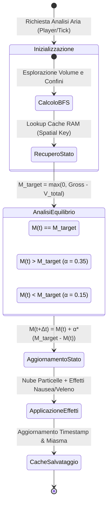

# 🌫️ Proposta Architetturale: Gestione Dinamica della Saturazione e Dissipazione delle Spore
**Progetto**: Spores & Shadows (Minecraft Fabric 1.21.1)  
**Documento**: Proposta Modello Ibrido (Flusso Proporzionale + Decadimento Temporale)  
**Data**: 29 Agosto 2026  
**Autore / Target**: Core Architecture & Simulation Physics  

---

## 📑 Indice dei Contenuti
1. [Obiettivi di Design ed Esperienza Utente](#-1-obiettivi-di-design-ed-esperienza-utente)
2. [Confronto tra Modello Attuale e Modello Proposto](#-2-confronto-tra-modello-attuale-e-modello-proposto)
3. [Il Modello Fisico-Matematico Ibrido](#-3-il-modello-fisico-matematico-ibrido)
4. [Diagramma di Stato e Flusso della Dinamica dei Gas](#-4-diagramma-di-stato-e-flusso-della-dinamica-dei-gas)
5. [Architettura Tecnica Server-Side (Zero-Lag & RAM Cache)](#-5-architettura-tecnica-server-side-zero-lag--ram-cache)
6. [Feedback Visivo, Sonoro e Diagnostica HUD / Comandi](#-6-feedback-visivo-sonoro-e-diagnostica-hud--comandi)
7. [Matrice di Configurazione Parametrica (Cloth Config / ModMenu)](#-7-matrice-di-configurazione-parametrica-cloth-config--modmenu)
8. [Piano di Collaudo Automatizzato (GameTest Suite)](#-8-piano-di-collaudo-automatizzato-gametest-suite)

---

## 🎯 1. Obiettivi di Design ed Esperienza Utente

1. **Eliminazione dell'Exploit "Apri/Chiudi Istantaneo"**:
   * Attualmente, aprire una botola o una porta azzera immediatamente il miasma nel medesimo tick del server, consentendo ai giocatori di bypassare la tossicità aprendo e richiudendo all'istante i varchi.
   * Con la transizione graduale, il ricambio d'aria richiede un **tempo continuo di aerazione**.
2. **Atmosfera Immersiva ("Apertura Cripta Sigillata")**:
   * Quando il giocatore abbatte una parete o apre una porta di una cripta o miniera abbandonata satura di muffa, l'aria mefitica fuoriesce gradualmente, costringendo il giocatore ad attendere la bonifica dell'ambiente prima di avventurarsi all'interno.
3. **Pressione di Equilibrio Fisico (Generazione vs Capacità di Flusso)**:
   * Ambienti con ingenti quantità di focolai marci attivi non vengono purificati completamente da una minuscola fessura, ma raggiungono un livello di equilibrio residuo che richiede interventi di bonifica strutturale (rimozione o ceratura dei focolai).
4. **Finestra Tattica di Manovra**:
   * Quando una stanza mefitica viene arieggiata e successivamente richiusa, il miasma impiega un intervallo temporale percepibile (15-25 secondi) a risaturare l'aria, offrendo al giocatore una finestra di sicurezza per intervenire.

---

## ⚖️ 2. Confronto tra Modello Attuale e Modello Proposto

| Aspetto | Modello Attuale (Statico/Istantaneo) | Modello Proposto (Dinamico Ibrido) |
| :--- | :--- | :--- |
| **Apertura Varco Esterno** | Miasma forzato istantaneamente a $0.0$ (`CLEAN_OPEN_AIR`) | Miasma decade progressivamente verso il target $M_{target}$ in 6–10 secondi |
| **Chiusura di una Stanza Arieggiata** | Miasma sale istantaneamente al valore massimo nel tick successivo | La concentrazione sale gradualmente nell'arco di 15–25 secondi |
| **Apertura Parziale su Grande Focolaio** | Una singola botola azzera stanze con decine di ceppi marci | La ventilazione sottrae un flusso proporzionale; l'aria resta parzialmente tossica |
| **Feedback Particellare** | Le particelle scompaiono/appaiono a gradino binario | La densità della nebbia si dirada visivamente in tempo reale verso le aperture |
| **Persistenza & Memoria** | Nessun dato memorizzato tra i tick | Cache in memoria RAM con garbage collection automatica (zero scritture su disco) |

---

## 🔬 3. Il Modello Fisico-Matematico Ibrido

L'aria all'interno di uno spazio confinato possiede uno stato temporale $M(t)$ (Miasma Effettivo al tempo $t$) che evolve verso un valore di equilibrio $M_{target}$:

### A. Capacità di Flusso e Ventilazione Proporzionale ($V_{total}$)
Ogni tipologia di apertura verso l'esterno contribuisce alla capacità di estrazione dell'aria:

$$V_{total} = \sum V_{\text{varchi}}$$

* **Fessure Singole** (Staccionate, Muretti isolati, Sbarre di ferro, Mezze lastre): $+3.0$
* **Porte Singole Aperte verso l'esterno**: $+15.0$
* **Botole Singole Aperte verso l'esterno/cielo**: $+15.0$
* **Aperture Dirette a Cielo Aperto ($1\times 1$ blocco)**: $+25.0 \text{ per blocco}$
* **Grate di Rame (`GrateBlock`)**: $+20.0 \text{ per blocco}$

---

### B. Miasma Lordo e Target di Equilibrio ($M_{target}$)
$$M_{\text{gross}} = \sum_{\text{ceppi}} \text{Tossicità}(\text{Stadio})$$
$$M_{target} = \max\left(0.0, \, M_{\text{gross}} - V_{total}\right)$$

---

### C. Equazione di Evoluzione Temporale a Step Discreti
Ad ogni intervallo di campionamento $\Delta t$ (default: $40 \text{ tick} = 2.0 \text{ secondi}$):

$$M(t + \Delta t) = M(t) + \alpha \cdot \left( M_{target} - M(t) \right)$$

Il coefficiente di convergenza $\alpha \in (0.0, 1.0]$ è asimmetrico:
1. **Fase di Dissipazione ($M(t) > M_{target}$)**:
   * L'aria fresca spinta dalla pressione atmosferica dissipa le spore rapidamente.
   * $\alpha_{\text{dissipazione}} = 0.35$ ($\approx 70\%$ di riduzione in 4–6 secondi, azzeramento completo in 8–10 secondi).
2. **Fase di Risaturazione ($M(t) < M_{target}$)**:
   * La generazione di spore biologiche da parte dei funghi richiede tempo per accumulare densità.
   * $\alpha_{\text{saturazione}} = 0.15$ ($\approx 15–20$ secondi per raggiungere la massima tossicità).

---

## 🔄 4. Diagramma di Stato e Flusso della Dinamica dei Gas



---

## 💾 5. Architettura Tecnica Server-Side (Zero-Lag & RAM Cache)

Per garantire prestazioni inalterate anche su server multiplayer ad alto carico, l'infrastruttura si basa su una cache in-memory volatile senza alcuna serializzazione su NBT dei chunk:

```java
public class RoomSaturationManager {
    // Chiave univoca deterministica: (WorldId + Coordinate Minime Bounding Box) -> RoomGasState
    private static final Map<Long, RoomGasState> ACTIVE_ROOMS = new ConcurrentHashMap<>();

    public record RoomGasState(
        double currentMiasma,
        double targetMiasma,
        long lastUpdateTick
    ) {}

    public static double getAndUpdateMiasma(ServerWorld world, BlockPos roomAnchorPos, double targetMiasma, long currentTick) {
        long key = roomAnchorPos.asLong();
        RoomGasState state = ACTIVE_ROOMS.get(key);

        if (state == null) {
            // Nuova stanza scansionata: inizializza con target immediato
            ACTIVE_ROOMS.put(key, new RoomGasState(targetMiasma, targetMiasma, currentTick));
            return targetMiasma;
        }

        long elapsedTicks = currentTick - state.lastUpdateTick();
        if (elapsedTicks <= 0) {
            return state.currentMiasma();
        }

        // Calcolo coefficiente in base al tempo trascorso
        double current = state.currentMiasma();
        double alpha = (current > targetMiasma) ? 0.35 : 0.15;
        double steps = elapsedTicks / 40.0; // Normalizzato sui tick di campionamento
        
        double updated = current + (1.0 - Math.pow(1.0 - alpha, Math.max(1.0, steps))) * (targetMiasma - current);
        
        ACTIVE_ROOMS.put(key, new RoomGasState(updated, targetMiasma, currentTick));
        return updated;
    }

    // Eseguito ogni 60 secondi: rimuove le stanze non più interrogate da giocatori
    public static void cleanupStaleRooms(long currentTick) {
        ACTIVE_ROOMS.entrySet().removeIf(entry -> (currentTick - entry.getValue().lastUpdateTick()) > 1200);
    }
}
```

---

## 🎨 6. Feedback Visivo, Sonoro e Diagnostica HUD / Comandi

### A. Feedback Particellare e Visivo Proporzionale
* Il numero di particelle di spore (`SPORE_BLOSSOM_AIR`, `MYCELIUM`) spawnate nello spazio d'aria della stanza è proporzionale a $M(t) / M_{\text{max}}$.
* All'apertura di un varco, il giocatore osserva la nebbia tossica diradarsi gradualmente nell'arco di pochi secondi verso l'uscita.

### B. Integrazione con il Comando `/miasma`
L'output del comando visualizza lo stato dinamico e la proiezione temporale:
```text
=== Miasma Air Analysis (Dynamic Simulation) ===
- Position: [120, 64, -310]
- Status: DISSIPATING (Purifying Air...)
- Current Miasma: 18.40 -> Target: 0.00
- Ventilation Capacity: +30.0 (Door: +15, Grate: +15)
- Estimated Clearance Time: ~4.8s
- Current Toxicity Level: WARNING (Transitioning to CLEAN)
```

---

## ⚙️ 7. Matrice di Configurazione Parametrica (`ModConfig.java`)

Tutti i coefficienti fisici e i tassi di scambio sono esposti per la personalizzazione in ModMenu e Cloth Config:

| Parametro Config | Tipo | Valore Default | Descrizione |
| :--- | :---: | :---: | :--- |
| `enable_dynamic_spore_saturation` | `boolean` | `true` | Abilita la transizione e simulazione temporale della saturazione |
| `dissipation_speed_multiplier` | `double` | `0.35` | Tasso di velocità di dissipazione quando $M(t) > M_{target}$ |
| `saturation_speed_multiplier` | `double` | `0.15` | Tasso di velocità di accumulo quando $M(t) < M_{target}$ |
| `door_ventilation_value` | `double` | `15.0` | Capacità di estrazione di una porta aperta verso l'esterno |
| `open_sky_ventilation_per_block` | `double` | `25.0` | Capacità di estrazione per blocco d'aria a cielo aperto |
| `trapdoor_ventilation_value` | `double` | `15.0` | Capacità di estrazione di una botola aperta verso l'esterno |
| `gap_ventilation_value` | `double` | `3.0` | Capacità di estrazione per fessura (staccionata, muretto, sbarra) |

---

## 🧪 8. Piano di Collaudo Automatizzato (GameTest Suite)

Per garantire la stabilità e la deterministica correttezza della fisica dei gas, verranno introdotti i seguenti GameTest dedicati:

1. `testGradualDissipationOnDoorOpen`:
   * Misura $M(t)$ al tick 0, tick 40 e tick 80 dall'apertura di una porta, verificando la curva di decadimento decrescente $M(0) > M(40) > M(80) \approx 0.0$.
2. `testGradualSaturationOnDoorClose`:
   * Misura $M(t)$ al tick 0, tick 40 e tick 100 dalla chiusura della porta, verificando la risaturazione progressiva dell'aria.
3. `testEquilibriumOnPartialVentilation`:
   * Stanza con 10 ceppi marci ($M_{\text{gross}} = 30.0$) e 1 fessura ($V = 3.0$); verifica che il miasma converga a $M_{target} = 27.0$ senza azzerarsi.
4. `testMemoryCleanupOnRoomAbandonment`:
   * Verifica che le stanze non più frequentate vengano automaticamente rimosse dalla RAM senza perdite di memoria.
