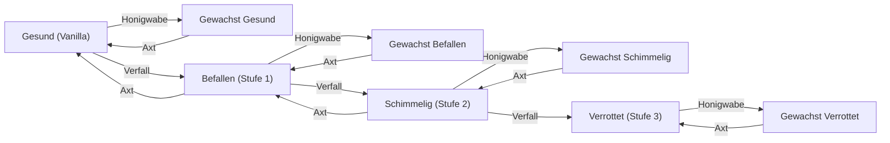

# Spores & Shadows 

**Spores & Shadows** ist eine Mod für Minecraft (Fabric 1.21.1), die ein dynamisches, hochrealistisches und unerbittliches Ökosystem für den Zerfall von Holz einführt. Keine hölzerne Struktur ist vor der Zeit, Feuchtigkeit und den Elementen sicher!

---

## 📑 Inhaltsverzeichnis
1. [🌳 Übersicht und Inhalte](#-übersicht-und-inhalte)
2. [🦠 Der Schimmelkreislauf](#-der-schimmelkreislauf)
3. [☠️ Umweltgefahren (Volumetrisches Miasma)](#️-umweltgefahren-volumetrisches-miasma)
4. [🛠️ Interaktionen und Vorbeugung](#️-interaktionen-und-vorbeugung)
5. [⚖️ Physikalische Eigenschaften, Strafen und Crafting](#️-physikalische-eigenschaften-strafen-und-crafting)
6. [🗺️ Generierung von Strukturen](#️-generierung-von-strukturen)
7. [📊 HUD-, JEI- & Mod-Integrationen](#-hud--jei--mod-integrationen)
8. [💻 Admin- und Debug-Befehle](#-admin--und-debug-befehle)
9. [⚙️ Mod-Konfiguration (Cloth Config)](#️-mod-konfiguration-cloth-config)

---

## 🌳 Übersicht und Inhalte

Hast du jemals eine majestätische Holzhütte gebaut und gedacht, dass sie unversehrt bleibt, die Jahrhunderte überdauert und keinerlei Wartung bedarf? **Spores & Shadows** revolutioniert diese Gewissheit und verwandelt Holz von einem einfachen, statischen Block in ein lebendiges, verletzliches und auf die Umgebung reagierendes Material.

Die Mod ersetzt nahtlos und unbemerkt jedes vom Spieler platzierte (oder natürlich in Strukturen wie Schiffswracks und Minenschächten generierte) Holz durch eine ruhende Variante. Im Laufe der Zeit besiegeln Witterungseinflüsse wie Regen, Feuchtigkeit, Dunkelheit, Tiefe und das lokale Biom das Schicksal deiner Bauten. Du bist gefordert, deine Gebäude aktiv zu pflegen und zu schützen – oder ihrem unaufhaltsamen Verfall zuzusehen.

### 🔢 Technische Details und neue Blöcke

Auf technischer Ebene fügt die Mod für jede einzelne Holzvariante des Spiels ein vollständiges Ökosystem hinzu (einschließlich Karmesin- und Wirrholz aus dem Nether):

* **🧱 13 Architektonische Formate**: *Stämme*, *Entrindete Stämme*, *Holz*, *Entrindetes Holz*, *Bretter*, *Treppen*, *Stufen*, *Zäune*, *Zauntore*, *Türen*, *Falltüren*, *Druckplatten*, *Knöpfe*.

Für jedes der 130 Basis-Holzformate implementiert die Mod **3 schimmlige Zerfallsvarianten** (*Befallen*, *Schimmelig*, *Verrottet*). Zusätzlich existiert für jeden dieser Blöcke – einschließlich des ursprünglichen Vanilla-Basisblocks – eine entsprechende **gewachste Variante**.

Auf diese Weise bietet das Spiel **910 einzigartige Varianten, die im Survival-Modus voll erhältlich und nutzbar sind**:
1. Die **130 gewachsten Vanilla-Varianten**: Die geschützte und versiegelte Kopie des Basisblocks.
2. Die **390 schimmligen Varianten**: Die drei natürlichen Zerfallsstadien.
3. Die **390 gewachsten schimmligen Varianten**: Die verfallenen, aber durch Bienenwachs in der Zeit dauerhaft konservierten Blöcke.

> [!TIP]
> **Konservierung & Dekoration**: Du kannst verwitterte oder überwucherte Blöcke gezielt im Survival-Modus entstehen lassen und sie anschließend mit einer Honigwabe versiegeln. Dadurch behält der Block seine einzigartige morbide Textur, verliert aber jegliche Ansteckungskraft und gast kein Miasma mehr aus.

---

## 🦠 Der Schimmelkreislauf

Holz durchläuft 4 aufeinanderfolgende Zerfallsstadien:  
**Gesund / Vanilla (0) ➔ Befallen (1) ➔ Schimmelig (2) ➔ Verrottet (3)**.

Ein Übergang in die nächste Stufe wird bei jedem Zufallsticker berechnet und vollzieht sich nur, wenn das dynamische **Infektionsrisiko ($R$)** den konfigurierten Schwellenwert von standardmäßig **0.40** überschreitet:

$$R = \Big( (\text{Feuchtigkeit} \times \text{Licht} \times \text{Anfälligkeit}) + \text{Ansteckung} \Big) \times \text{Temperatur}$$

### 🔬 Genaue Faktoren und Parameter

* 💧 **Feuchtigkeit ($\text{Moisture}$)**:
  * **Biom-Basiswert**: Abhängig vom Niederschlag des Bioms (Regen/Schnee: `0.8`, Trocken: `0.3`).
  * **Tiefen-Malus**: Unterhalb des Meeresspiegels ($Y < 64$) steigt die Grundfeuchtigkeit drastisch um `+0.01` pro Block Tiefe an ($Y=48 \rightarrow +0.16$, tiefere Höhlen und Minen erreichen maximale Feuchtigkeit).
  * **Lokale Nachbarschaft**: Direkter Kontakt mit Wasserblöcken addiert `+0.15`, Kessel addieren `+0.10`.
* ☀️ **Licht ($\text{Licht / UV}$)**:
  * Skaliert linear von `0.0` (Lichtlevel 15, blockiert den Zerfall vollständig) bis `1.0` (Vollkommene Dunkelheit / Lichtlevel 0).
* 🪓 **Material-Anfälligkeit ($\text{Susceptibility}$)**:
  * Entrindetes Holz ist besonders schutzlos (`x1.4`), rohe Stämme sind der Standard (`x1.0`), während gesägte Bretter dichter und widerstandsfähiger sind (`x0.8`).
* 🌡️ **Temperatur ($\text{Temperature}$)**:
  * Dient als biologischer Überlebensfilter: Schimmelsporen vermehren sich **nur** in einem Temperaturfenster zwischen `0.15` und `1.5`.
  * **Oberfläche**: Extreme Klimazonen wie sengende Wüsten oder vereiste Gletscher stoppen den Schimmelbefall ($0.0$).
  * **Nether & End**: Die extreme Hitze des Nethers und das eisige Vakuum des Ends sind für Schimmelpilze absolut tödlich. Holz verrottet in diesen Dimensionen niemals spontan.
  * **Tiefen-Normalisierung ($Y < 64$)**: Tief unter der Erde nähert sich die Temperatur unabhängig vom Oberflächenbiom an und stabilisiert sich ab $Y \le 48$ bei milden `0.5`. Auch unter Wüsten oder Tundren schimmelt Holz im Untergrund!
  * **Höhen-Vereisung ($Y > 128$)**: Mit zunehmender Höhe kühlt die Luft ab und gefriert ab $Y=256$ bei `-0.5`. Berghütten im Hochgebirge sind von Natur aus hervorragend geschützt.
* ☣️ **Ansteckung & Katalysatoren ($\text{Contagion}$)**:
  * Direkter Nachbarschaftskontakt mit Pilzherden beschleunigt die Infektion massiv:
    * Befallener Block: `+0.05`
    * Schimmeliger Block: `+0.10`
    * Verrotteter Block: `+0.20`
    * Schlamm: `+0.05`
    * Podsol / Myzel: `+0.15`
    * Pilze (Braun / Rot): `+0.25`
    * Sporenblüte (*Spore Blossom*): `+0.80`

---

## ☠️ Umweltgefahren (Volumetrisches Miasma)

- ✨ **Sporenpartikel**: Ungewachste Blöcke im Stadium **Schimmelig** oder **Verrottet** sondern bei Kontakt mit Luft kontinuierlich sichtbare Sporen ab (unter Wasser inaktiv).
- 🤢 **Volumetrisches Miasma-System (Flood-Fill BFS)**:
  Das Miasma-System nutzt einen präzisen 3D-Breitensuche-Algorithmus (*Flood-Fill BFS*), der von den Augen des Spielers ausgeht und geschlossene Räume scannt:
  * **Freie Natur vs. Geschlossener Raum**: Im Freien oder in weitläufigen Hallen mit direktem Himmelskontakt verflüchtigen sich Sporen augenblicklich ($openAir = true$). In engen Räumen oder feuchten Kellern (bis zu $512\text{ m}^3$ Raumvolumen) staut sich das giftige Gas an.
  * **Manhattan-Radius-Begrenzung**: Die Erkennung ist auf einen maximalen Manhattan-Radius von $8$ Blöcken begrenzt ($|x| + |y| + |z| \le 8$), wodurch endlose Tunnelketten performance-schonend begrenzt werden.
  * **Wände und Durchgänge**: Solide Vollblöcke versiegeln den Raum. Offene Türen, Falltüren oder Treppen lassen das Miasma ungehindert in Nebenräume strömen.
  * **Natürliche Belüftung (*Ventilation*)**: Teilblöcke mit Öffnungen zur Außenwelt (wie Zäune, Eisengitter, Mauern oder Fensterluken) zählen als Belüftungsöffnungen und verringern den Toxizitätswert massiv ($\text{Ventilation Score} += 3.0$ pro Fuge):
    $$\text{Netto-Miasma} = \text{Toxizitäts-Score} - \text{Belüftungs-Score}$$
    $$\text{Sporendichte} = \frac{\text{Netto-Miasma}}{\text{Raumvolumen}}$$

### ⚠️ Statuseffekte und Vergiftungsschwellen

| Gefahrenstufe | Kriterien (Netto-Miasma & Dichte) | Symptome & Statuseffekte |
| :--- | :--- | :--- |
| 🟢 **Sicher** | $\text{Netto-Miasma} < 3.0$ | Saubere Luft, keine Effekte. |
| 🟡 **Warnung** | $\text{Netto-Miasma} \ge 3.0$ oder $\text{Dichte} \ge 0.04$ | Feine Myzel-Sporen schweben in der Raumluft. |
| 🟠 **Mäßig** | $\text{Netto-Miasma} \ge 8.0$ (oder $\text{Dichte} \ge 0.09 \land \text{Netto} \ge 5.0$) | **Hunger** (Sporen greifen die Atemwege an). |
| 🔴 **Tödlich** | $\text{Netto-Miasma} \ge 35.0$ (oder $\text{Dichte} \ge 0.18 \land \text{Netto} \ge 15.0$) | **Übelkeit + Vergiftung** (Schwere Mykotoxikose). |

*(💡 Alle Schwellenwerte, Dauern und Effektstärken lassen sich im Konfigurationsmenü flexibel justieren).*

---

## 🛠️ Interaktionen und Vorbeugung

Durch Interaktion im **Schleich-Modus (Sneaking / Shift)** kannst du das Schicksal von Holzblöcken gezielt steuern. Das Schleichen verhindert versehentliche Auslösungen bei interaktiven Blöcken (z. B. Türen, Falltüren oder Knöpfen).



* 🪓 **Axt (Abkratzen & Heilen)** – *Shift + Rechtsklick*:
  1. **Entwachsen**: Entfernt die Wachsschicht von jedem gewachsten Block und setzt den biologischen Zyklus wieder in Kraft.
  2. **Schimmel entfernen**: Kratzt die oberflächliche Pilzschicht ab und senkt die Zerfallsstufe um $1$ (*Schimmelig ➔ Befallen ➔ Gesund Vanilla*). Verbraucht Werkzeughaltbarkeit.
* 🐝 **Honigwabe (Wachsen & Versiegeln)** – *Shift + Rechtsklick*:
  * Funktioniert auf **allen 4 Stadien**. Gewachstes Holz ist dauerhaft versiegelt: Es verrottet nicht weiter, steckt keine Nachbarblöcke an, emittiert kein Miasma und **droppt beim Abbau immer zu 100%**.
* 🚪 **Mehrteilige Blöcke**: Aktionen auf Türen, Doppelstufen oder Betten synchronisieren sich sofort über alle Hälften der Struktur.

---

## ⚖️ Physikalische Eigenschaften, Strafen und Crafting

Wenn Holz verrottet, wird seine innere Zellulose- und Ligninstruktur irreversibel zersetzt. Dies spiegelt sich in allen physikalischen und handwerklichen Eigenschaften wider:

### 1. 🧱 Progressive Härte-Skalierung & Abbaugeschwindigkeit
Die Härte eines Blocks bestimmt, wie lange das Abbauen dauert:
* **Stufe 0 (Gesund / Vanilla)**: Härte **2.0** ($100\%$) – Standard-Abbauzeit mit Axt.
* **Stufe 1 (Befallen)**: Härte **1.6** ($80\%$) – Leicht geschwächt.
* **Stufe 2 (Schimmelig)**: Härte **1.0** ($50\%$) – Spürbar poröser.
* **Stufe 3 (Verrottet)**: Härte **0.4** ($20\%$) – **Extreme Brüchigkeit / Friabilität**.

> [!IMPORTANT]
> **Neutralisierung der Axt auf Stufe 3**: Durch den völligen Verlust der inneren Festigkeit lässt sich verrottetes Holz auf Stufe 3 mit der **Axt und mit der bloßen Faust exakt gleich schnell** zerschlagen. Kein Werkzeug bietet hier mehr einen Tempovorteil.

### 2. 💨 Sporenwolken-Effekt & Sound beim Abbau
* Wird ein ungewachster Block der Stufe 2 (*Schimmelig*) oder Stufe 3 (*Verrottet*) **ohne Behutsamkeit (Silk Touch)** abgebaut, bricht das morsche Gefüge mit einem feuchten Pilzgeräusch auf und entlässt eine **dichte Sporenwolke** (`SPORE_BLOSSOM_AIR`, `FALLING_SPORE_BLOSSOM`, `MYCELIUM`) in die Umgebung.
* Mit **Behutsamkeit** oder bei **gewachsten Blöcken** bleibt das Material intakt und es entstehen keine Sporenwolken.

### 3. 💥 Drops & Strukturelle Integrität

| Zerfallsstufe | Drop ohne Silk Touch (Ungewachst) | Drop mit Silk Touch ODER Gewachst |
| :--- | :---: | :---: |
| 🌲 **Gesund (0)** | **100%** Drop | **100%** Drop |
| 🟢 **Befallen (1)** | **100%** Drop | **100%** Drop |
| 🦠 **Schimmelig (2)** | **50%** Drop (50% zerfällt zu Sporenstaub) | **100%** Drop garantiert |
| ☠️ **Verrottet (3)** | **0%** Drop (Vollständiger Kollaps) | **100%** Drop garantiert |

### 4. 🔥 Skalierte Entflammbarkeit & Feuerausbreitung
Trockenes, zersetztes Holz brennt explosionsartig schnell, während Bienenwachs als Brandbeschleuniger wirkt:
* **Stufe 1 (Befallen)**: Entflammbarkeit **+5**, Brandausbreitung **+10**.
* **Stufe 2 (Schimmelig)**: Entflammbarkeit **+10**, Brandausbreitung **+25**.
* **Stufe 3 (Verrottet)**: Entflammbarkeit **+20**, Brandausbreitung **+60** (Brennt lichterloh!).
* **Wachs-Modifikator**: Gewachstes Holz erhält zusätzlich **+5** Entflammbarkeit.
* **Netherholz-Immunität**: Karmesin- und Wirrholz behalten ihre absolute Feuerimmunität (**0**).

### 5. 💣 Skalierte Explosionsresistenz
Zersetzte Holzstrukturen bieten Creepern und TNT kaum noch Gegenwehr:
* **Stufe 0 (Gesund)**: $100\%$ Resistenz (Vanilla: $3.0$).
* **Stufe 1 (Befallen)**: **80%** Resistenz ($2.4$).
* **Stufe 2 (Schimmelig)**: **50%** Resistenz ($1.5$).
* **Stufe 3 (Verrottet)**: **10%** Resistenz ($0.3$ – Zerschellt bei der kleinsten Erschütterung).

### 6. 🛠️ Crafting-Ausbeute & Hybrides Crafting
Infiziertes Holz kann auf der Werkbank zu sauberen Vanilla-Gegenständen verarbeitet werden, verliert jedoch aufgrund des Materialverschnitts an Ertrag:

| Materialqualität | 🌳 Stamm ➔ Bretter | 🦯 Bretter ➔ Stöcke |
| :--- | :---: | :---: |
| 🌲 **Gesund (Vanilla)** | 1 Stamm ➔ **4** Bretter | 2 Bretter ➔ **4** Stöcke |
| 🟢 **Befallen (1)** | 1 Stamm ➔ **2** Bretter | 2 Bretter ➔ **2** Stöcke |
| 🦠 **Schimmelig (2)** | 1 Stamm ➔ **1** Brett | 2 Bretter ➔ **1** Stock |
| ☠️ **Verrottet (3)** | ❌ *Kein Crafting möglich* | ❌ *Kein Crafting möglich* |

> [!TIP]
> **Hybrides Crafting**: Gewachste und ungewachste Blöcke derselben Zerfallsstufe können im Crafting-Gitter beliebig miteinander kombiniert werden.

### 7. 🪵 Ofen-Effizienz & Holzkohle (*Charcoal*)
* **Brennwert-Multiplikatoren**:
  * Stufe 0: **100%** Brenndauer (`1.0x`)
  * Stufe 1: **50%** Brenndauer (`0.5x`)
  * Stufe 2: **25%** Brenndauer (`0.25x`)
  * Stufe 3: **12.5%** Brenndauer (`0.125x`, Mindestbrenndauer: 37 Ticks)
* **Holzkohle-Herstellung**: Alle Stämme und Hölzer der Mod (sowohl verfallen als auch gewachst) unterstützen die Tags `#minecraft:item/charcoal` sowie `#c:charcoal` und können im Ofen zu Holzkohle geschmolzen werden.

### 8. ♻️ Komposter-Chancen
Verrottetes Holz ist ein hervorragender organischer Dünger für den Komposter:
* Befallenes Holz (1): **50%**
* Schimmeliges Holz (2): **65%**
* Verrottetes Holz (3): **85%**

### 9. 🔴 Redstone-Verzögerung
Schimmel dringt in mechanische Schalter ein und lässt diese klemmen:
* **Holzknopf**: Gesund $1.5\text{s}$ (30 Ticks) ➔ Befallen $3.0\text{s}$ ➔ Schimmelig $7.5\text{s}$ ➔ Verrottet $22.5\text{s}$ (450 Ticks).
* **Druckplatte**: Bleibt nach dem Verlassen ebenfalls entsprechend verlängert aktiv.

---

## 🗺️ Generierung von Strukturen

Die Mod klinkt sich in die Weltgenerierung ein und lässt historische Holzstrukturen authentisch verwittern:

1. 🏴‍☠️ **Kritischer Zerfall** (Hoher Anteil an Stufe 3): Schiffswracks (`shipwreck`), Sumpfhütten (`swamp_hut`).
2. 🧟 **Hoher Zerfall** (Mischung aus Stufe 1 und 2): Verlassene Minenschächte (`mineshaft`), Zombiedörfer (`zombie_village`), Pfadruinen (`trail_ruins`).
3. 🏹 **Mäßiger Zerfall** (Hauptsächlich Stufe 1): Plünderer-Außenposten (`pillager_outpost`), Zerstörte Portale (`ruined_portal`).
4. 🏡 **Minimaler Zerfall** (Überwiegend intakt): Normale Dörfer (`village`), Waldanwesen (`mansion`).

### 🛡️ Schutzmechanismen für die Welt

* **Lebende Bäume**: Natürlich gewachsene Bäume sind lebendig und resistent gegen Schimmel.
* **Eingefrorene Strukturen**: Generierte Bauten starten im verfallenen Zustand, sind jedoch standardmäßig "eingefroren" (`structures_immune = true`), damit Dörfer nicht ohne Zutun des Spielers kollabieren. Erst wenn ein Spieler einen Block modifiziert, erwacht die Fäulnis in dessen Umgebung.

---

## 📊 HUD-, JEI- & Mod-Integrationen

### 🔍 Jade / WTHIT-Integration
* Zeigt beim Anvisieren eines Holzblocks den genauen Namen, das Vorschausymbol und das aktuelle **Infektionsrisiko in %** an.
* Dynamische Farbcodierung: **Grau = Sicher (0%)**, **Rot = Gefährdet**. Gewachste Blöcke zeigen dauerhaft $0\%$ an.
* Nativer Raytracing-Callback sorgt für fehlerfreie Tooltips auf modifizierten Blöcken.

### 📖 Just Enough Items (JEI) Integration
Vollständige Integration aller Mod-Mechaniken in JEI:
1. 🐝 **Kategorie Wachsen (*Waxing*)**: Zeigt für alle 130 Holzblöcke das Versiegeln mit Honigwaben (`Block + Honigwabe ➔ Gewachster Block`).
2. 🪓 **Kategorie Axt-Abschaben (*Axe Scraping*)**:
   * **Entwachsen**: `Gewachster Block + Axt ➔ Ungewachster Block`.
   * **Schimmelheilung**: `Schimmelig ➔ Befallen ➔ Gesund Vanilla`.
3. ℹ️ **Fäulnis-Infokarten (*Info Tabs*)**: Ausführliche JEI-Beschreibungen für alle Gegenstände der Stufe 3 (*Verrottet*), die über Zerbrechlichkeit, Miasma und Kompostierung aufklären.

---

## 💻 Admin- und Debug-Befehle

Alle Befehle erfordern standardmäßig Operator-Rechte (Berechtigungsstufe 2):

* 🔎 `/moldrisk` oder `/moldyrisk`:
  * Berechnet das exakte Infektionsrisiko des aktuell anvisierten Holzblocks.
  * `/moldrisk verbose`: Gibt eine detaillierte mathematische Aufschlüsselung aller Variablen (Feuchtigkeit, UV-Licht, Anfälligkeit, Temperatur, Katalysatoren) im Chat aus.
* 🌫️ `/miasma` *(oder `/miasma <spieler>`)*:
  * Führt einen sofortigen BFS-Scan der Raumluft um die Augenposition des Spielers durch.
  * **Chat-Ausgabe**:
    ```text
    === Miasma Air Analysis ===
    - Environment: Confined Space (Volume: 84 / 512 m³)
    - Toxicity Score (from mold): +24.50
    - Ventilation Score (from openings/gaps): -6.00
    - Net Miasma: 18.50
    - Spore Density: 0.220
    [WARNING] Lethal level! Nausea and Poison imminent!
    ```
* 🔄 `/spores reload`:
  * Lädt die gesamte Konfiguration aus der Datei `config/spores--shadows.json` im laufenden Betrieb neu, ohne dass der Server oder Client neu gestartet werden muss.

---

## ⚙️ Mod-Konfiguration (Cloth Config)

Über das Menü von **ModMenu** und **Cloth Config** lässt sich jedes Detail des Verhaltens feinstufig anpassen. Die Konfiguration ist in folgende Kategorien unterteilt:

1. 🛠️ **Allgemein (`general`)**:
   * `enable_mold_growth`: Globales Ein-/Ausschalten des Schimmelwachstums.
   * `infection_threshold`: Schwellenwert für das Fortschreiten der Fäulnis (Standard: `0.40`).
   * `scan_radius`: Blockradius für den Nachbarschaftsscan (`1` = $3\times3\times3$, `2` = $5\times5\times5$).
   * `structures_immune`: Schützt generierte Strukturen vor weiterem Verfall (Standard: `true`).
   * `axe_scrape_damage`: Haltbarkeitsverlust der Axt beim Abkratzen (Standard: `1`).
2. 🌡️ **Umgebung (`environment`)**:
   * Basisfeuchtigkeit bei Regen (`0.8`) und Trockenheit (`0.3`), Tiefen-Feuchtigkeitsanstieg (`0.01`/Block), Wasser- und Kesselboni.
   * Temperaturgrenzen (`0.15` bis `1.5`), Höhlentemperatur (`0.5` ab $Y=48$) und Höhenvereisung (`-0.5` ab $Y=256$).
3. 🪓 **Anfälligkeit (`susceptibility`)**:
   * Multiplikatoren für entrindetes Holz (`1.4`), Bretter (`0.8`) und Standard-Holz (`1.0`).
4. ☣️ **Katalysatoren (`catalysts`)**:
   * Ansteckungsboni für befallenes (`0.05`), schimmeliges (`0.10`) und verrottetes Holz (`0.20`).
   * Umgebungsboni für Schlamm (`0.05`), Podsol/Myzel (`0.15`), Pilze (`0.25`) und Sporenblüten (`0.80`).
5. 🧱 **Härte & Abbau (`hardness`)**:
   * `enable_hardness_scaling`: Aktiviert die progressive Härteskalierung.
   * Multiplikatoren für Stufe 1 (`0.80`), Stufe 2 (`0.50`) und Stufe 3 (`0.20`).
   * `enable_break_spore_cloud`: Erzeugt Sporenpartikel beim Zerstören ohne Behutsamkeit.
6. 🔥 **Entflammbarkeit (`flammability`)**:
   * Boni auf Entflammbarkeit und Ausbreitungsgeschwindigkeit für Stufe 1 ($+5/+10$), Stufe 2 ($+10/+25$), Stufe 3 ($+20/+60$) sowie Wachs ($+5$).
7. 💣 **Explosionsresistenz (`blast_resistance`)**:
   * Resistenzmultiplikatoren für Stufe 1 (`0.80`), Stufe 2 (`0.50`) und Stufe 3 (`0.10`).
8. 💥 **Drops (`drops`)**:
   * Drop-Wahrscheinlichkeiten ohne Silk Touch für Stufe 2 (Standard: `0.50`) und Stufe 3 (Standard: `0.00`).
9. 🪵 **Ofen-Multiplikatoren (`furnace_multipliers`)**:
   * Brennwertskalierung: Stufe 0 (`1.0`), Stufe 1 (`0.5`), Stufe 2 (`0.25`), Stufe 3 (`0.125`).
10. ☠️ **Toxizität & Miasma (`toxicity`)**:
    * Scan-Intervall (`40` Ticks), Schwellenwerte für Übelkeit (`15`) und Vergiftung (`35`), Effektdauern und Verstärkerstufen.
11. 🗺️ **Strukturen (`structures`)**:
    * Prozentuale Verteilung von Fäulnisstufen in Schiffswracks, Minen, Ruinen und Dörfern.
12. 🖥️ **Client (`client`)**:
    * `mold_z_offset`: Feinjustierung des Schimmel-Renderings (`0.002f`) für fehlerfreie Darstellung mit Shadern (Iris/Sodium).

