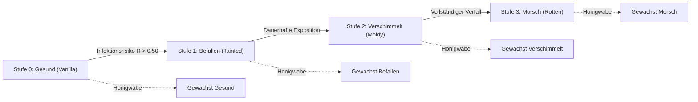
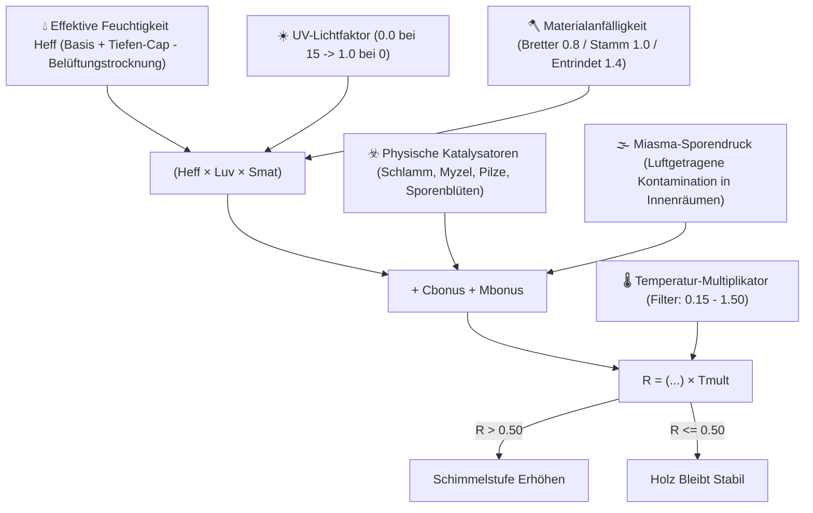
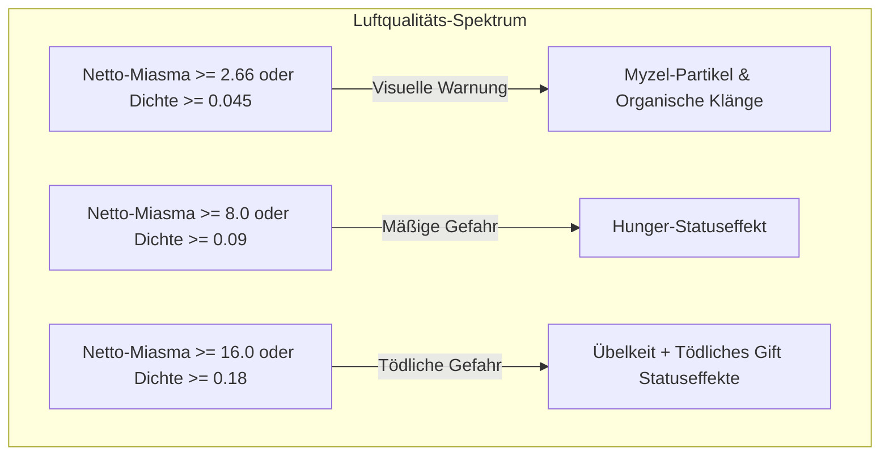
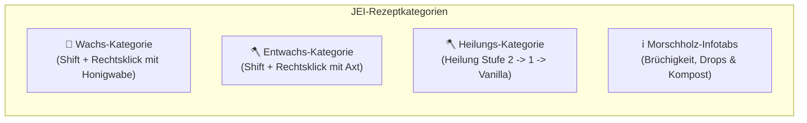

# Spores & Shadows

**Spores & Shadows** ist eine Minecraft-Mod (**Fabric 1.21.1**), die ein dynamisches, realistisches und unbarmherziges Ökosystem für den Verfall von Holz einführt. Keine Holzkonstruktion ist vor dem Zahn der Zeit und den Elementen sicher!

---

## 📑 Inhaltsverzeichnis
1. [Übersicht & Holz-Ökosystem](#-übersicht--holz-ökosystem)
2. [Der Schimmelzyklus & Mathematisches Modell](#-der-schimmelzyklus--mathematisches-modell)
3. [Umweltgefahren & Volumetrisches Miasma](#-umweltgefahren--volumetrisches-miasma)
4. [Physischer Zerfall & Werkzeugphysik](#-physischer-zerfall--werkzeugphysik)
5. [Strafen für Handwerk, Schmelzen & Kompostieren](#-strafen-für-handwerk-schmelzen--kompostieren)
6. [Interaktionen & Prävention (Wachsen & Abschaben)](#-interaktionen--prävention-wachsen--abschaben)
7. [Weltgenerierung & Strukturabnutzung](#-weltgenerierung--strukturabnutzung)
8. [JEI (Just Enough Items) Integration](#-jei-just-enough-items-integration)
9. [HUD-Integration (Jade) & Erfolge (Advancements)](#-hud-integration-jade--erfolge-advancements)
10. [Befehle im Spiel](#-befehle-im-spiel)
11. [Cloth Config & Anpassung](#-cloth-config--anpassung)

---

## 🌳 Übersicht & Holz-Ökosystem

Haben Sie jemals eine prächtige Holzhütte gebaut und erwartet, dass sie ohne Wartung ewig hält? **Spores & Shadows** stellt diese Annahme grundlegend auf den Kopf und verwandelt Holz von einem statischen Block in ein lebendiges Material, das anfällig für Feuchtigkeit, Dunkelheit, Höhe und Klima ist.

Die Mod ersetzt platziertes und in der Welt generiertes Holz nahtlos durch dynamische Varianten. Mit der Zeit bestimmt die Umgebung, ob Ihr Holz widerstandsfähig bleibt oder stufenweise verfällt.

### 🔢 Vollständiges Holz-Ökosystem: 910 Erhältliche Varianten
Die Mod fügt einen kompletten Verfallsbaum für jeden Holzblocktyp über **13 Bauformate** hinzu:

* **🧱 13 Formate**: *Stämme*, *Entrindete Stämme*, *Holz*, *Entrindetes Holz*, *Bretter*, *Treppen*, *Stufen*, *Zäune*, *Zauntore*, *Türen*, *Falltüren*, *Druckplatten*, *Knöpfe*.
* **🌲 10 Holzarten**: Eiche, Birke, Fichte, Dschungel, Akazie, Schwarzeiche, Mangrove, Kirsche, Karmesin und Wirr.

Über die 130 Basis-Holzblöcke führt die Mod Folgendes ein:
1. **130 Gewachste Vanilla-Varianten**: Versiegelte, geschützte Kopien der Basisblöcke.
2. **390 Verschimmelte Varianten**: Die 3 organischen Verfallsstufen (*Tainted*, *Moldy*, *Rotten*).
3. **390 Gewachste Verschimmelte Varianten**: Verfallene Blöcke, die mit Bienenwachs für sicheres Bauen konserviert wurden.

Insgesamt **910 einzigartige Überlebensblöcke** mit eigenen Texturen, Beutetabellen und Rezepten!

---

## 🦠 Der Schimmelzyklus & Mathematisches Modell

Holz durchläuft aufeinanderfolgende Stufen: **Stufe 0 (Vanilla) ➔ Stufe 1 (Tainted) ➔ Stufe 2 (Moldy) ➔ Stufe 3 (Rotten)**.

Das Fortschreiten erfolgt bei zufälligen Block-Ticks, sobald das **Infektionsrisiko ($R$)** den konfigurierbaren Schwellenwert von **0.50** überschreitet:

$$R = \Big( (H_{eff} \cdot L_{uv} \cdot S_{mat}) + C_{bonus} + M_{bonus} \Big) \cdot T_{mult}$$

### 🔬 Umweltfaktoren und Modifikatoren

* 💧 **Effektive Feuchtigkeit ($H_{eff} = \max(0.0, \min(1.0, H_{raw} - \text{Belüftung} \cdot \text{drying\_bonus}))$)**:
  * **Basisfeuchtigkeit**: Abhängig vom Biomwetter (Regen-/Schneebiome: `0.80`, Trockenbiome: `0.30`).
  * **Tiefengradient & $Y \le 0$ Cap**: Unter dem Meeresspiegel ($Y < 64$) steigt die Feuchtigkeit linear um $\frac{64 - Y}{64} \times 0.40$. Bei allen Tiefen $Y \le 0$ (bis $Y = -64$) bleibt der Tiefenbonus bei $+0.40$ fixiert, was Verstopfungen in Tiefenschieferhöhlen verhindert.
  * **Wassernähe**: Wasserquellen bringen $+0.15$ lokale Feuchtigkeit; Kessel $+0.10$ im 3-Block-Radius.
  * **Belüftungstrocknung**: Saubere Außenluft trocknet Holzoberflächen ab und senkt $H_{raw}$.
* ☀️ **Licht / UV ($L_{uv}$)**:
  * Berechnet an 7 Messpunkten (6 Seiten + Innenraum). Skaliert von `0.0` bei Lichtlevel 15 (Sterilisation) bis `1.0` bei völliger Dunkelheit.
* 🪓 **Materialanfälligkeit ($S_{mat}$)**:
  * Entrindetes Holz: **Multiplikator $1.4\times$**.
  * Stämme und Rohholz: **Multiplikator $1.0\times$**.
  * Bretter und verarbeitete Blöcke: **Multiplikator $0.8\times$**.
* 🌡️ **Temperaturfilter & Dynamische Höhennormalisierung ($T_{mult}$)**:
  * Biologisches Fenster: **$0.15 \le \text{Temp} \le 1.50$**. Außerhalb beträgt $T_{mult} = 0.0$ (Wachstum stoppt).
  * **Höhlennormalisierung ($Y \le 48$)**: Die Temperatur unter Tage pendelt sich bei **$0.50$** ein und erhält den Höhlenverfall.
  * **Höhenfrost ($Y \ge 256$)**: Fällt auf **$-0.50$** ab und schützt Berghütten natürlich.
* ☣️ **Physische Katalysatoren ($C_{bonus}$)**:
  * Schlamm ($+0.05$), Podsol / Myzel ($+0.15$), Pilze ($+0.25$), Sporenblüten ($+0.80$), Angrenzendes Morsches Holz ($+0.20$).
* 🌫️ **Miasma-Sporendruck ($M_{bonus}$)**:
  * Holz in miasmagesättigten Räumen erfährt einen zusätzlichen Sporendruck von $\text{ExposureIndex} \times \text{miasma\_multiplier}$.

---

## ☠️ Umweltgefahren & Volumetrisches Miasma

### 🌫️ 1. Volumetrisches Miasma & Dynamische Sättigung
In geschlossenen, unbelüfteten Räumen gibt befallenes Holz giftige Sporen ab, die die Raumluft anreichern.

* **Direktionaler 3D-BFS-Algorithmus**: Ausgehend von der Augenposition (`player.getEyePos()`) prüft BFS bis zu **$1024\text{ m}^3$** in einem **sphärischen euklidischen Radius von $24$ Blöcken**.
* **Hydraulische & Hermetische Dichtungen**:
  * **Überflutete Blöcke (`waterlogged`)**: Wirken als **100% luftdichter Siphon** und blockieren Gasströme zwischen Räumen.
  * **Hermetische Barrieren**: Feste Blöcke, geschlossene Türen, geschlossene Falltüren, verbundene Mauern und Glasscheiben.
  * **Belüftungsöffnungen**: Offene Kupfergitter (`GrateBlock`, $+15.0/\text{Block}$), offene Türen ($+15.0$), offene Falltüren ($+15.0$), Zäune/Tore ($+3.0$) und offener Himmel ($+25.0/\text{Block}$).
* **Dynamische Sättigung & Zeitliche Trägheit (`RoomSaturationManager`)**:
  * Miasma verändert sich stetig: $M(t) = M_{vorh} + \alpha \cdot (M_{ziel} - M_{vorh})$.
  * Vergiftung erfolgt mit `saturation_speed_multiplier` (`0.02`), während das Öffnen von Fenstern den Raum mit `dissipation_speed_multiplier` (`0.05`) rasch reinigt.
* **Expositionsindex und Effekte**:

$$\text{Dichte} = \frac{\text{Netto-Miasma}}{\text{Volumen}}, \quad \text{Exposition} = \text{Dichte} \cdot \left(0.5 + 0.5 \cdot \min\left(2.0, \sqrt{\frac{\text{Netto-Miasma}}{8.0}}\right)\right)$$

### 💥 2. Sporenwolken-Ausbruch beim Abbau
Das Zerstören unversiegelten, verfallenen Holzes stört die Pilzkolonien massiv:
* **Auslöser**: Abbau von **Stufe 2 (Moldy)** oder **Stufe 3 (Rotten)** ohne **Behutsamkeit** (und ungewachst).
* **Effekt**: Schlagartiger Ausstoß von `MYCELIUM`-Partikeln begleitet von einem tiefen Pilzknacken (`BLOCK_FUNGUS_BREAK`).

---

## 📉 Physischer Zerfall & Werkzeugphysik

Mit dem Abbau der Zellulose- und Ligninstruktur durch die Fäulnis bricht die physische Widerstandskraft ein:

| Eigenschaft | 🌲 Stufe 0 (Vanilla) | 🟢 Stufe 1 (Tainted) | 🦠 Stufe 2 (Moldy) | ☠️ Stufe 3 (Rotten) |
| :--- | :---: | :---: | :---: | :---: |
| **Blockhärte** | `2.0` ($100\%$) | `1.6` ($80\%$) | `1.0` ($50\%$) | `0.4` ($20\%$) |
| **Werkzeugeffektivität** | Standard mit Axt | Standard mit Axt | Standard mit Axt | **Neutralisiert (Faust = Axt)** |
| **Explosionsresistenz** | `100%` | `80%` Multiplikator | `50%` Multiplikator | `10%` Multiplikator |
| **Feuer-Entzündungsbonus**| $+0$ | $+5$ | $+10$ | $+20$ |
| **Feuer-Ausbreitungsbonus**| $+0$ | $+10$ | $+25$ | $+60$ |
| **Überlebens-Dropchance** | `100%` | `100%` | `50%` (50% zerfällt) | `0%` (Vollständiger Zerfall) |
| **Behutsamkeit / Wachs Drop** | `100%` | `100%` | `100%` | `100%` |

### 🪓 Extreme Brüchigkeit der Stufe 3
Auf **Stufe 3 (Rotten)** hat das Holz jede Struktur verloren. Werkzeuggeschwindigkeitsboni werden **vollständig umgangen**: Morschholz mit einer Netheritaxt abzubauen dauert genauso lange wie mit der bloßen Faust.

### 🔥 Entflammbarkeit & Feuerausbreitung
* **Trocknung und Sporen**: Zersetztes Holz brennt erheblich schneller und breitet Flammen aggressiv auf Nachbarblöcke aus.
* **Wachsentflammbarkeit**: Gewachste Blöcke erhalten $+5$ Verbrennungsbonus durch das Bienenwachs.
* **Immunität von Netherholz**: Karmesin- und Wirr-Stämme/Bretter behalten **absolute Feuerimmunität** ($0$ Brand / $0$ Ausbreitung).

---

## ⚖️ Strafen für Handwerk, Schmelzen & Kompostieren

Die Verwendung von morschem Holz für Tischlerarbeiten oder als Brennstoff bringt realistische Nachteile:

### 🪵 1. Handwerksausbeute & Hybrides Handwerk
Befallenes Holz kann an der Werkbank zu sauberen Vanilla-Brettern, Stufen oder Stöcken verarbeitet werden. Durch das Wegschneiden fauler Teile sinkt die Ausbeute:

| Qualitätsstufe | 🌳 1 Stamm ➔ Bretter | 🦯 2 Bretter ➔ Stöcke |
| :--- | :---: | :---: |
| 🌲 **Gesund (Vanilla / Gewachst)** | **4** Bretter | **4** Stöcke |
| 🟢 **Befallen (Stufe 1)** | **2** Bretter | **2** Stöcke |
| 🦠 **Verschimmelt (Stufe 2)** | **1** Brett | **1** Stock |
| ☠️ **Morsch (Stufe 3)** | ❌ *Nicht herstellbar* | ❌ *Nicht herstellbar* |

> [!TIP]
> **Hybrides Handwerk**: Ungewachstes und gewachstes Holz derselben Verfallsstufe kann im Handwerksgitter frei gemischt werden!

### 🔥 2. Ofenverbrennung & Holzkohle
* **Brenndauer-Multiplikatoren**: Stufe 0 (`1.0x` / 100%) ➔ Stufe 1 (`0.5x` / 50%) ➔ Stufe 2 (`0.25x` / 25%) ➔ Stufe 3 (`0.125x` / 12.5%).
* **Holzkohleverhüttung**: Alle befallenen und gewachsten Stämme können zu Holzkohle gebrannt werden.

### ♻️ 3. Komposter-Düngung
Befallenes Holz ist reich an organischer Pilzmasse und ideal für den Komposter:
* **Befallenes Holz**: $50\%$ Chance
* **Verschimmeltes Holz**: $65\%$ Chance
* **Morsches Holz**: $85\%$ Chance (Ausgezeichneter Dünger!)

### 🔴 4. Träge Redstone-Komponenten
Schimmel verstopft die Mechanik von Holzknöpfen und Druckplatten:
* **Befallen**: Aktiv für **3.0 Sekunden** ($60\text{ Ticks}$).
* **Verschimmelt**: Aktiv für **7.5 Sekunden** ($150\text{ Ticks}$).
* **Morsch**: Aktiv für **22.5 Sekunden** ($450\text{ Ticks}$).

---

## 🛠️ Interaktionen & Prävention (Wachsen & Abschaben)

Spieler interagieren mit Holz im **Schleichmodus (Sneak / Shift + Rechtsklick)**:

* 🐝 **Wachsen (Honigwabe)**:
  * Das Anwenden einer Honigwabe versiegelt den Block mit Wachs.
  * **Effekte**: Friert den Verfall ein, eliminiert Miasma, stoppt Ansteckung und **garantiert 100% Dropchance** selbst bei Stufe 3 Morschholz!
* 🪓 **Abschaben mit der Axt**:
  * **Entwachsen**: Shift + Rechtsklick mit einer Axt entfernt die Wachsschicht.
  * **Schimmelbehandlung**: Shift + Rechtsklick mit einer Axt auf ungewachstes befallenes Holz heilt 1 Stufe ($2 \rightarrow 1 \rightarrow 0$ Vanilla). Verbraucht Haltbarkeit.
  * **Unheilbarkeit von Stufe 3**: Morschholz der Stufe 3 ist strukturell kollabiert und **unheilbar** (die Axt hat keinen Effekt; es kann nur gewachst oder kompostiert werden).

---

## 🗺️ Weltgenerierung & Strukturabnutzung

Natürlich generierte Bauwerke weisen authentische Altersspuren in 4 Stufen auf:

1. 🏴‍☠️ **Kritischer Verfall**: Schiffswracks (`shipwreck`), Sumpfhütten (`swamp_hut`) — Hoher Anteil an Stufe 3 Morschholz.
2. 🧟 **Starker Verfall**: Minenschächte (`mineshaft`), Zombiedörfer (`zombie_village`), Ruinen (`trail_ruins`) — Mischung aus Stufe 1 & 2.
3. 🏹 **Mäßiger Verfall**: Plünderer-Außenposten (`pillager_outpost`), Portalruinen (`ruined_portal`) — Überwiegend Stufe 1.
4. 🏡 **Minimaler Verfall**: Dörfer (`village`), Waldanwesen (`mansion`) — Fast unberührtes Holz.

### 🛡️ Lebende Bäume & Strukturimmunität
* **Lebende Bäume**: Natürlich gewachsene Setzlinge und Wildbäume leben und sind absolut immun gegen Verfall, bis sie gefällt werden.
* **Strukturimmunität**: Standardmäßig generieren Strukturen vorgealtert und frieren ihren Zustand ein, bis ein Spieler mit ihnen interagiert.

---

## 📖 JEI (Just Enough Items) Integration

Die Mod bietet umfassende, native JEI-Unterstützung:

1. **Wachs-Kategorie (`WaxingRecipeCategory`)**: Zeigt alle 130 Block-Wachstransformationen an.
2. **Axt-Schabekategorie (`ScrapingRecipeCategory`)**:
   * Zeigt Entwachsungsrezepte für alle gewachsten Blöcke mit Vanilla-Äxten.
   * Zeigt Heilpfade für Schimmel ($2 \rightarrow 1 \rightarrow 0$).
3. **Morschholz-Infotabs**: Eingebettete Beschreibungen über null Drops ohne Wachs, neutralisierte Axtgeschwindigkeit und Kompostierung.

---

## 📊 HUD-Integration (Jade) & Erfolge (Advancements)

* 🔍 **Jade / WTHIT Tooltips**: Das Anvisieren eines Holzblocks zeigt Namen, Schimmelstufe, Wachsstatus und Live-Infektionsrisiko ($R\%$) mit dynamischer Farbe an (**Grau = Sicher**, **Rot = Gefährdet**).
* 🏆 **Erfolge (Advancements)**:
  * **Spores & Shadows**: Überlebe den natürlichen Holzzerfallszyklus.
  * **Natural Prevention**: Wachse einen Holzblock mit einer Honigwabe, um ihn zu versiegeln.
  * **Elbow Grease**: Verwende eine Axt, um Schimmel von befallenem Holz abzuschaben.
  * **Short Breath**: Erliege einer Miasmavergiftung in einem unbelüfteten Keller.
  * **Dust to Dust**: Sieh zu, wie ein morscher Block der Stufe 3 beim Abbau zu Staub zerfällt.

---

## 💻 Befehle im Spiel

Alle Administratorbefehle erfordern Berechtigungsstufe 2:

* `/miasma`  
  Führt einen Echtzeit-BFS-Luftscan an der Spielerposition durch und gibt Umgebungstyp (Offene Luft / Geschlossener Raum), Luftvolumen ($m^3$), Toxizitätswert, Belüftungswert, Netto-Miasma und Sporendichte aus.
* `/moldrisk` 
  Inspiziert den anvisierten Block und zeigt Feuchtigkeit ($H_{\text{eff}}$), Licht ($L_{\text{uv}}$), Anfälligkeit ($S_{\text{mat}}$), Katalysatoren, Miasma-Luftbonus ($M_{\text{bonus}}$), Temperatur und berechneten $R$-Wert an.
* `/moldrisk verbose`  
  Zeigt die vollständige mathematische Zwischenrechnung an (Tiefenmodifikatoren, Oberflächen- vs. Höhlentemperatur, lokale Wasserboni).
* `/spores reload`  
  Lädt die Konfigurationsdatei (`config/spores--shadows.json`) im laufenden Betrieb ohne Neustart von Server oder Client neu.

---

## ⚙️ Cloth Config & Anpassung

Über **ModMenu & Cloth Config** im Spiel in 12 Kategorien konfigurierbar:

1. 🛠️ **General**: Schimmelwachstum aktivieren/deaktivieren, Infektionsschwelle (`0.50`), Scan-Radius, Strukturimmunität und Axtabnutzung.
2. 🪓 **Susceptibility**: Multiplikatoren für entrindetes Holz (`1.4`), Bretter (`0.8`) und Stämme (`1.0`).
3. ☣️ **Catalysts**: Boni für Schlamm, Myzel, Pilze, Sporenblüten und befallenes Holz.
4. 🌡️ **Environment**: Basisfeuchtigkeit, Tiefenmodifikatoren, Wasserbonus, Belüftungstrocknung, Miasma-Sporendruck, Temperaturgrenzen, Höhlennormalisierung ($Y=48$) und Höhenfrost ($Y=256$).
5. 💥 **Drops**: Dropchancen für Stufe 2 (`50%`) und Stufe 3 (`0%`).
6. 🗺️ **Structures**: Verfallsprozentsätze für Strukturkategorien.
7. 🔥 **Furnace Multipliers**: Ofenbrennstoff-Multiplikatoren für Stufen 0, 1, 2, 3.
8. 🚒 **Flammability**: Entflammbarkeits-Toggle, Entzündungsboni ($+5/+10/+20$), Ausbreitung ($+10/+25/+60$) und Wachs ($+5$).
9. 💣 **Blast Resistance**: Explosionsresistenz-Toggle, Multiplikatoren für Stufe 1 (`0.80`), Stufe 2 (`0.50`), Stufe 3 (`0.10`).
10. ⛏️ **Hardness**: Härteskalierungs-Toggle (`0.80`, `0.50`, `0.20`), und Sporenwolken-Toggle beim Abbau.
11. ☠️ **Toxicity**: Miasma-Tickintervall, Maximalvolumen, euklidischer Radius, Sättigungs-/Auflösungsraten, Belüftungswerte und Statuseffekt-Schwellen.
12. 🖥️ **Client**: Schimmel-Render-Z-Offset zur perfekten Kompatibilität mit Iris- und Sodium-Shadern.
