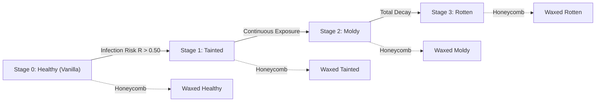
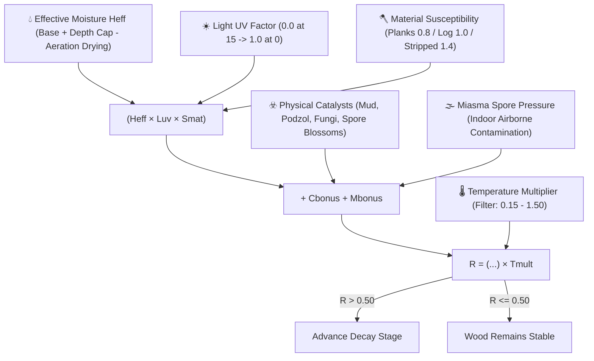
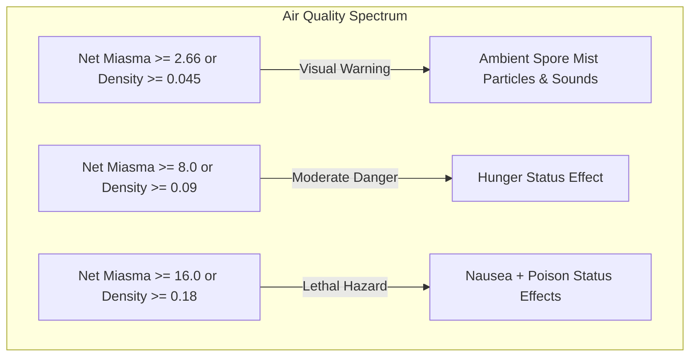
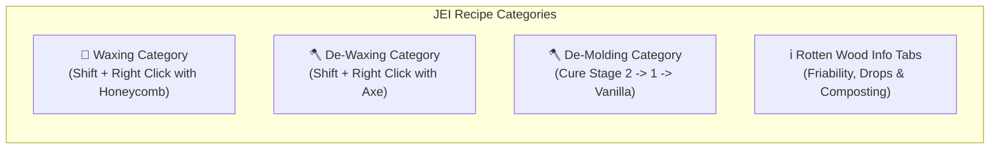

# Spores & Shadows

**Spores & Shadows** is a Minecraft mod (**Fabric 1.21.1**) that introduces a dynamic, realistic, and unforgiving environmental decay ecosystem for wood. No timber structure is safe from the passage of time and the harshness of the elements!

---

## 📑 Table of Contents
1. [Overview & Wood Ecosystem](#-overview--wood-ecosystem)
2. [The Mold Cycle & Mathematical Model](#-the-mold-cycle--mathematical-model)
3. [Environmental Hazards & Volumetric Miasma](#-environmental-hazards--volumetric-miasma)
4. [Physical Degradation & Tool Physics](#-physical-degradation--tool-physics)
5. [Crafting, Smelting & Composting Penalties](#-crafting-smelting--composting-penalties)
6. [Interactions & Prevention (Waxing & Scraping)](#-interactions--prevention-waxing--scraping)
7. [World Generation & Structure Wear](#-world-generation--structure-wear)
8. [JEI (Just Enough Items) Integration](#-jei-just-enough-items-integration)
9. [HUD Integration (Jade) & Advancements](#-hud-integration-jade--advancements)
10. [In-Game Commands](#-in-game-commands)
11. [Cloth Config & Customization](#-cloth-config--customization)

---

## 🌳 Overview & Wood Ecosystem

Have you ever built a majestic wooden cabin expecting it to stand eternal without maintenance? **Spores & Shadows** completely overturns that assumption, turning wood from a static, inert block into a living, breathing material vulnerable to moisture, darkness, altitude, and climate.

The mod seamlessly replaces placed and world-generated wood with dynamic variants. Over time, exposure to environmental conditions determines whether your timber stays resilient or slowly decays through successive fungal stages.

### 🔢 Comprehensive Wood Ecosystem: 910 Obtainable Variants
The mod injects a complete decay tree for every single wooden block type in the game across **13 architectural formats**:

* **🧱 13 Formats**: *Logs*, *Stripped Logs*, *Wood*, *Stripped Wood*, *Planks*, *Stairs*, *Slabs*, *Fences*, *Fence Gates*, *Doors*, *Trapdoors*, *Pressure Plates*, *Buttons*.
* **🌲 10 Wood Types**: Oak, Birch, Spruce, Jungle, Acacia, Dark Oak, Mangrove, Cherry, Crimson, and Warped.

Across the 130 base wooden blocks, the mod introduces:
1. **130 Waxed Vanilla Variants**: Sealed, preserved copies of base Vanilla wooden blocks.
2. **390 Moldy Variants**: The 3 organic stages of decay (*Tainted*, *Moldy*, *Rotten*).
3. **390 Waxed Moldy Variants**: Decayed blocks frozen in time with beeswax for safe building and decoration.

Totaling **910 unique survival blocks** with dedicated textures, loot tables, and full crafting recipes!

---

## 🦠 The Mold Cycle & Mathematical Model

Wood transitions sequentially: **Stage 0 (Vanilla) ➔ Stage 1 (Tainted) ➔ Stage 2 (Moldy) ➔ Stage 3 (Rotten)**.

Progression occurs on random block ticks whenever the **Infection Risk ($R$)** exceeds the configurable threshold of **0.50**:

$$R = \Big( (H_{eff} \cdot L_{uv} \cdot S_{mat}) + C_{bonus} + M_{bonus} \Big) \cdot T_{mult}$$

### 🔬 Factors and Environmental Modifiers

* 💧 **Effective Moisture ($H_{eff} = \max(0.0, \min(1.0, H_{raw} - \text{Aeration} \cdot \text{drying\_bonus}))$)**:
  * **Base Humidity**: Determined by biome weather (Rain/Snow biomes: `0.80`, Arid/Dry biomes: `0.30`).
  * **Depth Gradient & $Y \le 0$ Cap**: Below sea level ($Y < 64$), moisture increases linearly by $\frac{64 - Y}{64} \times 0.40$. At all depths $Y \le 0$ (down to $Y = -64$), depth moisture stays fixed at $+0.40$, avoiding soft-locking in deepslate caverns.
  * **Water Adjacency**: Water sources add $+0.15$ local moisture; cauldrons add $+0.10$ within a 3-block radius.
  * **Aeration Drying**: Clean exterior airflow actively dries timber faces, lowering $H_{raw}$.
* ☀️ **Light / UV ($L_{uv}$)**:
  * Calculated across 7 sampling points (6 faces + interior block space). Scales linearly from `0.0` at light level 15 (completely sterilizing mold) to `1.0` in pitch darkness.
* 🪓 **Material Susceptibility ($S_{mat}$)**:
  * Stripped wood: **$1.4\times$ multiplier**.
  * Logs and wood: **$1.0\times$ multiplier**.
  * Processed planks and derived blocks: **$0.8\times$ multiplier**.
* 🌡️ **Temperature Filter & Dynamic Altitude Normalization ($T_{mult}$)**:
  * Biological activity window: **$0.15 \le \text{Temp} \le 1.50$**. Outside this range, $T_{mult} = 0.0$ (growth halts).
  * **Cave Normalization ($Y \le 48$)**: Ambient temperature underground normalizes toward **$0.50$**, sustaining deep underground rot.
  * **High Altitude Freezing ($Y \ge 256$)**: Drops toward **$-0.50$**, naturally preserving high-mountain chalets.
* ☣️ **Physical Catalysts ($C_{bonus}$)**:
  * Mud ($+0.05$), Podzol / Mycelium ($+0.15$), Mushrooms ($+0.25$), Spore Blossoms ($+0.80$), Adjacent Rotten Wood ($+0.20$).
* 🌫️ **Airborne Miasma Pressure ($M_{bonus}$)**:
  * Timber exposed to spore-saturated indoor rooms suffers an additional fungal pressure $\text{ExposureIndex} \times \text{miasma\_multiplier}$.

---

## ☠️ Environmental Hazards & Volumetric Miasma

### 🌫️ 1. Volumetric Miasma & Dynamic Saturation
In confined, unventilated rooms, infected wood releases toxic spores that accumulate into a hazardous indoor atmosphere.

* **3D Directional BFS Engine**: Starting at the player's eye position (`player.getEyePos()`), BFS evaluates connected air spaces up to a volume of **$1024\text{ m}^3$** and a **Euclidean radius limit of $24$ blocks**.
* **Hydraulic & Hermetic Seals**:
  * **Waterlogged Blocks**: Any submerged block acts as a **100% airtight hydraulic siphon**, preventing gas flow between rooms.
  * **Airtight Boundaries**: Solid blocks, closed doors, closed horizontal trapdoors, connected walls, and glass panes.
  * **Permeable / Ventilation Portals**: Open copper grates (`GrateBlock`, $+15.0/\text{block}$), open doors ($+15.0$), open trapdoors ($+15.0$), fences/gates ($+3.0$), and open sky ($+25.0/\text{block}$).
* **Dynamic Saturation & Temporal Inertia (`RoomSaturationManager`)**:
  * Miasma changes continuously according to $M(t) = M_{prev} + \alpha \cdot (M_{target} - M_{prev})$.
  * Intoxication occurs with `saturation_speed_multiplier` (`0.02`), while opening doors/windows purifies the room faster with `dissipation_speed_multiplier` (`0.05`).
* **Exposure Index & Toxic Effects**:

$$\text{Density} = \frac{\text{Net Miasma}}{\text{Volume}}, \quad \text{Exposure} = \text{Density} \cdot \left(0.5 + 0.5 \cdot \min\left(2.0, \sqrt{\frac{\text{Net Miasma}}{8.0}}\right)\right)$$

### 💥 2. Spore Cloud Burst upon Breaking
Breaking unsealed decayed timber violently disturbs embedded fungal colonies:
* **Trigger**: Destroying **Stage 2 (Moldy)** or **Stage 3 (Rotten)** blocks without **Silk Touch** (and when not waxed).
* **Visual & Audio Burst**: Spawns an instantaneous burst of `MYCELIUM` particles accompanied by a deep organic fungal snap (`BLOCK_FUNGUS_BREAK`).

---

## 📉 Physical Degradation & Tool Physics

As rot digests the internal cellulose and lignin matrix of the timber, its physical resistance drops dramatically:

| Property | 🌲 Stage 0 (Vanilla) | 🟢 Stage 1 (Tainted) | 🦠 Stage 2 (Moldy) | ☠️ Stage 3 (Rotten) |
| :--- | :---: | :---: | :---: | :---: |
| **Block Hardness** | `2.0` ($100\%$) | `1.6` ($80\%$) | `1.0` ($50\%$) | `0.4` ($20\%$) |
| **Tool Effectiveness** | Standard Axe Speed | Standard Axe Speed | Standard Axe Speed | **Neutralized (Fist = Axe)** |
| **Blast Resistance** | `100%` | `80%` multiplier | `50%` multiplier | `10%` multiplier |
| **Fire Burn Bonus** | $+0$ | $+5$ | $+10$ | $+20$ |
| **Fire Spread Bonus** | $+0$ | $+10$ | $+25$ | $+60$ |
| **Survival Drop Rate** | `100%` | `100%` | `50%` (50% disintegrates) | `0%` (Total crumble) |
| **Silk Touch / Wax Drop** | `100%` | `100%` | `100%` | `100%` |

### 🪓 Stage 3 Extreme Friability
At **Stage 3 (Rotten)**, the wood has lost all structural coherence. Axe tool speed bonuses are **completely bypassed**: breaking rotten wood with a Netherite Axe takes the exact same time as breaking it bare-handed with your fist.

### 🔥 Flammability & Fire Spread
* **Drying & Spore Acceleration**: Decayed timber burns substantially faster and spreads flames vigorously across neighboring blocks.
* **Wax Flammability**: Waxed blocks retain their decay level and receive a $+5$ burn bonus due to flammable beeswax.
* **Nether Wood Immunity**: Crimson and Warped fungal stems/planks possess **absolute fire immunity** ($0$ burn / $0$ spread).

---

## ⚖️ Crafting, Smelting & Composting Penalties

Using rotten wood for carpentry or fuel yields realistic penalties:

### 🪵 1. Crafting Yields & Hybrid Crafting
You can craft infected timber into clean Vanilla planks, slabs, or sticks on a crafting table. However, since decayed sections must be carved away, item yields drop significantly:

| Quality Level | 🌳 1 Log ➔ Planks | 🦯 2 Planks ➔ Sticks |
| :--- | :---: | :---: |
| 🌲 **Healthy (Vanilla / Waxed)** | **4** Planks | **4** Sticks |
| 🟢 **Tainted (Stage 1)** | **2** Planks | **2** Sticks |
| 🦠 **Moldy (Stage 2)** | **1** Plank | **1** Stick |
| ☠️ **Rotten (Stage 3)** | ❌ *Uncraftable* | ❌ *Uncraftable* |

> [!TIP]
> **Hybrid Crafting**: You can freely mix unwaxed and waxed timber of the same decay tier inside the crafting grid!

### 🔥 2. Furnace Combustion & Charcoal Support
* **Burn Time Multipliers**: Stage 0 (`1.0x` / 100%) ➔ Stage 1 (`0.5x` / 50%) ➔ Stage 2 (`0.25x` / 25%) ➔ Stage 3 (`0.125x` / 12.5%).
* **Charcoal Smelting**: All infected and waxed log variants can be smelted in furnaces to produce Charcoal.

### ♻️ 3. Composter Fertilization
Infected timber is rich in organic fungal matter, making it ideal for composting:
* **Tainted Wood**: $50\%$ chance
* **Moldy Wood**: $65\%$ chance
* **Rotten Wood**: $85\%$ chance (Superb organic fertilizer!)

### 🔴 4. Sticky Redstone Components
Mold clogs mechanical joints in wooden buttons and pressure plates:
* **Tainted**: Active for **3.0 seconds** ($60\text{ ticks}$).
* **Moldy**: Active for **7.5 seconds** ($150\text{ ticks}$).
* **Rotten**: Active for **22.5 seconds** ($450\text{ ticks}$).

---

## 🛠️ Interactions & Prevention (Waxing & Scraping)

Players interact with timber states using **Stealth Mode (Sneak / Shift + Right Click)**:

* 🐝 **Waxing (Honeycomb)**:
  * Applying Honeycomb to any wood block seals it with wax.
  * **Effects**: Completely freezes decay progression, eliminates miasma contribution, prevents spreading infection, and **guarantees a 100% drop rate** even on Stage 3 Rotten wood!
* 🪓 **Scraping (Axe)**:
  * **De-waxing**: Shift + Right-clicking a waxed block strips the wax coat, returning it to active environmental decay.
  * **De-molding (Curing)**: Shift + Right-clicking unwaxed Stage 1 or Stage 2 wood scrapes away surface mold, restoring it by 1 stage ($2 \rightarrow 1 \rightarrow 0$ Vanilla). Consumes axe durability.
  * **Stage 3 Incurability**: Stage 3 Rotten wood has collapsed structural integrity and is **incurable** (scraping has no effect; it can only be waxed or composted).

---

## 🗺️ World Generation & Structure Wear

Naturally generated structures show authentic environmental age through 4 decay tiers:

1. 🏴‍☠️ **Critical Decay**: Shipwrecks (`shipwreck`), Swamp Huts (`swamp_hut`) — High concentration of Stage 3 Rotten wood.
2. 🧟 **High Decay**: Mineshafts (`mineshaft`), Zombie Villages (`zombie_village`), Trail Ruins (`trail_ruins`) — Heavy blend of Stage 1 & 2.
3. 🏹 **Moderate Decay**: Pillager Outposts (`pillager_outpost`), Ruined Portals (`ruined_portal`) — Primarily Stage 1 Tainted wood.
4. 🏡 **Minimal Decay**: Villages (`village`), Woodland Mansions (`mansion`) — Almost pristine Vanilla wood.

### 🛡️ Living Trees & Structure Immunity
* **Living Trees**: Naturally grown saplings and wild trees are alive and completely immune to decay until harvested.
* **Structure Immunity**: By default, world-generated structures generate pre-aged and then freeze their state. They remain stable until a player edits, scrapes, or interacts with them.

---

## 📖 JEI (Just Enough Items) Integration

The mod features comprehensive, native JEI integration:

1. **Waxing Category (`WaxingRecipeCategory`)**: Displays all 130 block waxing transformations (`Block + Honeycomb ➔ Waxed Variant`).
2. **Axe Scraping Category (`ScrapingRecipeCategory`)**:
   * Displays de-waxing recipes for all waxed blocks using any Vanilla axe.
   * Displays curative scraping pathways (`Stage 2 ➔ Stage 1 ➔ Stage 0`).
3. **Rotten Wood Info Tabs**: Embedded item descriptions explaining zero drop rates without wax, axe speed neutralization, and composter efficiency.

---

## 📊 HUD Integration (Jade) & Advancements

* 🔍 **Jade / WTHIT Tooltips**: Looking at any wood block displays its exact name, decay stage, wax status, and live Infection Risk ($R\%$) with dynamic coloring (**Gray = Safe**, **Red = At Risk**).
* 🏆 **Advancements**:
  * **Spores & Shadows**: Survive the natural wood decay cycle.
  * **Natural Prevention**: Wax a wooden block with honeycomb to seal it.
  * **Elbow Grease**: Use an axe to scrape mold off infected timber.
  * **Short Breath**: Succumb to toxic miasma poisoning in an unventilated cellar.
  * **Dust to Dust**: Watch a Stage 3 rotten block crumble into dust when mined.

---

## 💻 In-Game Commands

All administrative commands require permission level 2:

* `/miasma`  
  Runs a real-time BFS atmospheric scan at the player's position, outputting environment type (Open Air / Confined Space), air volume ($m^3$), Toxicity Score, Ventilation Score, Net Miasma, and Spore Density.
* `/moldrisk`
  Inspects the targeted block and displays its live humidity ($H_{\text{eff}}$), light ($L_{\text{uv}}$), material susceptibility ($S_{\text{mat}}$), catalyst score, airborne miasma bonus ($M_{\text{bonus}}$), effective temperature, and calculated $R$ value.
* `/moldrisk verbose`  
  Displays full intermediate mathematical breakdowns (depth modifiers, surface vs. cave temperatures, local moisture bonuses).
* `/spores reload`  
  Hot-reloads the configuration file (`config/spores--shadows.json`) directly without restarting the server or client.

---

## ⚙️ Cloth Config & Customization

Configurable via **ModMenu & Cloth Config** in-game across 12 dedicated categories:

1. 🛠️ **General**: Enable/disable mold growth, infection threshold (`0.50`), scan radius, structure immunity toggle, and axe scrape durability damage.
2. 🪓 **Susceptibility**: Multipliers for stripped wood (`1.4`), planks (`0.8`), and logs (`1.0`).
3. ☣️ **Catalysts**: Bonus values for mud, mycelium, mushrooms, spore blossoms, and infected blocks.
4. 🌡️ **Environment**: Base rain/dry humidity, cave depth modifiers, water bonus, aeration drying, miasma spore pressure, temperature boundaries, cave normalization ($Y=48$), and mountain freezing ($Y=256$).
5. 💥 **Drops**: Stage 2 drop chance (`50%`) and Stage 3 drop chance (`0%`).
6. 🗺️ **Structures**: Percentage decay chances for Critical, High, Moderate, and Low structure categories.
7. 🔥 **Furnace Multipliers**: Fuel burn multipliers for Stage 0 (`1.0`), Stage 1 (`0.5`), Stage 2 (`0.25`), and Stage 3 (`0.125`).
8. 🚒 **Flammability**: Toggle flammability scaling, burn bonuses ($+5/+10/+20$), spread bonuses ($+10/+25/+60$), and wax burn bonus ($+5$).
9. 💣 **Blast Resistance**: Toggle blast resistance scaling, multipliers for Stage 1 (`0.80`), Stage 2 (`0.50`), and Stage 3 (`0.10`).
10. ⛏️ **Hardness**: Toggle hardness scaling (`0.80`, `0.50`, `0.20`), and toggle the spore cloud burst effect upon breaking.
11. ☠️ **Toxicity**: Miasma check interval ticks, max air volume, Euclidean radius, saturation/dissipation rates, ventilation portal scores, and effect thresholds.
12. 🖥️ **Client**: Mold render Z-Offset adjustments for seamless compatibility with Iris and Sodium shaders.
