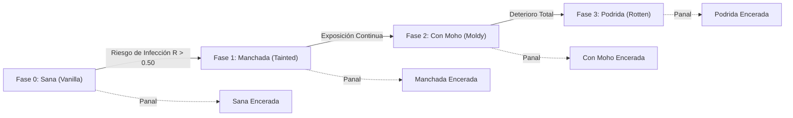
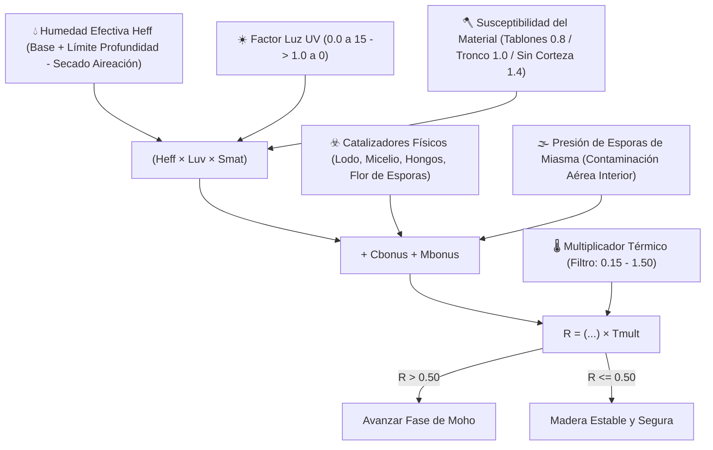
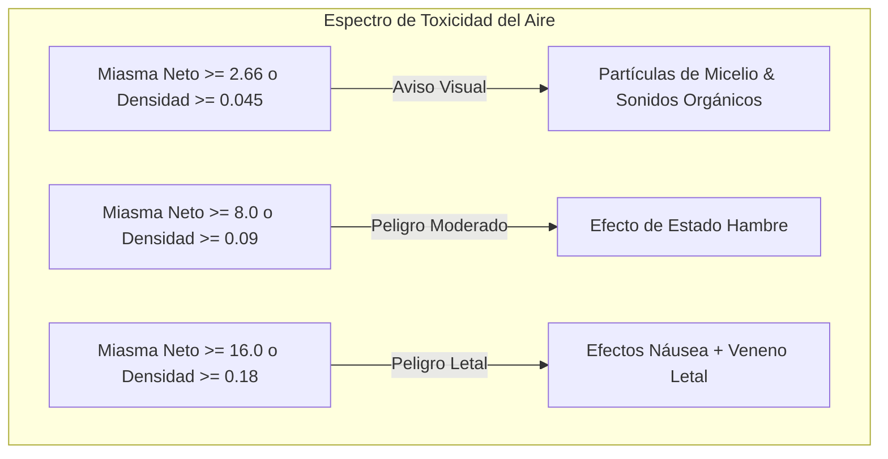
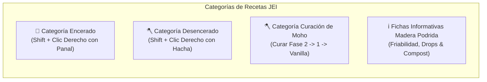

# Spores & Shadows

**Spores & Shadows** es un mod para Minecraft (**Fabric 1.21.1**) que introduce un ecosistema dinámico, realista e implacable de deterioro ambiental de la madera. ¡Ninguna estructura de madera está a salvo del paso del tiempo y la dureza de los elementos!

---

## 📑 Tabla de Contenidos
1. [Visión General & Ecosistema de la Madera](#-visión-general--ecosistema-de-la-madera)
2. [El Ciclo del Moho & Modelo Matemático](#-el-ciclo-del-moho--modelo-matemático)
3. [Peligros Ambientales & Miasma Volumétrico](#-peligros-ambientales--miasma-volumétrico)
4. [Degradación Física & Física de Herramientas](#-degradación-física--física-de-herramientas)
5. [Penalizaciones de Crafteo, Horno & Compostaje](#-penalizaciones-de-crafteo-horno--compostaje)
6. [Interacciones & Prevención (Encerado & Raspado)](#-interacciones--prevención-encerado--raspado)
7. [Generación de Mundo & Desgaste de Estructuras](#-generación-de-mundo--desgaste-de-estructuras)
8. [Integración con JEI (Just Enough Items)](#-integración-con-jei-just-enough-items)
9. [Integración HUD (Jade) & Logros (Advancements)](#-integración-hud-jade--logros-advancements)
10. [Comandos del Juego](#-comandos-del-juego)
11. [Configuración Cloth Config & ModMenu](#-configuración-cloth-config--modmenu)

---

## 🌳 Visión General & Ecosistema de la Madera

¿Alguna vez construiste una majestuosa cabaña de madera esperando que durara para siempre sin mantenimiento? **Spores & Shadows** cambia completamente esa suposición, transformando la madera de un bloque estático en un material vivo y vulnerable a la humedad, la oscuridad, la altitud y el clima.

El mod reemplaza de forma transparente la madera colocada y generada con variantes dinámicas. Con el tiempo, la exposición a las condiciones ambientales determina si la madera permanece resistente o se deteriora a través de sucesivas fases fúngicas.

### 🔢 Ecosistema Completo: 910 Variantes Obtenibles
El mod inyecta un árbol de deterioro completo para cada tipo de bloque de madera a través de **13 formatos arquitectónicos**:

* **🧱 13 Formatos**: *Troncos*, *Troncos Sin Corteza*, *Madera*, *Madera Sin Corteza*, *Tablones*, *Escaleras*, *Losas*, *Vallas*, *Puertas de Valla*, *Puertas*, *Trampillas*, *Placas de Presión*, *Botones*.
* **🌲 10 Tipos de Madera**: Roble, Abedul, Abeto, Jungla, Acacia, Roble Oscuro, Mangle, Cerezo, Carmesí y Distorsionado.

Sobre los 130 bloques base, el mod introduce:
1. **130 Variantes Vanilla Enceradas**: Copias selladas y protegidas de los bloques base.
2. **390 Variantes con Moho**: Las 3 fases orgánicas de deterioro (*Tainted*, *Moldy*, *Rotten*).
3. **390 Variantes con Moho Enceradas**: Bloques deteriorados congelados en el tiempo con cera para construcción segura.

¡Un total de **910 bloques únicos en supervivencia** con texturas dedicadas, tablas de botín y recetas completas!

---

## 🦠 El Ciclo del Moho & Modelo Matemático

La madera transiciona secuencialmente: **Fase 0 (Vanilla) ➔ Fase 1 (Tainted) ➔ Fase 2 (Moldy) ➔ Fase 3 (Rotten)**.

La progresión ocurre en los random block ticks cuando el **Riesgo de Infección ($R$)** supera el umbral configurable de **0.50**:

$$R = \Big( (H_{eff} \cdot L_{uv} \cdot S_{mat}) + C_{bonus} + M_{bonus} \Big) \cdot T_{mult}$$

### 🔬 Factores y Modificadores Ambientales

* 💧 **Humedad Efectiva ($H_{eff} = \max(0.0, \min(1.0, H_{raw} - \text{Aireación} \cdot \text{drying\_bonus}))$)**:
  * **Humedad Base**: Determinada por el clima del bioma (Biomas lluviosos/nevados: `0.80`, Biomas áridos/secos: `0.30`).
  * **Gradiente de Profundidad & Límite $Y \le 0$**: Por debajo del nivel del mar ($Y < 64$), la humedad aumenta linealmente $\frac{64 - Y}{64} \times 0.40$. En todas las profundidades $Y \le 0$ (hasta $Y = -64$), la humedad de profundidad permanece fija en $+0.40$, evitando bloqueos en cavernas de pizarra profunda.
  * **Adyacencia de Agua**: Fuentes de agua añaden $+0.15$ de humedad local; calderos $+0.10$ en un radio de 3 bloques.
  * **Secado por Aireación**: El flujo de aire limpio exterior seca las caras de la madera, reduciendo $H_{raw}$.
* ☀️ **Luz / UV ($L_{uv}$)**:
  * Calculado en 7 puntos de muestreo (6 caras + espacio interior). Escala de `0.0` a nivel de luz 15 (esterilización) a `1.0` en oscuridad total.
* 🪓 **Susceptibilidad del Material ($S_{mat}$)**:
  * Madera sin corteza: **multiplicador $1.4\times$**.
  * Troncos y madera estándar: **multiplicador $1.0\times$**.
  * Tablones y bloques derivados: **multiplicador $0.8\times$**.
* 🌡️ **Filtro Térmico & Normalización por Altitud ($T_{mult}$)**:
  * Ventana biológica: **$0.15 \le \text{Temp} \le 1.50$**. Fuera de este rango, $T_{mult} = 0.0$ (crecimiento detenido).
  * **Normalización en Cavernas ($Y \le 48$)**: La temperatura subterránea se normaliza hacia **$0.50$**, permitiendo pudrición en cuevas.
  * **Congelación a Gran Altitud ($Y \ge 256$)**: Desciende hacia **$-0.50$**, protegiendo cabañas de alta montaña.
* ☣️ **Catalizadores Físicos ($C_{bonus}$)**:
  * Lodo ($+0.05$), Podzol / Micelio ($+0.15$), Hongos ($+0.25$), Flor de Esporas ($+0.80$), Madera Podrida Adyacente ($+0.20$).
* 🌫️ **Presión de Esporas de Miasma ($M_{bonus}$)**:
  * La madera expuesta a habitaciones saturadas de miasma sufre una presión fúngica aérea de $\text{ExposureIndex} \times \text{miasma\_multiplier}$.

---

## ☠️ Peligros Ambientales & Miasma Volumétrico

### 🌫️ 1. Miasma Volumétrico & Saturación Dinámica
En espacios cerrados no ventilados, la madera infectada libera esporas tóxicas que saturan el aire interior.

* **Motor BFS 3D Direccional**: Desde los ojos del jugador (`player.getEyePos()`), evalúa el aire hasta un volumen de **$1024\text{ m}^3$** y un **radio euclídeo de $24$ bloques**.
* **Sellos Hidráulicos & Herméticos**:
  * **Bloques Anegados (`waterlogged`)**: Actúan como un **sifón hidráulico 100% hermético**, impidiendo el paso de gas entre habitaciones.
  * **Límites Herméticos**: Bloques sólidos, puertas cerradas, trampillas horizontales cerradas, muros conectados y cristales.
  * **Portales de Ventilación**: Rejillas de cobre abiertas (`GrateBlock`, $+15.0/\text{bloque}$), puertas abiertas ($+15.0$), trampillas abiertas ($+15.0$), vallas/cancelas ($+3.0$) y cielo abierto ($+25.0/\text{bloque}$).
* **Saturación Dinámica & Inercia Temporal (`RoomSaturationManager`)**:
  * El miasma evoluciona de forma continua: $M(t) = M_{prev} + \alpha \cdot (M_{target} - M_{prev})$.
  * Intoxicación con `saturation_speed_multiplier` (`0.02`), y purificación rápida al abrir ventanas con `dissipation_speed_multiplier` (`0.05`).
* **Índice de Exposición y Efectos**:

$$\text{Densidad} = \frac{\text{Miasma Neto}}{\text{Volumen}}, \quad \text{Exposición} = \text{Densidad} \cdot \left(0.5 + 0.5 \cdot \min\left(2.0, \sqrt{\frac{\text{Miasma Neto}}{8.0}}\right)\right)$$

### 💥 2. Explosión de Esporas al Romper
Romper madera deteriorada sin tratar perturba las colonias de hongos:
* **Activación**: Destruir bloques **Fase 2 (Moldy)** o **Fase 3 (Rotten)** sin **Toque de Seda** (y no encerados).
* **Efecto**: Emisión instantánea de partículas `MYCELIUM` acompañada de sonido fúngico profundo (`BLOCK_FUNGUS_BREAK`).

---

## 📉 Degradación Física & Física de Herramientas

Conforme la pudrición destruye la matriz de celulosa y lignina, la resistencia física cae drásticamente:

| Propiedad | 🌲 Fase 0 (Vanilla) | 🟢 Fase 1 (Tainted) | 🦠 Fase 2 (Moldy) | ☠️ Fase 3 (Rotten) |
| :--- | :---: | :---: | :---: | :---: |
| **Dureza del Bloque** | `2.0` ($100\%$) | `1.6` ($80\%$) | `1.0` ($50\%$) | `0.4` ($20\%$) |
| **Eficacia de Herramientas** | Estándar con Hacha | Estándar con Hacha | Estándar con Hacha | **Anulada (Puño = Hacha)** |
| **Resistencia a Explosiones**| `100%` | Multiplicador `80%` | Multiplicador `50%` | Multiplicador `10%` |
| **Bonus Combustión Fuego** | $+0$ | $+5$ | $+10$ | $+20$ |
| **Bonus Propagación Fuego**| $+0$ | $+10$ | $+25$ | $+60$ |
| **Drop en Supervivencia** | `100%` | `100%` | `50%` (50% destruido) | `0%` (Desintegración) |
| **Drop con Toque de Seda / Cera** | `100%` | `100%` | `100%` | `100%` |

### 🪓 Extrema Friabilidad de la Fase 3
En la **Fase 3 (Rotten)**, la madera ha perdido toda coherencia estructural. Los bonus de velocidad del hacha quedan **totalmente anulados**: romper madera podrida con un hacha de Netherite toma exactamente el mismo tiempo que romperla con los puños desnudos.

### 🔥 Inflamabilidad & Propagación del Fuego
* **Secado y Esporas**: La madera deteriorada arde mucho más rápido y propaga el fuego intensamente a bloques vecinos.
* **Inflamabilidad de Cera**: Los bloques encerados reciben un bonus de $+5$ de combustión debido a la cera de abeja.
* **Inmunidad de Madera del Nether**: Los tallos y tablones Carmesí y Distorsionados mantienen **inmunidad total al fuego** ($0$ ignición / $0$ propagación).

---

## ⚖️ Penalizaciones de Crafteo, Horno & Compostaje

Usar madera podrida para carpintería o combustible conlleva penalizaciones realistas:

### 🪵 1. Rendimientos de Crafteo & Crafteo Híbrido
Puedes procesar madera infectada en la mesa de trabajo para obtener tablones, losas o palos vanilla. Sin embargo, al tener que descartar partes podridas, los rendimientos disminuyen:

| Nivel de Calidad | 🌳 1 Tronco ➔ Tablones | 🦯 2 Tablones ➔ Palos |
| :--- | :---: | :---: |
| 🌲 **Sana (Vanilla / Encerada)** | **4** Tablones | **4** Palos |
| 🟢 **Manchada (Fase 1)** | **2** Tablones | **2** Palos |
| 🦠 **Con Moho (Fase 2)** | **1** Tablón | **1** Palo |
| ☠️ **Podrida (Fase 3)** | ❌ *No crafteable* | ❌ *No crafteable* |

> [!TIP]
> **Crafteo Híbrido**: ¡Puedes mezclar libremente madera encerada y no encerada de la misma fase en la cuadrícula de crafteo!

### 🔥 2. Combustión en Horno & Carbón Vegetal
* **Multiplicadores de Tiempo de Combustión**: Fase 0 (`1.0x` / 100%) ➔ Fase 1 (`0.5x` / 50%) ➔ Fase 2 (`0.25x` / 25%) ➔ Fase 3 (`0.125x` / 12.5%).
* **Fundición de Carbón Vegetal**: Todos los troncos infectados y encerados pueden fundirse en hornos para producir carbón vegetal.

### ♻️ 3. Fertilización en Compostador
La madera infectada es rica en materia orgánica fúngica, ideal para el compostador:
* **Madera Manchada**: $50\%$ de probabilidad
* **Madera con Moho**: $65\%$ de probabilidad
* **Madera Podrida**: $85\%$ de probabilidad (¡Excelente fertilizante!)

### 🔴 4. Inercia Mecánica Redstone
El moho atasca los mecanismos de botones y placas de presión de madera:
* **Manchada**: Activa durante **3.0 segundos** ($60\text{ ticks}$).
* **Con Moho**: Activa durante **7.5 segundos** ($150\text{ ticks}$).
* **Podrida**: Activa durante **22.5 segundos** ($450\text{ ticks}$).

---

## 🛠️ Interacciones & Prevención (Encerado & Raspado)

Los jugadores interactúan con la madera usando el **Modo Sigilo (Sneak / Shift + Clic Derecho)**:

* 🐝 **Encerado (Panal)**:
  * Aplicar panal a cualquier bloque de madera lo sella con cera.
  * **Efectos**: Congela el deterioro, elimina la emisión de miasma, previene el contagio y **garantiza un 100% de drop** ¡incluso en madera Podrida de Fase 3!
* 🪓 **Raspado con Hacha**:
  * **Desencerado**: Shift + Clic derecho con un hacha retira la capa de cera, reactivando el ciclo biológico.
  * **Curación de Moho**: Shift + Clic derecho con un hacha en madera no encerada infectada cura 1 fase ($2 \rightarrow 1 \rightarrow 0$ Vanilla). Consume durabilidad del hacha.
  * **Incurabilidad de la Fase 3**: La madera Podrida de Fase 3 tiene su estructura colapsada y es **incurable** (el hacha no tiene efecto; solo puede encerarse o compostarse).

---

## 🗺️ Generación de Mundo & Desgaste de Estructuras

Las estructuras naturales muestran signos auténticos del paso del tiempo clasificados en 4 niveles:

1. 🏴‍☠️ **Deterioro Crítico**: Naufragios (`shipwreck`), Cabañas de Bruja (`swamp_hut`) — Alta presencia de madera Podrida Fase 3.
2. 🧟 **Deterioro Alto**: Minas abandonadas (`mineshaft`), Aldeas Zombie (`zombie_village`), Ruinas (`trail_ruins`) — Fuerte mezcla de Fases 1 y 2.
3. 🏹 **Deterioro Moderado**: Puestos de Saqueadores (`pillager_outpost`), Portales en Ruinas (`ruined_portal`) — Principalmente Fase 1.
4. 🏡 **Deterioro Mínimo**: Aldeas (`village`), Mansiones del Bosque (`mansion`) — Madera casi intacta.

### 🛡️ Árboles Vivos & Inmunidad de Estructuras
* **Árboles Vivos**: Los árboles silvestres y retoños están vivos y son totalmente inmunes al deterioro hasta que se talan.
* **Inmunidad de Estructuras**: Por defecto, las estructuras se generan pre-envejecidas y congelan su estado hasta que un jugador interactúa con ellas.

---

## 📖 Integración con JEI (Just Enough Items)

El mod incluye soporte nativo y completo para JEI:

1. **Categoría Encerado (`WaxingRecipeCategory`)**: Muestra las 130 transformaciones de encerado.
2. **Categoría Raspado con Hacha (`ScrapingRecipeCategory`)**:
   * Muestra recetas de desencerado con cualquier hacha vanilla.
   * Muestra rutas de curación de moho ($2 \rightarrow 1 \rightarrow 0$).
3. **Fichas Informativas de Madera Podrida**: Descripciones integradas sobre friabilidad, drop cero sin cera y eficiencia en el compostador.

---

## 📊 Integración HUD (Jade) & Logros (Advancements)

* 🔍 **Tooltips Jade / WTHIT**: Mirar cualquier bloque de madera muestra su nombre, fase de moho, estado de cera y Riesgo de Infección en vivo ($R\%$) con color dinámico (**Gris = Seguro**, **Rojo = En Riesgo**).
* 🏆 **Logros (Advancements)**:
  * **Spores & Shadows**: Sobrevive al ciclo natural de deterioro de la madera.
  * **Natural Prevention**: Encera un bloque de madera con un panal para sellarlo.
  * **Elbow Grease**: Usa un hacha para retirar el moho de la madera infectada.
  * **Short Breath**: Sucumbe al envenenamiento por miasma en un sótano sin ventilación.
  * **Dust to Dust**: Mira cómo un bloque podrido de Fase 3 se desintegra en polvo al picarlo.

---

## 💻 Comandos del Juego

Todos los comandos administrativos requieren nivel de operador 2:

* `/miasma`  
  Ejecuta un escaneo atmosférico BFS en tiempo real en la posición del jugador, mostrando tipo de ambiente (Abierto / Espacio Confinado), volumen de aire ($m^3$), Puntuación de Toxicidad, Puntuación de Ventilación, Miasma Neto y Densidad de Esporas.
* `/moldrisk`
  Inspecciona el bloque apuntado y muestra humedad ($H_{\text{eff}}$), luz ($L_{\text{uv}}$), susceptibilidad ($S_{\text{mat}}$), catalizadores, bonus aéreo de miasma ($M_{\text{bonus}}$), temperatura y valor calculado de $R$.
* `/moldrisk verbose`  
  Muestra el desglose matemático intermedio completo (modificadores de profundidad, temperaturas de superficie vs cueva, bonus de agua locales).
* `/spores reload`  
  Recarga instantáneamente el archivo de configuración (`config/spores--shadows.json`) sin reiniciar el servidor ni el cliente.

---

## ⚙️ Configuración Cloth Config & ModMenu

Configurable mediante **ModMenu & Cloth Config** en 12 categorías dedicadas:

1. 🛠️ **General**: Activar/desactivar crecimiento de moho, umbral de infección (`0.50`), radio de escaneo, inmunidad de estructuras y desgaste del hacha.
2. 🪓 **Susceptibility**: Multiplicadores para madera sin corteza (`1.4`), tablones (`0.8`) y troncos (`1.0`).
3. ☣️ **Catalysts**: Ponderaciones para lodo, micelio, hongos, flor de esporas y bloques infectados.
4. 🌡️ **Environment**: Humedad base, modificadores de profundidad, bonus de agua, secado por aireación, presión de esporas de miasma, temperaturas críticas, normalización en cuevas ($Y=48$) y congelación en cumbres ($Y=256$).
5. 💥 **Drops**: Probabilidades de drop para Fase 2 (`50%`) y Fase 3 (`0%`).
6. 🗺️ **Structures**: Porcentajes de deterioro para categorías de estructuras.
7. 🔥 **Furnace Multipliers**: Multiplicadores de combustible en horno para Fases 0, 1, 2, 3.
8. 🚒 **Flammability**: Toggle de inflamabilidad, bonus de ignición ($+5/+10/+20$), propagación ($+10/+25/+60$) y cera ($+5$).
9. 💣 **Blast Resistance**: Toggle de resistencia a explosiones, multiplicadores para Fase 1 (`0.80`), Fase 2 (`0.50`), Fase 3 (`0.10`).
10. ⛏️ **Hardness**: Toggle de dureza escalada (`0.80`, `0.50`, `0.20`), y toggle de nube de esporas al romper.
11. ☠️ **Toxicity**: Intervalo de ticks de miasma, volumen máximo, radio euclídeo, velocidades de saturación/disipación, portales de ventilación y umbrales de efectos.
12. 🖥️ **Client**: Ajustes de Z-Offset para compatibilidad perfecta con shaders Iris y Sodium.
