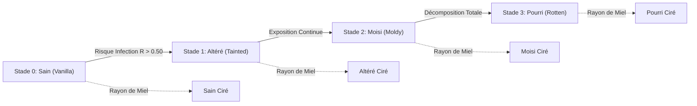
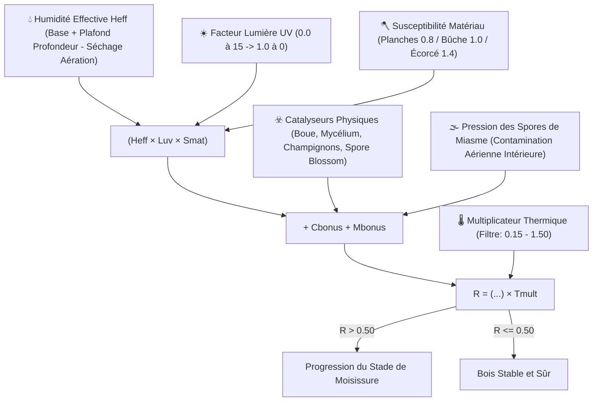
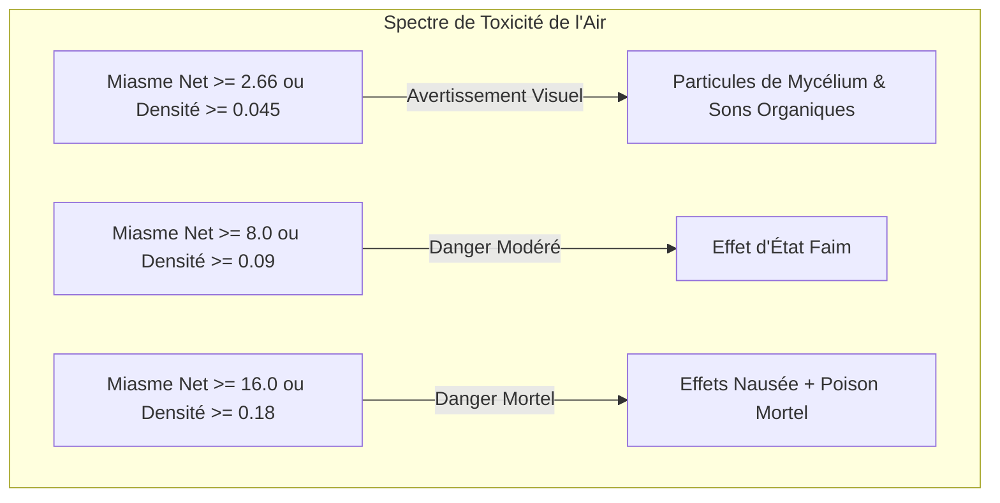
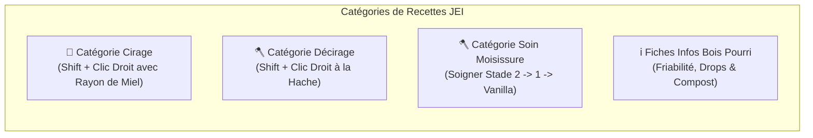

# Spores & Shadows

**Spores & Shadows** est un mod Minecraft (**Fabric 1.21.1**) qui introduit un écosystème dynamique, réaliste et impitoyable de décomposition environnementale du bois. Aucune structure en bois n'est à l'abri du temps et de la rigueur des éléments !

---

## 📑 Table des Matières
1. [Aperçu & Écosystème du Bois](#-aperçu--écosystème-du-bois)
2. [Le Cycle de la Moisissure & Modèle Mathématique](#-le-cycle-de-la-moisissure--modèle-mathématique)
3. [Dangers Environnementaux & Miasme Volumétrique](#-dangers-environnementaux--miasme-volumétrique)
4. [Dégradation Physique & Physique des Outils](#-dégradation-physique--physique-des-outils)
5. [Pénalités d'Artisanat, Four & Compost](#-pénalités-dartisanat-four--compost)
6. [Interactions & Prévention (Cirage & Grattage)](#-interactions--prévention-cirage--grattage)
7. [Génération du Monde & Usure des Structures](#-génération-du-monde--usure-des-structures)
8. [Intégration JEI (Just Enough Items)](#-intégration-jei-just-enough-items)
9. [Intégration HUD (Jade) & Succès (Advancements)](#-intégration-hud-jade--succès-advancements)
10. [Commandes en Jeu](#-commandes-en-jeu)
11. [Configuration Cloth Config & ModMenu](#-configuration-cloth-config--modmenu)

---

## 🌳 Aperçu & Écosystème du Bois

Avez-vous déjà bâti un somptueux chalet en bois en espérant qu'il demeure intact pour l'éternité sans entretien ? **Spores & Shadows** bouleverse cette certitude, transformant le bois d'un bloc inerte en un matériau vivant vulnérable à l'humidité, à l'obscurité, à l'altitude et au climat.

Le mod remplace de manière transparente le bois posé et généré par des variantes dynamiques. Avec le temps, l'exposition aux conditions ambiantes détermine si vos poutres restent saines ou se dégradent à travers des stades fongiques successifs.

### 🔢 Écosystème Complet : 910 Variantes Obtensibles
Le mod injecte un arbre de décomposition complet pour chaque bloc de bois du jeu à travers **13 formats architecturaux** :

* **🧱 13 Formats** : *Bûches*, *Bûches Écorcées*, *Bois*, *Bois Écorcé*, *Planches*, *Escaliers*, *Dalles*, *Barrières*, *Portillons*, *Portes*, *Trappes*, *Plaques de Pression*, *Boutons*.
* **🌲 10 Essences de Bois** : Chêne, Bouleau, Sapin, Jungle, Acacia, Chêne Noir, Palétuvier, Cerisier, Carmin et Biscorne.

Sur les 130 blocs de bois de base, le mod ajoute :
1. **130 Variantes Vanilla Cirées** : Copies scellées et préservées des blocs de base.
2. **390 Variantes Moisies** : Les 3 stades organiques de décomposition (*Tainted*, *Moldy*, *Rotten*).
3. **390 Variantes Moisies Cirées** : Blocs dégradés figés dans le temps avec de la cire d'abeille pour bâtir en toute sécurité.

Soit un total de **910 blocs de survie uniques** dotés de textures dédiées, tables de butin et recettes d'artisanat complètes !

---

## 🦠 Le Cycle de la Moisissure & Modèle Mathématique

Le bois évolue séquentiellement : **Stade 0 (Vanilla) ➔ Stade 1 (Tainted) ➔ Stade 2 (Moldy) ➔ Stade 3 (Rotten)**.

La progression a lieu lors des random block ticks dès que le **Risque d'Infection ($R$)** dépasse le seuil paramétrable de **0.50** :

$$R = \Big( (H_{eff} \cdot L_{uv} \cdot S_{mat}) + C_{bonus} + M_{bonus} \Big) \cdot T_{mult}$$

### 🔬 Facteurs et Modificateurs Environnementaux

* 💧 **Humidité Effective ($H_{eff} = \max(0.0, \min(1.0, H_{raw} - \text{Aération} \cdot \text{drying\_bonus}))$)** :
  * **Humidité de Base** : Déterminée par le climat du biome (Biomes pluvieux/enneigés : `0.80`, Biomes arides/secs : `0.30`).
  * **Gradient de Profondeur & Plafond $Y \le 0$** : Sous le niveau de la mer ($Y < 64$), l'humidité croît de $\frac{64 - Y}{64} \times 0.40$. À toutes les profondeurs $Y \le 0$ (jusqu'à $Y = -64$), le bonus de profondeur reste fixé à $+0.40$, prévenant les blocages dans les grottes d'abîme.
  * **Proximité de l'Eau** : Les sources d'eau ajoutent $+0.15$ d'humidité locale ; les chaudrons $+0.10$ dans un rayon de 3 blocs.
  * **Séchage par Aération** : Le flux d'air pur extérieur assèche activement le bois, réduisant $H_{raw}$.
* ☀️ **Lumière / UV ($L_{uv}$)** :
  * Évalué sur 7 points d'échantillonnage (6 faces + espace intérieur). Évolue linéairement de `0.0` au niveau 15 (stérilisation) à `1.0` dans le noir complet.
* 🪓 **Susceptibilité du Matériau ($S_{mat}$)** :
  * Bois écorcé : **multiplicateur $1.4\times$**.
  * Bûches et bois brut : **multiplicateur $1.0\times$**.
  * Planches et dérivés : **multiplicateur $0.8\times$**.
* 🌡️ **Filtre Thermique & Normalisation par Altitude ($T_{mult}$)** :
  * Fenêtre biologique : **$0.15 \le \text{Temp} \le 1.50$**. En dehors, $T_{mult} = 0.0$ (croissance stoppée).
  * **Normalisation en Caverne ($Y \le 48$)** : La température souterraine se stabilise à **$0.50$**, entretenant la moisissure en sous-sol.
  * **Gel en Haute Altitude ($Y \ge 256$)** : Chute vers **$-0.50$**, préservant naturellement les chalets d'altitude.
* ☣️ **Catalyseurs Physiques ($C_{bonus}$)** :
  * Boue ($+0.05$), Podzol / Mycélium ($+0.15$), Champignons ($+0.25$), Fleurs Sporifères ($+0.80$), Bois Pourri Voisin ($+0.20$).
* 🌫️ **Pression Aérienne du Miasme ($M_{bonus}$)** :
  * Le bois exposé à une pièce saturée de miasme subit une pression fongique aéroportée de $\text{ExposureIndex} \times \text{miasma\_multiplier}$.

---

## ☠️ Dangers Environnementaux & Miasme Volumétrique

### 🌫️ 1. Miasme Volumétrique & Saturation Dynamique
Dans les espaces clos non ventilés, le bois infecté dégage des spores toxiques qui saturent l'air ambiant.

* **Moteur BFS 3D Directionnel** : Depuis la tête du joueur (`player.getEyePos()`), la BFS analyse l'air jusqu'à **$1024\text{ m}^3$** dans un **rayon euclidien sphérique de $24$ blocs**.
* **Siphons Hydrauliques & Barrières Hermétiques** :
  * **Blocs Immergés (`waterlogged`)** : Agissent comme un **siphon hydraulique 100% étanche**, bloquant tout passage de gaz entre pièces adjacentes.
  * **Barrières Étanche** : Blocs pleins, portes fermées, trappes horizontales fermées, murets connectés et vitres.
  * **Portails de Ventilation** : Grilles de cuivre ouvertes (`GrateBlock`, $+15.0/\text{bloc}$), portes ouvertes ($+15.0$), trappes ouvertes ($+15.0$), barrières/portillons ($+3.0$) et ciel ouvert ($+25.0/\text{bloc}$).
* **Saturation Dynamique & Inertie Temporelle (`RoomSaturationManager`)** :
  * Le miasme évolue continûment : $M(t) = M_{prec} + \alpha \cdot (M_{target} - M_{prec})$.
  * Intoxication à vitesse `saturation_speed_multiplier` (`0.02`), et purification accélérée à l'ouverture des fenêtres avec `dissipation_speed_multiplier` (`0.05`).
* **Indice d'Exposition et Effets** :

$$\text{Densité} = \frac{\text{Miasme Net}}{\text{Volume}}, \quad \text{Exposition} = \text{Densité} \cdot \left(0.5 + 0.5 \cdot \min\left(2.0, \sqrt{\frac{\text{Miasme Net}}{8.0}}\right)\right)$$

### 💥 2. Nuage de Spores à la Rupture
Casser du bois dégradé sans précaution disperse violemment les colonies fongiques :
* **Déclencheur** : Détruire des blocs **Stade 2 (Moldy)** ou **Stade 3 (Rotten)** sans l'enchantement **Toucher de Soie** (et non cirés).
* **Effet** : Émission instantanée de particules `MYCELIUM` accompagnée d'un son organique sourd (`BLOCK_FUNGUS_BREAK`).

---

## 📉 Dégradation Physique & Physique des Outils

La digestion de la cellulose et de la lignine par la moisissure fait s'effondrer la résistance du bois :

| Propriété | 🌲 Stade 0 (Vanilla) | 🟢 Stade 1 (Tainted) | 🦠 Stade 2 (Moldy) | ☠️ Stade 3 (Rotten) |
| :--- | :---: | :---: | :---: | :---: |
| **Dureté du Bloc** | `2.0` ($100\%$) | `1.6` ($80\%$) | `1.0` ($50\%$) | `0.4` ($20\%$) |
| **Efficacité des Outils**| Standard à la Hache | Standard à la Hache | Standard à la Hache | **Neutralisée (Poing = Hache)** |
| **Résistance aux Explosions** | `100%` | Multiplicateur `80%` | Multiplicateur `50%` | Multiplicateur `10%` |
| **Bonus Allumage Feu** | $+0$ | $+5$ | $+10$ | $+20$ |
| **Bonus Propagation Feu** | $+0$ | $+10$ | $+25$ | $+60$ |
| **Drop en Survie** | `100%` | `100%` | `50%` (50% désintégré) | `0%` (Effritement total) |
| **Drop Toucher de Soie / Cire** | `100%` | `100%` | `100%` | `100%` |

### 🪓 Friabilité Extrême du Stade 3
Au **Stade 3 (Rotten)**, le bois n'a plus aucune cohésion structurale. Les bonus de vitesse de la hache sont **totalement ignorés** : miner du bois pourri avec une hache en Netherite prend exactement le même temps qu'à mains nues.

### 🔥 Inflammabilité & Propagation du Feu
* **Séchage et Spores** : Le bois dégradé s'enflamme beaucoup plus vite et propage violemment les flammes aux blocs voisins.
* **Inflammabilité de la Cire** : Les blocs cirés reçoivent un bonus de $+5$ d'inflammation dû à la cire d'abeille.
* **Immunité du Bois du Nether** : Les tiges et planches Carmin et Biscorne conservent une **immunité totale au feu** ($0$ combustion / $0$ propagation).

---

## ⚖️ Pénalités d'Artisanat, Four & Compost

Employer du bois pourri en menuiserie ou combustible engendre des contraintes réalistes :

### 🪵 1. Rendements d'Artisanat & Crafting Hybride
Vous pouvez transformer le bois infecté sur un établi pour produire des planches, dalles ou bâtons vanilla. Les parties gâtées étant rejetées, les rendements chutent :

| Niveau de Qualité | 🌳 1 Bûche ➔ Planches | 🦯 2 Planches ➔ Bâtons |
| :--- | :---: | :---: |
| 🌲 **Sain (Vanilla / Ciré)** | **4** Planches | **4** Bâtons |
| 🟢 **Altéré (Stade 1)** | **2** Planches | **2** Bâtons |
| 🦠 **Moisi (Stade 2)** | **1** Planche | **1** Bâton |
| ☠️ **Pourri (Stade 3)** | ❌ *Inartisanable* | ❌ *Inartisanable* |

> [!TIP]
> **Artisanat Hybride** : Vous pouvez mélanger librement du bois ciré et non ciré du même stade dans la grille de craft !

### 🔥 2. Combustion au Four & Charbon de Bois
* **Multiplicateurs de Combustion** : Stade 0 (`1.0x` / 100%) ➔ Stade 1 (`0.5x` / 50%) ➔ Stade 2 (`0.25x` / 25%) ➔ Stade 3 (`0.125x` / 12.5%).
* **Cuisson en Charbon de Bois** : Toutes les bûches infectées et cirées peuvent être cuites pour obtenir du charbon de bois.

### ♻️ 3. Fertilisation au Composteur
Le bois infecté regorge de matière organique fongique, idéale pour le composteur :
* **Bois Altéré** : $50\%$ de chance
* **Bois Moisi** : $65\%$ de chance
* **Bois Pourri** : $85\%$ de chance (Engrais exceptionnel !)

### 🔴 4. Composants Redstone Englués
La moisissure grippe les boutons et plaques de pression en bois :
* **Altéré** : Actif pendant **3.0 secondes** ($60\text{ ticks}$).
* **Moisi** : Actif pendant **7.5 secondes** ($150\text{ ticks}$).
* **Pourri** : Actif pendant **22.5 secondes** ($450\text{ ticks}$).

---

## 🛠️ Interactions & Prévention (Cirage & Grattage)

Les joueurs interagissent avec le bois en **Mode Discrétion (Sneak / Shift + Clic Droit)** :

* 🐝 **Cirage (Rayon de Miel)** :
  * Appliquer un rayon de miel scelle le bloc avec de la cire.
  * **Effets** : Bloque la décomposition, supprime l'émission de miasme, prévient la contagion et **garantit 100% de drop** même sur le bois Pourri de Stade 3 !
* 🪓 **Grattage à la Hache** :
  * **Décirage** : Shift + Clic droit à la hache retire la cire, réactivant le cycle biologique.
  * **Soin de la Moisissure** : Shift + Clic droit à la hache sur du bois infecté non ciré soigne 1 stade ($2 \rightarrow 1 \rightarrow 0$ Vanilla). Consomme de la durabilité.
  * **Incurabilité du Stade 3** : Le bois Pourri de Stade 3 a sa structure ruinée et est **incurable** (la hache n'a aucun effet ; il peut seulement être ciré ou composté).

---

## 🗺️ Génération du Monde & Usure des Structures

Les structures naturelles générées affichent un vieillissement authentique réparti en 4 degrés :

1. 🏴‍☠️ **Dégradation Critique** : Épaves (`shipwreck`), Huttes de Sorcière (`swamp_hut`) — Forte proportion de bois Pourri Stade 3.
2. 🧟 **Dégradation Élevée** : Mines abandonnées (`mineshaft`), Villages Zombie (`zombie_village`), Ruines (`trail_ruins`) — Mélange marqué de Stades 1 et 2.
3. 🏹 **Dégradation Modérée** : Avant-postes de Pillards (`pillager_outpost`), Portails en Ruine (`ruined_portal`) — Principalement Stade 1.
4. 🏡 **Dégradation Minimale** : Villages (`village`), Manoirs (`mansion`) — Bois quasi intact.

### 🛡️ Arbres Vivants & Immunité des Structures
* **Arbres Vivants** : Les arbres sauvages et les pousses sont vivants et totalement immuns à la décomposition tant qu'ils ne sont pas abattus.
* **Immunité des Structures** : Par défaut, les structures se génèrent pré-vieillies puis figent leur état jusqu'à intervention du joueur.

---

## 📖 Intégration JEI (Just Enough Items)

Le mod s'intègre nativement et complètement à JEI :

1. **Catégorie Cirage (`WaxingRecipeCategory`)** : Présente l'ensemble des 130 transformations de cirage.
2. **Catégorie Grattage à la Hache (`ScrapingRecipeCategory`)** :
   * Recettes de décirage pour toutes les variantes cirées.
   * Procédures de soin de la moisissure ($2 \rightarrow 1 \rightarrow 0$).
3. **Fiches d'Informations Bois Pourri** : Descriptions intégrées sur la friabilité, l'absence de drop sans cire et le compostage.

---

## 📊 Intégration HUD (Jade) & Succès (Advancements)

* 🔍 **Infobulles Jade / WTHIT** : Viser un bloc de bois affiche son nom, stade de moisissure, état de cirage et Risque d'Infection en direct ($R\%$) avec coloration dynamique (**Gris = Sûr**, **Rouge = À Risque**).
* 🏆 **Succès (Advancements)** :
  * **Spores & Shadows** : Survivez au cycle naturel de décomposition du bois.
  * **Natural Prevention** : Cirez un bloc de bois avec un rayon de miel pour le sceller.
  * **Elbow Grease** : Utilisez une hache pour ôter la moisissure du bois infecté.
  * **Short Breath** : Succombez à l'empoisonnement au miasme dans une cave confinée.
  * **Dust to Dust** : Regardez un bloc pourri de Stade 3 s'effriter en poussière au minage.

---

## 💻 Commandes en Jeu

Toutes les commandes d'administration nécessitent le niveau opérateur 2 :

* `/miasma`  
  Exécute un scan atmosphérique BFS en direct à la position du joueur, affichant type d'espace (Plein Air / Espace Confiné), volume d'air ($m^3$), Score de Toxicité, Score de Ventilation, Miasme Net et Densité des Spores.
* `/moldrisk`
  Inspecte le bloc ciblé et affiche humidité ($H_{\text{eff}}$), lumière ($L_{\text{uv}}$), susceptibilité ($S_{\text{mat}}$), catalyseurs, bonus aérien de miasme ($M_{\text{bonus}}$), température et valeur calculée de $R$.
* `/moldrisk verbose`  
  Détaille l'intégralité du calcul intermédiaire (modificateurs de profondeur, températures de surface vs grotte, bonus d'eau locaux).
* `/spores reload`  
  Recharge instantanément le fichier de configuration (`config/spores--shadows.json`) sans redémarrage serveur ou client.

---

## ⚙️ Configuration Cloth Config & ModMenu

Configurable via **ModMenu & Cloth Config** en 12 catégories dédiées :

1. 🛠️ **General** : Activation de la moisissure, seuil d'infection (`0.50`), rayon de scan, immunité des structures et usure de la hache.
2. 🪓 **Susceptibility** : Multiplicateurs pour bois écorcé (`1.4`), planches (`0.8`) et bûches (`1.0`).
3. ☣️ **Catalysts** : Poids pour boue, mycélium, champignons, fleurs sporifères et bois infecté.
4. 🌡️ **Environment** : Humidité de base, modificateurs de profondeur, bonus d'eau, séchage par aération, pression des spores de miasme, températures critiques, normalisation en caverne ($Y=48$) et gel en montagne ($Y=256$).
5. 💥 **Drops** : Probabilités de drop pour Stade 2 (`50%`) et Stade 3 (`0%`).
6. 🗺️ **Structures** : Pourcentages de dégradation par catégorie de structure.
7. 🔥 **Furnace Multipliers** : Multiplicateurs de combustible de four pour Stades 0, 1, 2, 3.
8. 🚒 **Flammability** : Toggle d'inflammabilité, bonus d'allumage ($+5/+10/+20$), propagation ($+10/+25/+60$) et cire ($+5$).
9. 💣 **Blast Resistance** : Toggle de résistance aux explosions, multiplicateurs pour Stade 1 (`0.80`), Stade 2 (`0.50`), Stade 3 (`0.10`).
10. ⛏️ **Hardness** : Toggle de dureté progressive (`0.80`, `0.50`, `0.20`), et toggle de nuage de spores à la rupture.
11. ☠️ **Toxicity** : Intervalle des ticks de miasme, volume maximal, rayon euclidien, taux de saturation/dissipation, scores de ventilation et seuils d'effets.
12. 🖥️ **Client** : Ajustement du Z-Offset de rendu de moisissure pour compatibilité parfaite avec shaders Iris et Sodium.
