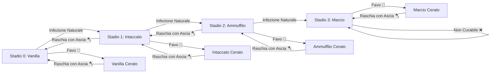

# 🍄 Spores & Shadows — Guida Ufficiale e Documentazione Wiki

**Spores & Shadows** è una mod per Minecraft (**Fabric 1.21.1**) che introduce un ecosistema dinamico, realistico e implacabile di decadimento biologico ed usura ambientale per il legno. Con questa mod, nessun edificio in legno è più eterno: il tempo, l'umidità, il buio e gli elementi atmosferici trasformeranno le tue costruzioni, costringendoti a prendertene cura o ad assistere al loro inesorabile degrado!

---

## 📑 Indice dei Contenuti
1. [Panoramica & Ecosistema dei Blocchi](#-1-panoramica--ecosistema-dei-blocchi)
2. [Il Ciclo della Muffa & Formula di Rischio](#-2-il-ciclo-della-muffa--formula-di-rischio)
3. [Pericoli Ambientali: Miasma Volumetrico & Aereazione](#-3-pericoli-ambientali-miasma-volumetrico--aereazione)
4. [Interazioni, Manutenzione e Cura con Cera e Ascia](#-4-interazioni-manutenzione-e-cura-con-cera-e-ascia)
5. [Fisica dei Blocchi: Durezza, Friabilità & Nuvola di Spore](#-5-fisica-dei-blocchi-durezza-friabilit%C3%A0--nuvola-di-spore)
6. [Fisica del Fuoco, Fornace & Carbonella](#-6-fisica-del-fuoco-fornace--carbonella)
7. [Resistenza alle Esplosioni](#-7-resistenza-alle-esplosioni)
8. [Artigianato, Compostiera & Pietrarossa](#-8-artigianato-compostiera--pietrarossa)
9. [Generazione nel Mondo & Strutture](#-9-generazione-nel-mondo--strutture)
10. [Integrazione JEI, HUD Jade & Obiettivi](#-10-integrazione-jei-hud-jade--obiettivi)
11. [Comandi di Gioco & Amministrazione](#-11-comandi-di-gioco--amministrazione)
12. [Configurazione della Mod (Cloth Config)](#-12-configurazione-della-mod-cloth-config)

---

## 🌳 1. Panoramica & Ecosistema dei Blocchi

Hai mai costruito una baita in legno pensando che sarebbe rimasta lì intatta, sfidando i secoli senza alcun bisogno di manutenzione? **Spores & Shadows** rivoluziona questa certezza, trasformando il legno da un semplice blocco inerte a un materiale vivo, permeabile e reattivo all'ambiente circostante.

La mod sostituisce in modo del tutto trasparente e silenzioso ogni pezzo di legno piazzato dal giocatore (o generato naturalmente nelle strutture come relitti e miniere) con una variante biologica attiva.

### 🔢 I 13 Formati Architettonici & le 910 Varianti
Il sistema supporta tutte le tipologie di legno vanilla (inclusi i legni cremisi e distorti del Nether, nonché il bambù) attraverso **13 formati architettonici**:
* *Tronchi (Logs)*, *Tronchi Scortecciati (Stripped Logs)*
* *Legno (Wood/Bark)*, *Legno Scortecciato (Stripped Wood)*
* *Assi (Planks)*, *Scale (Stairs)*, *Lastre (Slabs)*
* *Staccionate (Fences)*, *Cancelletti (Fence Gates)*
* *Porte (Doors)*, *Botole (Trapdoors)*
* *Pedane a Pressione (Pressure Plates)*, *Pulsanti (Buttons)*

Per ciascuno dei 130 formati base in legno, la mod aggiunge **3 stadi di decadimento** (*Intaccato*, *Ammuffito*, *Marcio*). Inoltre, per ogni singolo blocco — compreso il blocco Vanilla sano — esiste la corrispettiva **variante Cerata (*Waxed*)**.

In totale, la mod introduce ben **910 varianti uniche e ottenibili in Survival**:
1. **130 Varianti Vanilla Cerate**: La copia protetta e impermeabilizzata del blocco originale.
2. **390 Varianti Ammuffite**: I tre stadi di decadimento naturale (Stadio 1, 2 e 3).
3. **390 Varianti Ammuffite Cerate**: I blocchi degradati ma sigillati nel tempo dalla cera per usi decorativi sicuri.

---

## 🦠 2. Il Ciclo della Muffa & Formula di Rischio

Il legno attraversa 4 stadi evolutivi:
$$\text{Sano / Vanilla (Stadio 0)} \longrightarrow \text{Intaccato (Stadio 1)} \longrightarrow \text{Ammuffito (Stadio 2)} \longrightarrow \text{Marcio (Stadio 3)}$$

Durante ogni ciclo casuale (`randomTick`), il gioco valuta l'indice di **Rischio di Infezione ($R$)**. Se $R$ supera la soglia critica configurata (default: **$0.40$**), il blocco avanza allo stadio successivo.

### 📐 La Formula Matematica
$$R = \Big(\big(H_{\text{eff}} \times L_{\text{uv}} \times S_{\text{mat}}\big) + \text{Catalizzatori}\Big) \times T_{\text{mult}}$$

### 🔬 Dettaglio dei Fattori:
* 💧 **Umidità Effettiva ($H_{\text{eff}}$)**:
  * **Clima Base**: Biomi piovosi o innevati = `0.80`, Biomi aridi/secchi = `0.30`.
  * **Malus Profondità Sottoterra ($Y < 64$)**: L'umidità aumenta progressivamente di `+0.01` per ogni blocco al di sotto del livello del mare (fino a un massimo di `+1.28`). Le miniere e caverne profonde sono perennemente sature d'umidità.
  * **Bonus Prossimità Idrica**: Adiacenza ad acqua (`+0.15`) o calderoni pieni (`+0.10`), rilevati in un raggio orizzontale di 3 blocchi (fino a un massimo di `+0.60`).
* ☀️ **Fattore Luce UV ($L_{\text{uv}}$)**:
  * La luce naturale o artificiale sterilizza le superfici. Il fattore scala linearmente da `0.0` (Luce 15: blocca completamente l'infezione) fino a `1.0` (Buio totale, Luce 0).
* 🪓 **Suscettibilità del Materiale ($S_{\text{mat}}$)**:
  * **Legno Scortecciato**: Estremamente vulnerabile (`x1.40`), privo della corteccia protettiva.
  * **Tronchi Grezzi & Legno**: Valore standard (`x1.00`).
  * **Assi Lavorate e Derivati**: Leggermente più resistenti (`x0.80`).
* 🌡️ **Moltiplicatore Temperatura ($T_{\text{mult}}$)**:
  * La muffa prolifera solo se la temperatura locale è compresa tra `0.15` e `1.50`. Al di fuori di questo intervallo, $T_{\text{mult}} = 0.0$ e la crescita si arresta.
  * **Nether ed End**: Il calore infernale o il vuoto astrale sterilizzano completamente l'ambiente; la muffa non cresce mai in queste dimensioni.
  * **Sottoterra ($Y < 64$)**: Indipendentemente dal bioma di superficie (anche sotto un deserto o una tundra), scendendo in profondità la temperatura si normalizza gradualmente fino a stabilizzarsi a `0.50` (mite) sotto $Y=48$.
  * **Alta Quota ($Y > 128$)**: Salendo verso le vette montane la temperatura precipita gradualmente, raggiungendo il congelamento (`-0.50`) a quota $Y=256$.
* ☣️ **Catalizzatori Ambientali & Contagio**:
  * Presenza nel raggio di scansione di blocchi infetti o spore:
    * Legno Intaccato (`+0.05`), Legno Ammuffito (`+0.10`), Legno Marcio (`+0.20`).
    * Fango (`+0.05`), Podzol o Micelio (`+0.15`), Funghi (`+0.25`), Fiore di Spore / *Spore Blossom* (`+0.80`).

---

## ☠️ 3. Pericoli Ambientali: Miasma Volumetrico & Aereazione

I blocchi colonizzati dalla muffa non sono solo fragili: rilasciano spore biologiche volatili nell'atmosfera circostante.

```
┌─────────────────────────────────────────────────────────────┐
│                   ALGORITMO FLOOD-FILL BFS                  │
│                                                             │
│   [Occhi Giocatore] ──> Espansione Aria 3D (Raggio Manhattan ≤ 8)│
│                               │                             │
│               ┌───────────────┴───────────────┐             │
│               ▼                               ▼             │
│       Comunica col Cielo?              Pareti Sigillate?    │
│      [AEREAZIONE TOTALE]             [CONCENTRAZIONE GAS]   │
│         Net Miasma = 0             Net = Tossicità - Vento  │
└─────────────────────────────────────────────────────────────┘
```

### 🧠 Algoritmo Flood-Fill BFS per Spazi Confinati
* **Nessun Falso Positivo**: A differenza dei vecchi sistemi a raggio cubico, la mod utilizza una scansione **Flood-Fill BFS** (Breadth-First Search) a partire dagli occhi del giocatore:
  * Le pareti opache e solide (`isSideSolidFullSquare`) bloccano ermeticamente il passaggio del gas.
  * Porte aperte, botole, scale e varchi permettono all'aria tossica di fluire realisticamente nelle stanze adiacenti.
  * **Raggio di Manhattan Massimo (`MAX_MANHATTAN_RADIUS = 8`)**: Evita calcoli infiniti lungo lunghi tunnel sotterranei.
  * **Volume Massimo di Saturazione (`MAX_AIR_VOLUME = 512`)**: Oltre questo volume d'aria, l'ambiente è considerato troppo vasto per concentrare il miasma e il gas si disperde.

### 💨 Meccanica di Aereazione & Ventilazione Naturale
* **Verifica Cielo Aperto ($O(1)$)**: Se anche un solo blocco della stanza comunica verticalmente con il cielo aperto (superficie atmosferica non ostruita), la stanza è considerata ventilata all'aperto e il miasma si azzera istantaneamente.
* **Fessure e Prese d'Aria**: Le pareti perimetrali composte da blocchi non pieni (come staccionate, grate di ferro, muretti o lastre) che affacciano all'esterno accumulano un punteggio di ventilazione:
  $$\text{Ventilation Score} += 3.0 \quad \text{per ogni fessura verso l'esterno}$$
  $$\text{Net Miasma} = \text{Toxicity Score} - \text{Ventilation Score}$$

### 🤢 Effetti e Sintomi da Intossicazione
* **Particelle Nebbiose Volumetriche**: Nelle stanze contaminate, dense nubi di spore (`SPORE_BLOSSOM_AIR` e `MYCELIUM`) avvolgono volumetricamente l'intero volume d'aria della stanza.
* **Fame (Livello Moderato)**: $\text{Net Miasma} \ge 8.0$ (oppure Densità $\ge 0.09$ con $\text{Net} \ge 5.0$).
* **Nausea + Veleno (Livello Letale)**: $\text{Net Miasma} \ge 35.0$ (soglia veleno configurabile) oppure Densità $\ge 0.18$ con $\text{Net} \ge 15.0$ (soglia nausea configurabile).

---

## 🛠️ 4. Interazioni, Manutenzione e Cura con Cera e Ascia

Il giocatore può intervenire direttamente per salvare le proprie strutture. Tutte le interazioni manuali richiedono la **modalità furtiva (Sneaking / Shift + Tasto Destro)** per evitare conflitti con porte, botole e pulsanti.



### 🪓 Raschiamento con Ascia (*Axe Scraping*)
* **Rimozione Cera**: Facendo *Shift + Click Destro* su un blocco Cerato, l'ascia rimuove la cera (producendo particelle di cera) e ripristina lo stato biologico attivo.
* **Cura della Muffa**:
  * Un blocco **Ammuffito (Stadio 2)** raschiato con l'ascia regredisce a **Intaccato (Stadio 1)**.
  * Un blocco **Intaccato (Stadio 1)** raschiato con l'ascia torna perfettamente pulito a **Sano (Stadio 0 Vanilla)**.
  * *I blocchi Marci (Stadio 3) hanno subito un collasso cellulare irreversibile e NON possono essere curati con l'ascia.*
* Ogni raschiatura consuma normalmente 1 punto di durabilità dell'ascia (configurabile).

### 🐝 Ceratura con Favo (*Honeycomb Waxing*)
* Facendo *Shift + Click Destro* con un favo su un blocco di qualsiasi stadio (0, 1, 2 o 3), il blocco viene **Incerato**:
  * **Immunità Totale**: Congela indefinitamente il blocco al suo stadio attuale.
  * **Sicurezza Biologica**: Non può più infettare i blocchi vicini e non emette particelle né miasma tossico.
  * **Preservazione Meccanica**: Garantisce il **100% di probabilità di drop** alla rottura, persino per il legno marcio!
* **Supporto Strutture Multiple**: Incerare o raschiare una porta aggiorna istantaneamente entrambe le metà superiore e inferiore.

---

## ⛏️ 5. Fisica dei Blocchi: Durezza, Friabilità & Nuvola di Spore

La mod introduce una fisica dei blocchi dinamica che rispecchia la perdita di coesione strutturale delle fibre di legno marcescenti:

| Stadio di Degrado | Durezza Blocco | % Rispetto al Vanilla | Comportamento Attrezzi | Probabilità Drop (Senza Silk Touch) | Drop con Silk Touch / Cera |
| :--- | :---: | :---: | :--- | :---: | :---: |
| 🌲 **Stadio 0 (Vanilla)** | **2.0** | $100\%$ | Ascia raccomandata | **100%** | **100%** |
| 🟢 **Stadio 1 (Intaccato)** | **1.6** | $80\%$ | Ascia raccomandata | **100%** | **100%** |
| 🦠 **Stadio 2 (Ammuffito)** | **1.0** | $50\%$ | Ascia veloce | **50%** *(50% polvere)* | **100%** |
| ☠️ **Stadio 3 (Marcio)** | **0.4** | $20\%$ | **Friabile (Ascia = Pugno)** | **0%** *(Sbriciolamento)* | **100%** |

### 💥 Friabilità & Neutralizzazione dell'Ascia allo Stadio 3
Allo Stadio 3 (*Marcio*), la polpa interna del legno è talmente decomposta che il blocco perde ogni rigidità:
* **Velocità di Scavo Uniforme**: Rompere un blocco di Stadio 3 con un'ascia di diamante o a mani nude impiega esattamente la **stessa frazione di secondo**. L'ascia non fornisce alcun moltiplicatore di velocità aggiuntivo.
* **Collasso Meccanico**: Rompere il blocco senza *Tocco di Velluto (Silk Touch)* o senza averlo prima cerato lo distruggerà all'istante senza rilasciare alcun drop ($0\%$).

### ☁️ Nuvola di Spore alla Rottura
Distruggere un blocco di legno di **Stadio 2 (Ammuffito)** o **Stadio 3 (Marcio)** senza l'incantesimo *Tocco di Velluto*:
* Rilascia un'esplosione violenta di spore fungine nell'aria (`SPORE_BLOSSOM_AIR`, `FALLING_SPORE_BLOSSOM`, particelle di micelio).
* Emette un suono sordo e viscerale di rottura biologica (`BLOCK_WOOD_BREAK` combinato con suoni fungini del Nether).

---

## 🔥 6. Fisica del Fuoco, Fornace & Carbonella

Le cavità porose scavate dal micelio rendono il legno degradato estremamente suscettibile alla combustione rapida:

### 🪵 Infiammabilità & Diffusione del Fuoco
La mod integra un calcolo dinamico dell'infiammabilità registrato nel motore di combustione di Minecraft:
* **Stadio 1 (Intaccato)**: $+5$ Bruciatura (*Burn/Catch Chance*), $+10$ Diffusione (*Spread*).
* **Stadio 2 (Ammuffito)**: $+10$ Bruciatura, $+25$ Diffusione.
* **Stadio 3 (Marcio)**: $+20$ Bruciatura, $+60$ Diffusione (*Brucia con estrema violenza e rapidità*).
* **Bonus Cera (*Waxed*)**: $+5$ alla facilità di accensione a causa dell'infiammabilità della cera d'api.
* **🛡️ Immunità Assoluta Legni Nether**: I blocchi ricavati da *Fungo Cremisi* (*Crimson*) e *Fungo Distorto* (*Warped*) mantengono la loro nativa immunità al fuoco ($0$ bruciatura, $0$ diffusione) in tutti gli stadi!

### 🥩 Efficienza Combustibile in Fornace
Più il legno è marcio, minore è la densità energetica rilasciata nella fornace:
* **Sano (Vanilla / Cerato)**: Efficienza standard (**100%** / `1.0x` — 300 tick per tronco).
* **Intaccato (Stadio 1)**: Efficienza dimezzata (**50%** / `0.5x` — 150 tick).
* **Ammuffito (Stadio 2)**: Efficienza a un quarto (**25%** / `0.25x` — 75 tick).
* **Marcio (Stadio 3)**: Efficienza minima (**12.5%** / `0.125x` — 37 tick minimi garantiti contro underflow).

### ⬛ Cottura Carbonella (*Charcoal Tag Support*)
Tutti i tronchi e legni della mod (ammuffiti o cerati) sono registrati nei tag `#minecraft:item/charcoal` e `#c:charcoal`, permettendo di cuocerli normalmente in una fornace per ricavare carbonella!

---

## 💥 7. Resistenza alle Esplosioni

La decomposizione della lignina riduce drasticamente la capacità del legno di assorbire l'onda d'urto delle detonazioni (TNT, Creeper, palle di fuoco dei Ghast):
* **Stadio 0 (Vanilla)**: Resistenza standard $2.0\text{F}$ ($100\%$).
* **Stadio 1 (Intaccato)**: Resistenza scalata a $1.6\text{F}$ ($80\%$).
* **Stadio 2 (Ammuffito)**: Resistenza scalata a $1.0\text{F}$ ($50\%$).
* **Stadio 3 (Marcio)**: Resistenza ridotta a $0.2\text{F}$ ($10\%$). *Una minima detonazione periferica polverizza all'istante intere pareti marce.*

---

## ⚖️ 8. Artigianato, Compostiera & Pietrarossa

### 🛠️ Resa di Crafting Ridotta & Crafting Ibrido
Puoi trasformare i tronchi infetti in assi pulite e bastoni Vanilla al banco da lavoro. La resa è tuttavia proporzionale all'integrità del materiale:

| Qualità del Materiale | 🌳 Tronco ➔ Assi | 🦯 Assi ➔ Bastoni |
| :--- | :---: | :---: |
| 🌲 **Sano (Vanilla / Cerato)** | 1 Tronco ➔ **4** Assi Vanilla | 2 Assi ➔ **4** Bastoni |
| 🟢 **Intaccato (Stadio 1)** | 1 Tronco ➔ **2** Assi Vanilla | 2 Assi ➔ **2** Bastoni |
| 🦠 **Ammuffito (Stadio 2)** | 1 Tronco ➔ **1** Asse Vanilla | 2 Assi ➔ **1** Bastone |
| ☠️ **Marcio (Stadio 3)** | *Inutilizzabile* ❌ | *Inutilizzabile* ❌ |

* **💡 Crafting Ibrido**: Puoi posizionare nella stessa griglia di fabbricazione blocchi cerati e non cerati appartenenti allo stesso stadio; il banco da lavoro produrrà regolarmente i prodotti puliti.
* **Lavorazione Completa Blocchi Cerati**: Oltre 100 ricette dedicate consentono di lavorare tronchi cerati in assi cerate, e queste in porte, botole, scale, lastre, cancelletti e cartelli cerati.

### ♻️ Compostiera (Riciclo Organico)
Il legno degradato trova una seconda vita nella compostiera Vanilla per produrre farina d'ossa (*Bone Meal*):
* Legno Intaccato: **50%** di probabilità di riempimento.
* Legno Ammuffito: **65%** di probabilità di riempimento.
* Legno Marcio: **85%** di probabilità (*Fertilizzante biologico eccezionale!*).

### 🔴 Componenti in Pietrarossa Difettosi
La muffa che ostruisce molle e perni rallenta il rilascio dei meccanismi in pietrarossa:
* **Pulsante Sano**: Attivo per 1,5 secondi (30 tick).
* **Pulsante Intaccato**: Attivo per **3,0 secondi** (60 tick).
* **Pulsante Ammuffito**: Attivo per **7,5 secondi** (150 tick).
* **Pulsante Marcio**: Si incastra per ben **22,5 secondi** (450 tick)!

---

## 🗺️ 9. Generazione nel Mondo & Strutture

Durante la generazione dei chunk, la mod applica l'usura del tempo a tutte le strutture storiche del mondo secondo 4 livelli di degrado:

1. 🏴‍☠️ **Degrado Critico** (Prevalenza di legno Marcio): Relitti Sommersi (`shipwreck`), Capanne della Palude (`swamp_hut`).
2. 🧟 **Degrado Alto** (Misto Intaccato e Ammuffito): Miniere Abbandonate (`mineshaft`), Villaggi Zombie (`zombie_village`), Rovine del Sentiero (`trail_ruins`).
3. 🏹 **Degrado Moderato** (Principalmente Intaccato): Avamposti dei Saccheggiatori (`pillager_outpost`), Portali del Nether in Rovina (`ruined_portal`).
4. 🏡 **Degrado Minimo** (Quasi interamente sano): Villaggi abitati (`village`), Magioni della Foresta (`mansion`).

### 🛡️ Protezioni Native
* **Alberi Vivi Immuni**: Gli alberi generati naturalmente o cresciuti dai virgulti sono vivi e non marciscono spontaneamente. Solo il legno tagliato o posizionato entra nel ciclo vitale.
* **Strutture Sospese**: I blocchi all'interno delle strutture generate si trovano in uno stato "dormiente" e non marciscono autonomamente a meno che un giocatore non interagisca con essi (attivando la reattività biologica). Questa opzione può essere disattivata nel config per simulare il collasso spontaneo del mondo.

---

## 📊 10. Integrazione JEI, HUD Jade & Obiettivi

### 📖 Plugin Nativo JEI (Just Enough Items)
La mod include un'integrazione completa con JEI:
1. **Categoria Ceratura (*Waxing*)**: Mostra la ricetta `Blocco + Favo ➔ Variante Cerata` per tutti i 130 blocchi e varianti.
2. **Categoria Raschiamento con Ascia (*Axe Scraping*)**:
   * Rimozione cera: `Blocco Cerato + Ascia ➔ Blocco Non Cerato`.
   * Cura del legno: `Stadio 2 (Ammuffito) + Ascia ➔ Stadio 1 (Intaccato)` e `Stadio 1 ➔ Stadio 0 (Vanilla)`.
3. **Schede Informative (*Info Tabs*)**: Schede descrittive integrate su tutti i blocchi di **Stadio 3 (Marcio)** che illustrano l'impossibilità di cura/crafting e guidano all'uso nella compostiera, fornace o all'estrazione con Silk Touch.

### 🔍 HUD Jade / WTHIT
Inquadrando qualsiasi blocco di legno con il mirino:
* L'interfaccia mostra il nome esatto della variante (es. *Assi di Quercia Intaccate Cerate*).
* Indica la percentuale esatta di Rischio Infezione ($R$) in tempo reale (**Grigio = Sicuro**, **Rosso = In Pericolo**). Per i blocchi cerati mostra `0.0% (Waxed)`.
* Supporto nativo con Polymer e correzione automatica del raytracing dei blocchi virtuali.

### 🏆 Nuovi Obiettivi (Advancements)
* 🍄 **Spores & Shadows**: *Sopravvivi al decadimento della natura.*
* 🐝 **Prevenzione Naturale**: *Usa un favo di miele per incerare un blocco di legno e fermare la muffa.*
* 🪓 **Olio di Gomito**: *Raschia via la muffa superficiale da un blocco di legno usando un'ascia.*
* 🤢 **Respiro Corto**: *Subisci l'avvelenamento da miasma respirando troppe spore in una stanza chiusa.*
* 💨 **Polvere alla Polvere**: *Tenta di rompere un blocco di legno marcio e guardalo sgretolarsi nel nulla.*

---

## 💻 11. Comandi di Gioco & Amministrazione

Tutti i comandi richiedono permessi di livello 2 (amministratore o trucchi abilitati in singleplayer):

### 1. `/moldrisk` (oppure `/moldyrisk`)
Analizza il blocco di legno inquadrato dal mirino (fino a 10 blocchi di distanza):
* **Sintassi**:
  * `/moldrisk` — Fornisce una sintesi rapida dei punteggi parziali ($H_{\text{eff}}, L_{\text{uv}}, S_{\text{mat}}$, Catalizzatori, Temperatura) e il verdetto finale ($R > \text{Soglia} \implies \text{WILL GROW}$ o $\text{SAFE}$).
  * `/moldrisk verbose` — Mostra lo spaccato matematico completo (umidità base, quota, sorgenti d'acqua vicine, livello di luce medio, scostamento termico tra superficie e profondità).

### 2. `/miasma`
Esegue una scansione diagnostica istantanea dell'aria confinata attorno al giocatore:
* **Sintassi**: `/miasma`
* **Output Dettagliato in Chat**:
  ```text
  [Miasma Scanner] Scanning environment...
  - Environment: Confined Space (Volume: 84 blocks analyzed)
  - Toxicity Score (from mold): +24.50
  - Ventilation Score (from openings/gaps): -6.00
  - Net Miasma: 18.50
  - Spore Density: 0.220
  [WARNING] Lethal level! Nausea and Poison imminent!
  ```

### 3. `/spores reload`
Ricarica a caldo tutti i file di configurazione da disco senza dover riavviare il server o il client:
* **Sintassi**: `/spores reload`
* **Output**: `[Spores & Shadows] Configuration reloaded successfully!`

---

## ⚙️ 12. Configurazione della Mod (Cloth Config)

Accedendo al menu ModMenu / Cloth Config, è possibile personalizzare nel dettaglio ogni parametro della mod suddiviso in **12 categorie**:

1. 🛠️ **Generale (`general`)**:
   * `enable_mold_growth` (default: `true`): Abilita o disabilita globalmente la diffusione della muffa.
   * `infection_threshold` (default: `0.40`): Soglia critica oltre la quale il legno si infetta.
   * `scan_radius` (default: `1`): Raggio di scansione dei blocchi limitrofi ($1 = 3\times 3\times 3$, $2 = 5\times 5\times 5$).
   * `structures_immune` (default: `true`): Protegge le strutture generate dal decadimento spontaneo.
   * `axe_scrape_damage` (default: `1`): Durabilità consumata dall'ascia per ogni raschiatura.
2. 🌡️ **Ambiente (`environment`)**:
   * `rain_humidity_base` (`0.8`), `dry_humidity_base` (`0.3`): Valori base di umidità per biomi umidi o secchi.
   * `depth_modifier_per_level` (`0.01`), `max_depth_modifier` (`1.28`): Incremento umidità nelle profondità.
   * `water_adjacent_bonus` (`0.15`), `cauldron_adjacent_bonus` (`0.10`), `water_scan_radius` (`3`): Parametri idrici locali.
   * `min_temperature_survival` (`0.15`), `max_temperature_survival` (`1.50`): Finestra termica vitale per la muffa.
   * `cave_temperature` (`0.50`), `cave_start_y` (`64`), `cave_full_y` (`48`): Gradiente termico sotterraneo.
   * `high_altitude_freezing_temperature` (`-0.50`), `high_altitude_start_y` (`128`), `high_altitude_full_y` (`256`): Gradiente termico montano.
3. 🪓 **Suscettibilità (`susceptibility`)**:
   * `stripped_wood_multiplier` (`1.4`), `planks_multiplier` (`0.8`), `default_multiplier` (`1.0`).
4. ☣️ **Catalizzatori (`catalysts`)**:
   * Moltiplicatori additivi per fango (`0.05`), podzol/micelio (`0.15`), funghi (`0.25`), fiore di spore (`0.80`), e blocchi di legno infetti (`0.05`, `0.10`, `0.20`).
5. ☠️ **Tossicità & Miasma (`toxicity`)**:
   * `check_interval_ticks` (`40`): Frequenza dei controlli miasma sul giocatore (in tick).
   * `scan_radius` (`4`): Raggio di ricerca sorgenti di spore.
   * `threshold_nausea` (`15`), `threshold_poison` (`35`): Soglie di attivazione degli status alterati.
   * `duration_nausea_ticks` (`140`), `duration_poison_ticks` (`100`): Durata degli effetti.
   * `nausea_amplifier` (`0`), `poison_amplifier` (`0`): Potenza degli effetti.
6. 🗺️ **Strutture (`structures`)**:
   * Probabilità percentuali di comparsa di blocchi intaccati, ammuffiti e marci per le categorie *Critico*, *Alto*, *Moderato* e *Basso*.
7. 🔥 **Efficienza Fornace (`furnace_multipliers`)**:
   * Moltiplicatori carburante per Stadio 0 (`1.0`), Stadio 1 (`0.5`), Stadio 2 (`0.25`), Stadio 3 (`0.125`).
8. 🪵 **Infiammabilità (`flammability`)**:
   * `enable_flammability` (`true`): Abilita la fisica di propagazione del fuoco scalare.
   * Bonus bruciatura e diffusione per Stadio 1 (`+5/+10`), Stadio 2 (`+10/+25`), Stadio 3 (`+20/+60`).
   * `waxed_burn_bonus` (`5`): Bonus all'accensione per blocchi cerati.
9. 💥 **Resistenza alle Esplosioni (`blast_resistance`)**:
   * `enable_blast_resistance_scaling` (`true`): Abilita il calo di resistenza alle detonazioni.
   * Moltiplicatori per Stadio 1 (`0.80`), Stadio 2 (`0.50`), Stadio 3 (`0.10`).
10. ⛏️ **Durezza & Rottura (`hardness`)**:
    * `enable_hardness_scaling` (`true`): Abilita la durezza scalare ($2.0 \rightarrow 1.6 \rightarrow 1.0 \rightarrow 0.4$).
    * `stage_1_multiplier` (`0.80`), `stage_2_multiplier` (`0.50`), `stage_3_multiplier` (`0.20`).
    * `enable_break_spore_cloud` (`true`): Abilita l'esplosione di spore alla rottura dei blocchi senza Silk Touch.
11. 📦 **Drop (`drops`)**:
    * `stage_2_drop_chance` (`0.50`): Probabilità di drop per blocchi Ammuffiti non cerati.
    * `stage_3_drop_chance` (`0.00`): Probabilità di drop per blocchi Marci non cerati.
12. 🖥️ **Client (`client`)**:
    * `mold_z_offset` (`0.002`): Offset di rendering per prevenire Z-fighting con motori grafici come Sodium o Iris Shaders.
