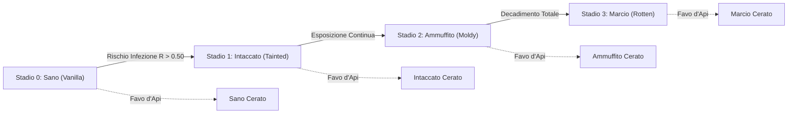
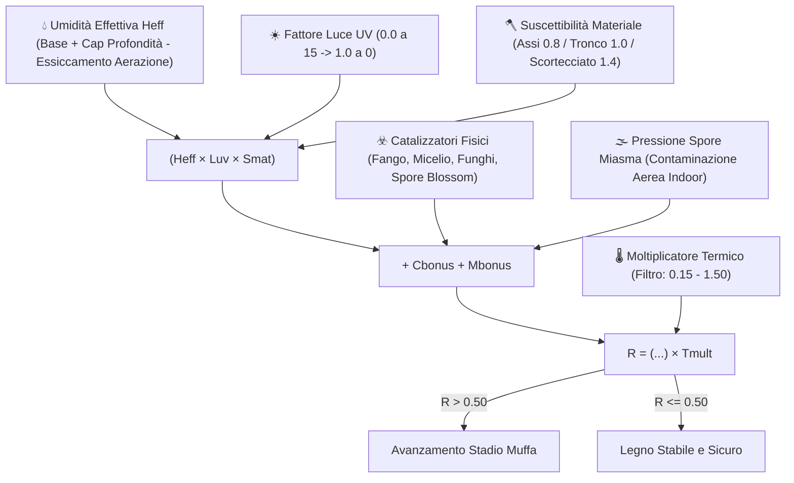
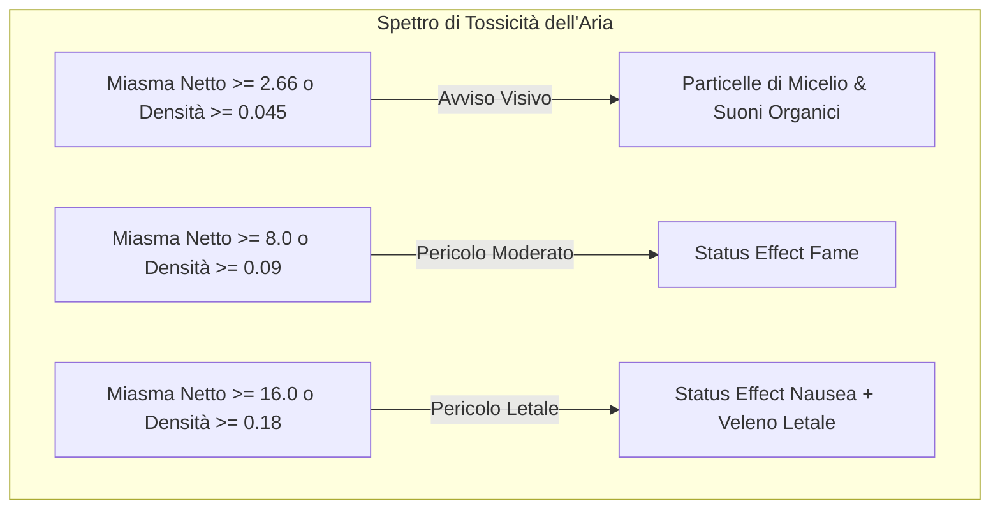
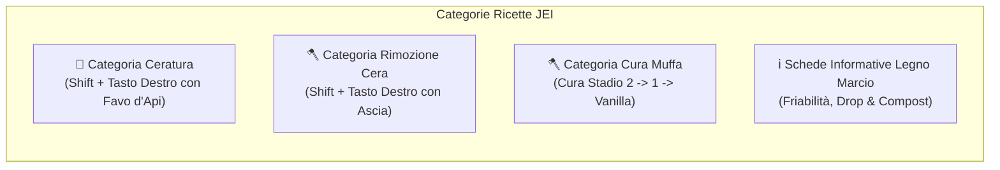

# Spores & Shadows

**Spores & Shadows** è una mod per Minecraft (**Fabric 1.21.1**) che introduce un ecosistema dinamico, realistico e spietato di decadimento ambientale del legno. Nessuna struttura in legno è al sicuro dal passare del tempo e dalla severità degli elementi!

---

## 📑 Indice dei Contenuti
1. [Panoramica & Ecosistema del Legno](#-panoramica--ecosistema-del-legno)
2. [Il Ciclo della Muffa & Modello Matematico](#-il-ciclo-della-muffa--modello-matematico)
3. [Pericoli Ambientali & Miasma Volumetrico](#-pericoli-ambientali--miasma-volumetrico)
4. [Degrado Fisico & Fisica degli Strumenti](#-degrado-fisico--fisica-degli-strumenti)
5. [Penalità di Crafting, Fornace & Compostaggio](#-penalità-di-crafting-fornace--compostaggio)
6. [Interazioni & Prevenzione (Ceratura & Raschiatura)](#-interazioni--prevenzione-ceratura--raschiatura)
7. [Generazione del Mondo & Usura delle Strutture](#-generazione-del-mondo--usura-delle-strutture)
8. [Integrazione JEI (Just Enough Items)](#-integrazione-jei-just-enough-items)
9. [Integrazione HUD (Jade) & Progressi (Advancements)](#-integrazione-hud-jade--progressi-advancements)
10. [Comandi di Gioco](#-comandi-di-gioco)
11. [Configurazione Cloth Config & ModMenu](#-configurazione-cloth-config--modmenu)

---

## 🌳 Panoramica & Ecosistema del Legno

Hai mai costruito una maestosa baita in legno aspettandoti che durasse in eterno senza manutenzione? **Spores & Shadows** ribalta completamente questa certezza, trasformando il legno da blocco statico e inerte a materiale vivo e vulnerabile a umidità, oscurità, altitudine e clima.

La mod sostituisce in modo trasparente il legno piazzato e generato nel mondo con varianti dinamiche. Con il passare del tempo, l'esposizione alle condizioni ambientali determina se il legname rimarrà sano o decadrà progressivamente attraverso successivi stadi fungini.

### 🔢 Ecosistema Completo: 910 Varianti Ottenibili
La mod inietta un albero di decadimento completo per ogni singolo tipo di blocco di legno del gioco attraverso **13 formati architettonici**:

* **🧱 13 Formati**: *Tronchi*, *Tronchi Scortecciati*, *Legno*, *Legno Scortecciato*, *Assi*, *Scale*, *Lastre*, *Staccionate*, *Cancelletti*, *Porte*, *Botole*, *Pedane a Pressione*, *Pulsanti*.
* **🌲 10 Tipi di Legno**: Quercia, Betulla, Abete, Giungla, Acacia, Quercia Scura, Mangrovia, Ciliegio, Cremisi e Deformato.

Sui 130 blocchi di legno base, la mod introduce:
1. **130 Varianti Vanilla Cerate**: Copie sigillate e protette dei blocchi base.
2. **390 Varianti con Muffa**: I 3 stadi organici di decadimento (*Tainted*, *Moldy*, *Rotten*).
3. **390 Varianti con Muffa Cerate**: Blocchi degradati congelati nel tempo con la cera d'api per costruzioni sicure.

Un totale di **910 blocchi unici in sopravvivenza** con texture dedicate, tabelle di drop e ricette di crafting!

---

## 🦠 Il Ciclo della Muffa & Modello Matematico

Il legno transiziona in sequenza: **Stadio 0 (Vanilla) ➔ Stadio 1 (Tainted) ➔ Stadio 2 (Moldy) ➔ Stadio 3 (Rotten)**.

La progressione avviene sui random block tick ogni volta che il **Rischio di Infezione ($R$)** supera la soglia configurabile di **0.50**:

$$R = \Big( (H_{eff} \cdot L_{uv} \cdot S_{mat}) + C_{bonus} + M_{bonus} \Big) \cdot T_{mult}$$

### 🔬 Fattori e Modificatori Ambientali

* 💧 **Umidità Effettiva ($H_{eff} = \max(0.0, \min(1.0, H_{raw} - \text{Aerazione} \cdot \text{drying\_bonus}))$)**:
  * **Umidità Base**: Determinata dal meteo del bioma (Biomi piovosi/innevati: `0.80`, Biomi aridi/secchi: `0.30`).
  * **Gradiente Profondità & Cap $Y \le 0$**: Sotto il livello del mare ($Y < 64$), l'umidità aumenta linearmente di $\frac{64 - Y}{64} \times 0.40$. A tutte le quote $Y \le 0$ (fino a $Y = -64$), il bonus profondità rimane fisso a $+0.40$, evitando soft-lock nelle caverne di Deepslate.
  * **Prossimità Acqua**: Fonti d'acqua aggiungono $+0.15$ umidità locale; i calderoni $+0.10$ entro 3 blocchi.
  * **Essiccamento da Aerazione**: Il flusso d'aria pulita esterna asciuga le superfici del legno, abbassando $H_{raw}$.
* ☀️ **Luce / UV ($L_{uv}$)**:
  * Calcolato su 7 punti di campionamento (6 facce + spazio interno). Scala da `0.0` a luce 15 (sterilizzazione) a `1.0` nel buio totale.
* 🪓 **Suscettibilità Materiale ($S_{mat}$)**:
  * Legno scortecciato: **moltiplicatore $1.4\times$**.
  * Tronchi e legno grezzo: **moltiplicatore $1.0\times$**.
  * Assi e blocchi lavorati: **moltiplicatore $0.8\times$**.
* 🌡️ **Filtro Termico & Normalizzazione Altitudine ($T_{mult}$)**:
  * Finestra biologica: **$0.15 \le \text{Temp} \le 1.50$**. Fuori da questo intervallo, $T_{mult} = 0.0$ (crescita arrestata).
  * **Normalizzazione Caverne ($Y \le 48$)**: La temperatura sotterranea si stabilizza a **$0.50$**, sostenendo la marcescenza sotterranea.
  * **Congelamento ad Alta Quota ($Y \ge 256$)**: Scende verso **$-0.50$**, proteggendo naturalmente gli chalet in montagna.
* ☣️ **Catalizzatori Fisici ($C_{bonus}$)**:
  * Fango ($+0.05$), Podzol / Micelio ($+0.15$), Funghi ($+0.25$), Spore Blossom ($+0.80$), Legno Marcio Adiacente ($+0.20$).
* 🌫️ **Pressione Spore Miasma ($M_{bonus}$)**:
  * Il legno esposto a stanze sature di miasma subisce una spinta infettiva aerea pari a $\text{ExposureIndex} \times \text{miasma\_multiplier}$.

---

## ☠️ Pericoli Ambientali & Miasma Volumetrico

### 🌫️ 1. Miasma Volumetrico & Saturazione Dinamica
In spazi confinati e non ventilati, il legno infetto non cerato rilascia spore tossiche che saturano l'aria interna.

* **Motore BFS 3D Direzionale**: A partire dalla testa del giocatore (`player.getEyePos()`), la BFS analizza fino a **$1024\text{ m}^3$** entro un **raggio euclideo sferico di $24$ blocchi**.
* **Sigilli Idraulici & Ermetici**:
  * **Blocchi Allagati (`waterlogged`)**: Agiscono da **sifone idraulico a tenuta stagna al 100%**, bloccando il passaggio del gas tra stanze adiacenti.
  * **Barriere Ermetiche**: Blocchi pieni, porte chiuse, botole orizzontali chiuse, muretti connessi e vetri.
  * **Varchi di Ventilazione**: Grate di rame aperte (`GrateBlock`, $+15.0/\text{blocco}$), porte aperte ($+15.0$), botole aperte ($+15.0$), staccionate/cancelletti ($+3.0$) e cielo aperto ($+25.0/\text{blocco}$).
* **Saturazione Dinamica & Inerzia Temporale (`RoomSaturationManager`)**:
  * Il miasma evolve con continuità: $M(t) = M_{prec} + \alpha \cdot (M_{target} - M_{prec})$.
  * L'avvelenamento avviene a velocità `saturation_speed_multiplier` (`0.02`), mentre aprendo varchi la stanza si purifica rapidamente a velocità `dissipation_speed_multiplier` (`0.05`).
* **Indice di Esposizione ed Effetti**:

$$\text{Densità} = \frac{\text{Miasma Netto}}{\text{Volume}}, \quad \text{Esposizione} = \text{Densità} \cdot \left(0.5 + 0.5 \cdot \min\left(2.0, \sqrt{\frac{\text{Miasma Netto}}{8.0}}\right)\right)$$

### 💥 2. Nuvola di Spore alla Rottura
Rompere legno degradato non cerato disturba violentemente le colonie fungine:
* **Innesco**: Distruggere blocchi **Stadio 2 (Moldy)** o **Stadio 3 (Rotten)** senza **Tocco di Seta** (e non cerati).
* **Effetto**: Rilascio immediato di particelle `MYCELIUM` accompagnato da un suono fungino profondo (`BLOCK_FUNGUS_BREAK`).

---

## 📉 Degrado Fisico & Fisica degli Strumenti

Con la marcescenza che distrugge la struttura di cellulosa e lignina, la resistenza fisica del blocco crolla:

| Proprietà | 🌲 Stadio 0 (Vanilla) | 🟢 Stadio 1 (Tainted) | 🦠 Stadio 2 (Moldy) | ☠️ Stadio 3 (Rotten) |
| :--- | :---: | :---: | :---: | :---: |
| **Durezza Blocco** | `2.0` ($100\%$) | `1.6` ($80\%$) | `1.0` ($50\%$) | `0.4` ($20\%$) |
| **Efficacia Strumenti** | Normale con Ascia | Normale con Ascia | Normale con Ascia | **Annullata (Pugno = Ascia)** |
| **Resistenza Esplosioni** | `100%` | Moltiplicatore `80%` | Moltiplicatore `50%` | Moltiplicatore `10%` |
| **Bonus Innesco Fuoco** | $+0$ | $+5$ | $+10$ | $+20$ |
| **Bonus Diffusione Fuoco** | $+0$ | $+10$ | $+25$ | $+60$ |
| **Drop in Sopravvivenza** | `100%` | `100%` | `50%` (50% distrutto) | `0%` (Sbriciolamento) |
| **Drop con Tocco di Seta / Cera** | `100%` | `100%` | `100%` | `100%` |

### 🪓 Estrema Friabilità dello Stadio 3
Allo **Stadio 3 (Rotten)**, il legno ha perso ogni coesione strutturale. I bonus di velocità dell'ascia sono **totalmente annullati**: rompere legno marcio con un'ascia di Netherite richiede lo stesso tempo che romperlo a mani nude.

### 🔥 Infiammabilità & Propagazione Fuoco
* **Asciugatura e Spore**: Il legno degradato brucia molto più in fretta e propaga vigorosamente le fiamme ai blocchi vicini.
* **Infiammabilità Cera**: I blocchi cerati ricevono $+5$ di bonus combustione a causa della cera d'api infiammabile.
* **Immunità Legno del Nether**: Gli stipiti e le assi di Crimson e Warped mantengono l'**immunità totale al fuoco** ($0$ innesco / $0$ diffusione).

---

## ⚖️ Penalità di Crafting, Fornace & Compostaggio

Utilizzare legno marcio per la falegnameria o come combustibile comporta penalità realistiche:

### 🪵 1. Rese di Crafting & Crafting Ibrido
Puoi lavorare il legno infetto sul banco da lavoro per ricavare assi, lastre o stick vanilla. Tuttavia, dovendo scartare le parti marce, le rese calano:

| Livello Qualità | 🌳 1 Tronco ➔ Assi | 🦯 2 Assi ➔ Stick |
| :--- | :---: | :---: |
| 🌲 **Sano (Vanilla / Cerato)** | **4** Assi | **4** Stick |
| 🟢 **Intaccato (Stadio 1)** | **2** Assi | **2** Stick |
| 🦠 **Ammuffito (Stadio 2)** | **1** Asse | **1** Stick |
| ☠️ **Marcio (Stadio 3)** | ❌ *Non lavorabile* | ❌ *Non lavorabile* |

> [!TIP]
> **Crafting Ibrido**: Puoi mescolare liberamente legname cerato e non cerato dello stesso stadio nella griglia di crafting!

### 🔥 2. Combustione in Fornace & Carbonella
* **Moltiplicatori Durata Combustibile**: Stadio 0 (`1.0x` / 100%) ➔ Stadio 1 (`0.5x` / 50%) ➔ Stadio 2 (`0.25x` / 25%) ➔ Stadio 3 (`0.125x` / 12.5%).
* **Cottura Carbonella**: Tutti i tronchi infetti e cerati possono essere cotti in fornace per produrre carbonella.

### ♻️ 3. Fertilizzazione nel Compostatore
Il legno infetto è ricco di materia organica fungina, ideale per il compostatore:
* **Legno Intaccato**: probabilità del $50\%$
* **Legno Ammuffito**: probabilità del $65\%$
* **Legno Marcio**: probabilità del $85\%$ (Ottimo fertilizzante!)

### 🔴 4. Inerzia Meccanica Redstone
La muffa intasa gli snodi meccanici di pulsanti e pedane a pressione:
* **Intaccato**: Attivo per **3.0 secondi** ($60\text{ tick}$).
* **Ammuffito**: Attivo per **7.5 secondi** ($150\text{ tick}$).
* **Marcio**: Attivo per **22.5 secondi** ($450\text{ tick}$).

---

## 🛠️ Interazioni & Prevenzione (Ceratura & Raschiatura)

I giocatori interagiscono con gli stati del legno usando la **Modalità Furtiva (Sneak / Shift + Tasto Destro)**:

* 🐝 **Ceratura (Favo d'Api)**:
  * Applicare il favo d'api sigilla il blocco con la cera.
  * **Effetti**: Congela il decadimento, azzera l'emissione di miasma, previene il contagio e **garantisce il 100% di drop** anche sul legno Marcio di Stadio 3!
* 🪓 **Raschiatura con Ascia**:
  * **De-ceratura**: Shift + Tasto destro con un'ascia rimuove la cera, riattivando il ciclo biologico.
  * **Cura Muffa**: Shift + Tasto destro con un'ascia su legno non cerato infetto rimuove uno stadio di muffa ($2 \rightarrow 1 \rightarrow 0$ Vanilla). Consuma durabilità dell'ascia.
  * **Incurabilità dello Stadio 3**: Il legno di Stadio 3 ha la struttura permanentemente collassata ed è **incurabile** (l'ascia non ha effetto; può solo essere cerato o compostato).

---

## 🗺️ Generazione del Mondo & Usura delle Strutture

Le strutture naturali mostrano autentici segni del tempo suddivisi in 4 categorie di degrado:

1. 🏴‍☠️ **Degrado Critico**: Relitti (`shipwreck`), Capanne della Strega (`swamp_hut`) — Alta presenza di legno Marcio Stadio 3.
2. 🧟 **Degrado Alto**: Miniere abbandonate (`mineshaft`), Villaggi Zombie (`zombie_village`), Rovine (`trail_ruins`) — Mix marcato di Stadi 1 e 2.
3. 🏹 **Degrado Moderato**: Avamposti dei Saccheggiatori (`pillager_outpost`), Portali in Rovina (`ruined_portal`) — Prevalentemente Stadio 1.
4. 🏡 **Degrado Minimo**: Villaggi (`village`), Magioni della Foresta (`mansion`) — Legno quasi del tutto intatto.

### 🛡️ Alberi Viventi & Immunità Strutture
* **Alberi Viventi**: Gli alberi selvatici e i germogli sono vivi e totalmente immuni al decadimento finché non vengono abbattuti.
* **Immunità Strutture**: Di default, le strutture si generano pre-invecchiate e congelano il proprio stato. Rimangono stabili finché il giocatore non interagisce con esse.

---

## 📖 Integrazione JEI (Just Enough Items)

La mod include il supporto completo e nativo a JEI:

1. **Categoria Ceratura (`WaxingRecipeCategory`)**: Mostra tutte le 130 trasformazioni di ceratura.
2. **Categoria Raschiatura Ascia (`ScrapingRecipeCategory`)**:
   * Mostra le ricette di de-ceratura con qualsiasi ascia vanilla.
   * Mostra i percorsi di cura della muffa ($2 \rightarrow 1 \rightarrow 0$).
3. **Schede Informative Legno Marcio**: Descrizioni incorporate su friabilità, drop zero senza cera ed efficienza nel compostatore.

---

## 📊 Integrazione HUD (Jade) & Progressi (Advancements)

* 🔍 **Tooltip Jade / WTHIT**: Inquadrando qualsiasi blocco di legno vengono mostrati nome, stadio di muffa, stato di ceratura e Rischio di Infezione in tempo reale ($R\%$) con colore dinamico (**Grigio = Sicuro**, **Rosso = A Rischio**).
* 🏆 **Progressi (Advancements)**:
  * **Spores & Shadows**: Sopravvivi al ciclo naturale di decadimento del legno.
  * **Natural Prevention**: Cera un blocco di legno con un favo per sigillarlo.
  * **Elbow Grease**: Usa un'ascia per rimuovere la muffa dal legname infetto.
  * **Short Breath**: Soccombi all'avvelenamento da miasma in una cantina non ventilata.
  * **Dust to Dust**: Guarda un blocco marcio di Stadio 3 sbriciolarsi in polvere quando distrutto.

---

## 💻 Comandi di Gioco

Tutti i comandi amministrativi richiedono il livello operatore 2:

* `/miasma`  
  Esegue una scansione atmosferica BFS in tempo reale alla posizione del giocatore, mostrando tipo di ambiente (Aperto / Confinato), volume d'aria ($m^3$), Toxic Score, Portata di Ventilazione, Miasma Netto e Densità delle Spore.
* `/moldrisk` 
  Ispeziona il blocco inquadrato e mostra umidità ($H_{\text{eff}}$), luce ($L_{\text{uv}}$), suscettibilità ($S_{\text{mat}}$), catalizzatori, bonus aereo miasma ($M_{\text{bonus}}$), temperatura e valore calcolato di $R$.
* `/moldrisk verbose`  
  Mostra la scomposizione matematica intermedia completa (modificatori profondità, temperature superficie vs caverna, bonus acqua locali).
* `/spores reload`  
  Ricarica istantaneamente il file di configurazione (`config/spores--shadows.json`) senza riavviare server o client.

---

## ⚙️ Configurazione Cloth Config & ModMenu

Configurabile tramite **ModMenu & Cloth Config** in 12 categorie dedicate:

1. 🛠️ **General**: Abilitazione diffusione muffa, soglia di infezione (`0.50`), raggio scansione, immunità strutture e usura ascia.
2. 🪓 **Susceptibility**: Moltiplicatori per scortecciato (`1.4`), assi (`0.8`) e tronchi (`1.0`).
3. ☣️ **Catalysts**: Pesi per fango, micelio, funghi, spore blossom e blocchi infetti.
4. 🌡️ **Environment**: Umidità base, modificatori profondità, bonus acqua, essiccamento aerazione, pressione spore miasma, temperature critiche, normalizzazione caverne ($Y=48$) e gelo montano ($Y=256$).
5. 💥 **Drops**: Probabilità drop Stadio 2 (`50%`) e Stadio 3 (`0%`).
6. 🗺️ **Structures**: Percentuali di decadimento per le categorie di strutture.
7. 🔥 **Furnace Multipliers**: Moltiplicatori combustibile fornace per Stadi 0, 1, 2, 3.
8. 🚒 **Flammability**: Toggle infiammabilità, bonus innesco ($+5/+10/+20$), propagazione ($+10/+25/+60$) e cera ($+5$).
9. 💣 **Blast Resistance**: Toggle blast resistance, moltiplicatori Stadio 1 (`0.80`), Stadio 2 (`0.50`), Stadio 3 (`0.10`).
10. ⛏️ **Hardness**: Toggle durezza scalata (`0.80`, `0.50`, `0.20`), e toggle nuvola di spore alla rottura.
11. ☠️ **Toxicity**: Intervallo tick miasma, volume massimo, raggio euclideo, velocità saturazione/dissipazione, punteggi ventilazione e soglie status effect.
12. 🖥️ **Client**: Offset Z rendering muffa per compatibilità perfetta con shader Iris e Sodium.
