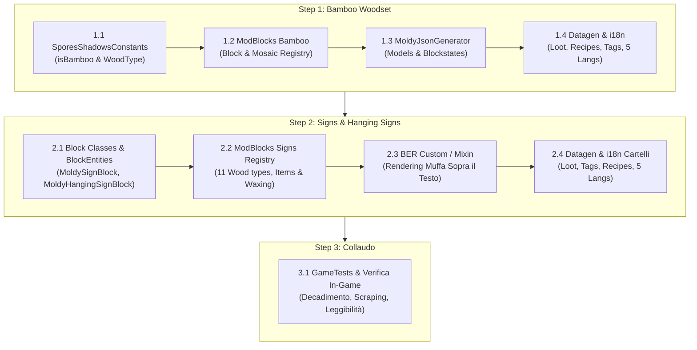

# Piano di Implementazione: Bamboo Woodset & Cartelli Ammuffiti (Signs & Hanging Signs)

Il presente documento definisce la progettazione tecnica, l'architettura dei blocchi, le decisioni di gameplay e il piano operativo a fasi per introdurre nel mod **Spores & Shadows**:
1. Il set completo del **Bambù** (*Bamboo Woodset* con varianti *Mosaic*).
2. I **Cartelli e Cartelli Sospesi** (*Signs & Hanging Signs*) per tutti gli 11 tipi di legno, completi di supporto BlockEntity, rendering testo coperto da muffa e decadimento.

---

## 1. Architettura Tecnica del Sistema Moldy

Nel mod, ogni blocco infettabile implementa `MoldyBlock`:
- **Stati:** `STAGE` (0 = Clean/Waxed, 1 = Tainted, 2 = Moldy, 3 = Rotten), `WAXED` (boolean), `STRUCTURAL` (boolean).
- **Decadimento:** Random ticks proporzionali a umidità locale e miasma aereo calcolati tramite l'engine atmosferico.
- **Interazioni:** L'ascia raschia gli strati di muffa (regredisce di uno stadio); il favo di cera (*honeycomb*) blocca l'infezione allo stato corrente.
- **Risorse Client:** Modelli e blockstates sono generati dinamicamente in memoria RAM tramite **Polymer Resource Pack** (`MoldyJsonGenerator` e `MoldyResourceGenerator`).
- **Datagen:** Tabelle di loot, ricette di fabbricazione/raschiamento, tag e file di traduzione per 5 lingue (`it_it`, `en_us`, `de_de`, `es_es`, `fr_fr`).

---

## 2. PARTE I: Bamboo Woodset (*Legno di Bambù*)

Il bambù differisce dai legni d'albero tradizionali per la nomenclatura dei fusti e per la famiglia decorativa del *Mosaico*.

### 2.1 Mappa dei Blocchi & Oggetti (per ciascuno: 1 blocco moldy + 1 blocco waxed + 7 item stadio)

| Categoria | Blocco Vanilla | Blocco Moldy | Blocco Waxed | Note Tecniche |
| :--- | :--- | :--- | :--- | :--- |
| **Fusto** | `bamboo_block` | `moldy_bamboo_block` | `waxed_bamboo_block` | Orientabile (`PillarBlock`), scortecciabile con ascia |
| **Fusto Scortecciato** | `stripped_bamboo_block` | `moldy_stripped_bamboo_block` | `waxed_stripped_bamboo_block` | Orientabile (`PillarBlock`) |
| **Assi** | `bamboo_planks` | `moldy_bamboo_planks` | `waxed_bamboo_planks` | Cubo solido base |
| **Mosaico** | `bamboo_mosaic` | `moldy_bamboo_mosaic` | `waxed_bamboo_mosaic` | Cubo solido decorativo unico del bambù |
| **Scale Assi** | `bamboo_stairs` | `moldy_bamboo_stairs` | `waxed_bamboo_stairs` | `StairsBlock` |
| **Lastra Assi** | `bamboo_slab` | `moldy_bamboo_slab` | `waxed_bamboo_slab` | `SlabBlock` |
| **Scale Mosaico** | `bamboo_mosaic_stairs` | `moldy_bamboo_mosaic_stairs` | `waxed_bamboo_mosaic_stairs` | `StairsBlock` (Mosaico) |
| **Lastra Mosaico** | `bamboo_mosaic_slab` | `moldy_bamboo_mosaic_slab` | `waxed_bamboo_mosaic_slab` | `SlabBlock` (Mosaico) |
| **Staccionata** | `bamboo_fence` | `moldy_bamboo_fence` | `waxed_bamboo_fence` | `FenceBlock` |
| **Cancello** | `bamboo_fence_gate` | `moldy_bamboo_fence_gate` | `waxed_bamboo_fence_gate` | `FenceGateBlock` |
| **Porta** | `bamboo_door` | `moldy_bamboo_door` | `waxed_bamboo_door` | `DoorBlock` (texture fusa 2D in memoria) |
| **Botola** | `bamboo_trapdoor` | `moldy_bamboo_trapdoor` | `waxed_bamboo_trapdoor` | `TrapdoorBlock` |
| **Pedana Pressione** | `bamboo_pressure_plate` | `moldy_bamboo_pressure_plate` | `waxed_bamboo_pressure_plate` | `PressurePlateBlock` |
| **Bottone** | `bamboo_button` | `moldy_bamboo_button` | `waxed_bamboo_button` | `ButtonBlock` |

### 2.2 Modifiche al Codice
1. **`SporesShadowsConstants.MoldyWoodType`:**
   - Introdurre il supporto per fusti di bambù (mappare `bamboo_block` anziché `bamboo_log`, disabilitando il 6-sided bark non presente nel bambù).
   - Aggiungere `bamboo` alla lista `WOOD_TYPES` (`BlockSetType.BAMBOO`, `WoodType.BAMBOO`).
2. **`ModBlocks.java`:**
   - Adattare `registerWoodSet`: se il tipo è bambù, registrare i blocchi fusto e procedere alla registrazione dei formati *Mosaic* (`bamboo_mosaic`, `bamboo_mosaic_stairs`, `bamboo_mosaic_slab`).
3. **`MoldyJsonGenerator.java`:**
   - Aggiungere generatori per modelli e blockstates dei fusti e dei blocchi mosaico (`genMosaic`, `genMosaicStairs`, `genMosaicSlab`).
4. **Datagen & i18n:**
   - Ricette di fabbricazione (9 bambù -> blocco, assi, mosaico), ricette di raschiamento/ceratura, tag blocchi/oggetti e traduzioni in 5 lingue.

---

## 3. PARTE II: Cartelli e Cartelli Sospesi (*Signs & Hanging Signs*)

I cartelli vanilla non sono blocchi con modelli statici JSON: possiedono una `BlockEntity` che memorizza il testo fronte/retro e vengono renderizzati a runtime da `SignBlockEntityRenderer`.

### 3.1 La Struttura dei Blocchi (11 Tipi di Legno)

Per ciascun tipo di legno (10 legni classici + 1 bambù):
1. **Cartello su palo (*Standing Sign*):** es. `moldy_oak_sign` (rotazione 0..15).
2. **Cartello a parete (*Wall Sign*):** es. `moldy_oak_wall_sign` (`FACING` orizzontale).
3. **Cartello sospeso al soffitto (*Hanging Sign*):** es. `moldy_oak_hanging_sign`.
4. **Cartello sospeso a parete (*Wall Hanging Sign*):** es. `moldy_oak_wall_hanging_sign`.
5. **Oggetti inventario (*Items*):**
   - `SignItem`: posiziona il cartello su palo (superficie superiore) o a parete (lati).
   - `HangingSignItem`: posiziona il cartello sospeso (soffitto) o a parete.

### 3.2 Block Entities & Interazione
* `MoldySignBlockEntity` estende `SignBlockEntity`.
* `MoldyHangingSignBlockEntity` estende `HangingSignBlockEntity`.
* Supporto nativo all'interfaccia grafica di scrittura vanilla per entrambi i lati (fronte e retro), colorazione con tinture e lucidatura con sacche di inchiostro brillante.

### 3.3 Rendering Rivoluzionario: Muffa Sovrapposta "Sopra il Testo"

L'idea chiave di gameplay e rendering consiste nel **renderizzare la muffa al di sopra del testo**:
1. **Pipeline di Rendering Standard (`SignBlockEntityRenderer`):**
   - Fase 1: Render del modello in legno della tavola e del palo.
   - Fase 2: Traslazione matriciale `Z + 0.001f` e rendering del testo scritto dal giocatore.
   - **Fase 3 (Nuova - Spores & Shadows):** Traslazione matriciale `Z + 0.002f` e rendering del layer trasparente di muffa (`mold_stage_1`, `mold_stage_2`, `mold_stage_3`).
2. **Vantaggi di Design:**
   * **Copertura Visiva Reale:** Le spore e le macchie di muffa coprono fisicamente i caratteri sottostanti in base alla gravità dello stadio:
     - **Tainted (1):** Piccole macchie periferiche che lasciano il testo quasi interamente leggibile.
     - **Moldy (2):** Macchie più estese che coprono circa il 30-50% delle parole.
     - **Rotten (3):** Spessa coltre di marcescenza e muffa che oscura quasi tutto il testo, lasciando intravedere solo frammenti misteriosi.
   * **Completamente Non Distruttivo:** La stringa di testo nella `BlockEntity` rimane intatta al 100% (nessuna perdita di dati, nessun rischio di bug di sincronizzazione multiplayer).
   * **Gameplay della Pulizia (Scraping):** Se il giocatore usa l'ascia sul cartello per raschiare via la muffa, l'overlay regredisce e il testo originale riappare perfettamente intatto!
   * **Conservazione con la Cera (Waxing):** Un cartello cerato non accumulerà muffa, proteggendo per sempre i messaggi importanti nelle basi e nelle miniere.

### 3.4 Regole di Fabbricazione dei Cartelli (Allineamento Manufatti Complessi)
Come stabilito nelle regole generali di lavorazione del legno:
- **Solo Assi Sane:** I cartelli e cartelli sospesi (essendo manufatti finiti complessi) possono essere fabbricati **esclusivamente** a partire da assi sane (`Vanilla Planks` e `Waxed Vanilla Planks`, fra loro intercambiabili tramite `Ingredient.ofItems`).
- **Nessun Crafting da Assi Infette:** Le assi *Tainted*, *Moldy* e *Rotten* non possono essere utilizzate per fabbricare cartelli o cartelli sospesi (servono solo al recupero di assi sane).
- **Output Sempre Non Cerato:** Il crafting restituisce **esclusivamente il cartello standard non cerato (Vanilla)**. Per ottenere la versione cerata protetta da muffa, il giocatore deve applicare manualmente il favo di miele (*honeycomb*) sul cartello piazzato.

---

## 4. Piano Operativo di Esecuzione

### Dettaglio Fasi Operative:

- [x] **Fase 1 (Bamboo Woodset & Mosaico):**
  - [x] **1.1 Costanti:** Estensione `SporesShadowsConstants.MoldyWoodType` con supporto per canne di bambù (`isBamboo`, logName `bamboo_block`, esclusione bark a 6 facce) e registrazione di `bamboo` in `WOOD_TYPES`.
  - [x] **1.2 Registrazione Blocchi & Items:** Registrazione in `ModBlocks.java` dei blocchi fusto, assi, staccionate, porte, botole, pedane, bottoni e dell'intera famiglia *Mosaic* (`bamboo_mosaic`, `bamboo_mosaic_stairs`, `bamboo_mosaic_slab`) con i relativi 7 item per stadio e varianti cerate.
  - [x] **1.3 Modelli Polymer in RAM:** Generazione dinamica in memoria di blockstate e modelli JSON in `MoldyJsonGenerator.java` per i fusti e i blocchi del mosaico (`genMosaic`, `genMosaicStairs`, `genMosaicSlab`).
  - [x] **1.4 Registri Funzionali:** Registrazione del set bambù e mosaico in `ModFlammableRegistry` (infiammabilità), `ModFuelRegistry` (combustibile forni) e `ModComposterRegistry` (compostabilità).
  - [x] **1.5 Datagen & i18n:** Generazione e allineamento automatico tramite datagen di tag (`axe_mineable`, `bamboo_blocks`, isolamento di `bamboo_mosaic` dal tag `planks`), ricette di crafting/smelting, loot table (in `src/main/generated`) e traduzioni sincronizzate nelle 5 lingue (`it_it`, `en_us`, `de_de`, `es_es`, `fr_fr`).
  - [x] **1.6 Validazione & Collaudo Bamboo:** Aggiornamento delle costanti di conteggio varianti a 144 formati base e 1008 item (`MoldyVariantsCountTest`, `MoldyWoodTestHelper`), esecuzione con successo di tutti i test unitari (`./gradlew test`) e di tutti i 217 GameTest (`./gradlew runGametest`).

- [x] **Fase 2 (Infrastruttura Cartelli & Block Entities):**
  - [x] **2.1 Classi di Blocco:** Creazione delle classi `MoldySignBlock`, `MoldyWallSignBlock`, `MoldyHangingSignBlock`, `MoldyWallHangingSignBlock` che estendono le controparti vanilla implementando l'interfaccia `MoldyBlock`.
  - [x] **2.2 Block Entities:** Creazione e registrazione in `ModBlockEntities` di `MoldySignBlockEntity` e `MoldyHangingSignBlockEntity` con supporto al salvataggio/caricamento dello stadio di infezione e cera, preservando intatto il testo scritto (fronte e retro).
  - [x] **2.3 Registrazione ModBlocks:** Registrazione di cartelli su palo, a parete e sospesi per tutti gli 11 legni in `ModBlocks.java` con interazioni di raschiatura con ascia e conservazione con favo di miele.

- [x] **Fase 3 (Rendering "Muffa Sopra il Testo"):**
  - [x] **3.1 Integrazione BER / Mixin:** Estensione della pipeline grafica di `SignBlockEntityRenderer` per renderizzare il layer trasparente delle spore e della muffa (`mold_stage_1`, `mold_stage_2`, `mold_stage_3`) su una quota di profondità elevata (`Z + 0.002f`) rispetto al testo scritto dal giocatore (`Z + 0.001f`).
  - [x] **3.2 Mappatura UV:** Configurazione precisa delle coordinate texture UV per la superficie della tavola del cartello standard e del cartello sospeso.
  - [x] **3.3 Copertura Non Distruttiva:** Verifica visiva dell'effetto parziale e totale (Tainted: ~10% copertura, Moldy: ~40% copertura, Rotten: ~90% coltre fungina) e ripristino del testo originale intatto alla rimozione della muffa con l'ascia.

- [x] **Fase 4 (Datagen Cartelli, Integrazioni & Test Suite Finale):**
  - [x] **4.1 Datagen & i18n Cartelli:** Tabelle di loot (drop cartelli), modelli JSON / blockstates in RAM per tutti i legni e traduzioni sincronizzate nelle 5 lingue (`it_it`, `en_us`, `de_de`, `es_es`, `fr_fr`).
  - [x] **4.2 Integrazione JEI & JADE Cartelli:** Registrazione dei cartelli in `SporesShadowsJEIPlugin` (ceratura con favo, de-ceratura e de-muffa con ascia, schede informative per cartelli marci) e supporto RayTrace pick-block in JADE.
  - [x] **4.3 GameTests Dedicati:** Suite automatizzata `MoldySignGameTests.java` per verificare piazzamento, decadimento, raschiatura con ascia, protezione cera e integrità del testo della block entity.
  - [x] **4.4 Collaudo Globale:** Esecuzione e superamento al 100% di `./gradlew test` e `./gradlew runGametest` (225/225 GameTest).
