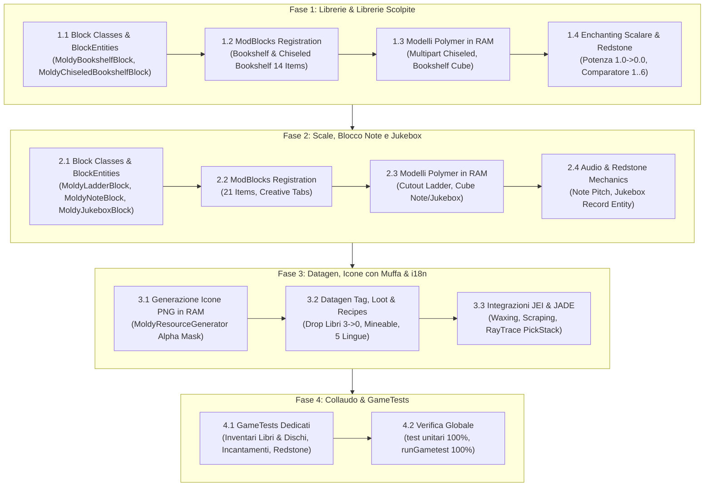

# Piano di Implementazione: Librerie, Librerie Scolpite, Scale a Pioli, Blocchi Note e Jukebox Ammuffiti (Bookshelves, Chiseled Bookshelves, Ladders, Note Blocks, Jukeboxes)

Il presente documento definisce la progettazione tecnica, l'architettura dei blocchi, le decisioni di gameplay e il piano operativo a fasi per introdurre nel mod **Spores & Shadows**:
1. Le **Librerie Standard** (`bookshelf`) e le **Librerie Scolpite** (`chiseled_bookshelf`), complete di BlockEntity, preservazione dei libri, rilascio scalare di libri alla rottura (3 -> 2 -> 1 -> 0) e potere magico frazionario per il tavolo degli incantesimi.
2. Le **Scale a Pioli** (`ladder`), con fisica di scalata, pioli resi scivolosi o fragili dalla muffa e texture cutout orientate.
3. I dispositivi acustici e redstone: il **Blocco Note** (`note_block`) e il **Jukebox** (`jukebox`), con risonanza smorzata dalla materia fungina, preservazione dei dischi musicali nella BlockEntity e segnali di comparatore.

---

## 1. Architettura Tecnica del Sistema Moldy per Manufatti Speciali

A differenza dei set di legno tradizionali (fusti, assi, porte, staccionate) che dipendono da ciascuna delle 11 specie arboree, questi 5 blocchi in Minecraft vanilla sono **manufatti compositi unici**:
- Non possiedono varianti per legno nel gioco base (es. non esiste una "birch ladder" o una "spruce jukebox" in vanilla).
- Vengono quindi registrati come **5 blocchi base**, ciascuno con:
  - 1 Blocco Moldy attivo (es. `moldy_bookshelf`, con stati dinamici `STAGE` 0..3, `WAXED`, `STRUCTURAL`).
  - 1 Blocco Waxed fisso (es. `waxed_bookshelf`).
  - 7 Oggetti d'inventario dedicati (1 Waxed Clean + 3 Moldy + 3 Waxed Moldy) per consentire al giocatore di tenerli e posizionarli direttamente allo stadio desiderato.

### 1.1 Mappa Totale di Registrazione (5 Manufatti = 10 Blocchi + 35 Items)

| Manufatto | Blocco Vanilla | Blocco Moldy | Blocco Waxed | BlockEntity Dedicata | Comportamento Interattivo |
| :--- | :--- | :--- | :--- | :--- | :--- |
| **Libreria** | `minecraft:bookshelf` | `moldy_bookshelf` | `waxed_bookshelf` | *Nessuna* (Blocco solido) | Potere incantesimi scalare (1.0 -> 0.66 -> 0.33 -> 0.0); drop scalare libri (3 -> 2 -> 1 -> 0) |
| **Libreria Scolpita** | `minecraft:chiseled_bookshelf` | `moldy_chiseled_bookshelf` | `waxed_chiseled_bookshelf` | `MoldyChiseledBookshelfBlockEntity` | 6 slot libro, raycast vanilla per inserimento/prelievo, segnale comparatore (1..6) |
| **Scala a Pioli** | `minecraft:ladder` | `moldy_ladder` | `waxed_ladder` | *Nessuna* (`LadderBlock` orientabile) | Scalata verticale (`isClimbable`), pioli scivolosi (Moldy) o cedevoli (Rotten) |
| **Blocco Note** | `minecraft:note_block` | `moldy_note_block` | `waxed_note_block` | *Nessuna* (`NoteBlock` redstone) | Accordatura note (0..24), cassa di risonanza smorzata da muffa, particelle fungine |
| **Jukebox** | `minecraft:jukebox` | `moldy_jukebox` | `waxed_jukebox` | `MoldyJukeboxBlockEntity` | Inserimento/espulsione dischi musicali, preservazione disco, comparatore (1..15) |

### 1.2 Regola di Disambiguazione delle Interazioni (Click vs Sneak + Click)

Molti di questi blocchi possiedono un'interazione con il tasto destro vanilla fondamentale (la libreria scolpita preleva o inserisce libri; il jukebox inserisce o espelle il disco musicale; il blocco note cambia intonazione).
Per evitare qualunque interferenza con il gameplay vanilla:
- **Clic Destro Normale:** Esegue l'interazione vanilla originale (inserimento/prelievo libro dalla libreria scolpita, inserimento/rimozione disco nel jukebox, sintonia del blocco note).
- **Shift + Clic Destro (Sneaking) con Ascia:** Esegue la raschiatura della muffa (regredisce lo stadio da 3->2, 2->1, 1->0) oppure la de-ceratura (rimozione dello strato cerato).
- **Shift + Clic Destro (Sneaking) con Favo di Miele (`honeycomb`):** Applica la cera, bloccando l'infezione allo stadio attuale con particelle di cera e suoni dedicati.

---

## 2. PARTE I: Librerie & Librerie Scolpite (Bookshelves & Chiseled Bookshelves)

### 2.1 Libreria Standard (`bookshelf`)
1. **Modello Polymer in RAM:**
   - Texture superiore/inferiore: `minecraft:block/oak_planks`
   - Texture laterali: `minecraft:block/bookshelf`
   - Overlay muffa: per gli stadi 1, 2 e 3 viene generato in memoria un modello con doppio layer (tavole/libri + `mold_stage_<stage>`).
2. **Meccanica Tavolo degli Incantesimi (Potere Magico Scalare):**
   - Nel Minecraft vanilla 1.21.1, il tavolo degli incantesimi incrementa il livello massimo in base ai blocchi adiacenti che forniscono bonus di incantamento.
   - **Regola di Gameplay Spores & Shadows (Potere Magico Proporzionale):**
     - Il potere magico fornito da ogni libreria diminuisce proporzionalmente all'avanzare della decomposizione fungina:
       - **Stadio 0 (Sana / Waxed):** Fornisce **1.0F** (100% di potenza; 15 librerie = Livello 30).
       - **Stadio 1 (Tainted):** Fornisce **0.66F** (~66% di potenza, riflettendo le prime pagine intaccate dalla muffa).
       - **Stadio 2 (Moldy):** Fornisce **0.33F** (~33% di potenza, le muffe occludono le rune e i tomi).
       - **Stadio 3 (Rotten):** Fornisce **0.0F** (0% di potenza, i libri sono ridotti a poltiglia fungina inerte).
     - Implementato intercettando il conteggio del bonus d'incantamento (tramite Mixin su `EnchantingTableBlock` / `EnchantmentScreenHandler`) sommando i valori float cumulativi delle librerie circostanti.
3. **Drop & Rottura (Numero di Libri Decrescente):**
   - Rompere una libreria senza *Silk Touch* rilascia un numero di libri (`Items.BOOK`) esattamente proporzionale allo stato di conservazione:
     - **Stadio 0 (Sana / Waxed):** Rilascia **3 Libri** (comportamento vanilla intatto).
     - **Stadio 1 (Tainted):** Rilascia **2 Libri** (1 libro è andato distrutto dall'infezione).
     - **Stadio 2 (Moldy):** Rilascia **1 Libro** (2 libri sono irrecuperabili).
     - **Stadio 3 (Rotten):** Rilascia **0 Libri** (tutti i libri sono marciti e distrutti).
   - Con *Silk Touch*: raccoglie il blocco nello stadio esatto corrispondente (`waxed_bookshelf`, `tainted_bookshelf`, `moldy_bookshelf`, `rotten_bookshelf`).

### 2.2 Libreria Scolpita (`chiseled_bookshelf`)
1. **Gestione BlockEntity & Inventario Non Distruttivo:**
   - `MoldyChiseledBookshelfBlockEntity` estende `ChiseledBookshelfBlockEntity`.
   - L'inventario interno (`DefaultedList<ItemStack>` da 6 slot) e la proprietà `lastInteractedSlot` sono preservati intatti al 100% durante le transizioni climatiche di decadimento (0->1->2->3) e durante la raschiatura con l'ascia.
   - I libri preziosi (libri incantati rari, libri con penna scritti dai giocatori) non andranno mai perduti né cancellati.
2. **Modelli Polymer Multipart:**
   - La libreria scolpita vanilla gestisce gli slot tramite le proprietà `slot_0_occupied` .. `slot_5_occupied`.
   - Il generatore dinamico `MoldyJsonGenerator` produrrà le varianti multipart orientate (`FACING`) combinando lo sfondo ligneo, i modelli dei libri nei singoli slot e l'overlay di muffa frontale trasparente.
3. **Segnale di Pietrarossa (Comparatore):**
   - Mantiene intatta l'emissione del segnale analogico da 1 a 6 per il comparatore, consentendo l'utilizzo di librerie ammuffite in passaggi segreti e meccanismi steampunk/antichi.

---

## 3. PARTE II: Scale a Pioli, Blocchi Note e Jukebox (Ladders, Note Blocks, Jukeboxes)

### 3.1 Scale a Pioli (`ladder`)
1. **Fisica di Scalata & Pioli Scivolosi:**
   - Estende `LadderBlock`, mantenendo `FACING` orizzontale e `WATERLOGGED`.
   - **Gameplay Fungino:**
     - **Stadio 0 & 1:** Scalata classica sicura.
     - **Stadio 2 (Moldy):** La muffa rende i pioli umidi e viscidi; la discesa può risultare più rapida se non si tiene premuto Shift.
     - **Stadio 3 (Rotten):** Il legno putrescente cede sotto il peso; rompere la scala non rilascia oggetti (i pioli marci si polverizzano).
2. **Modello Polymer Cutout:**
   - Layer 2D orientato con trasparenza cutout (`minecraft:block/ladder` fuso con l'overlay `mold_stage_<stage>`).

### 3.2 Blocco Note (`note_block`)
1. **Risonanza Armonica Fungina:**
   - Estende `NoteBlock`, con proprietà `INSTRUMENT`, `NOTE` (0..24), `POWERED`.
   - **Gameplay Acustico:**
     - Le spore e l'umidità infiltratesi nella cassa armonica alterano la timbrica:
       - **Stadio 1 (Tainted):** Lieve riverbero ovattato.
       - **Stadio 2 (Moldy):** Timbro sordo e cupo.
       - **Stadio 3 (Rotten):** La cassa di risonanza è marcia; l'emissione produce un "thud" sordo con emissione di particelle di spore scure al posto delle consuete note colorate musicali.
2. **Compatibilità Redstone:**
   - Reagisce perfettamente a impulsi di redstone, observer e blocchi adiacenti.

### 3.3 Jukebox (`jukebox`)
1. **BlockEntity & Conservazione Dischi:**
   - `MoldyJukeboxBlockEntity` estende `JukeboxBlockEntity`.
   - Preserva al 100% il disco musicale inserito (`recordStack`) e la durata di riproduzione durante i cambi di stadio, waxing e scraping.
2. **Interazione Redstone & Comparatore:**
   - Emette il segnale del comparatore vanilla (da 1 a 15 a seconda dell'ID del disco musicale inserito).
3. **Gameplay e Atmosfera:**
   - Clic destro a mani vuote o con disco: inserisce / estrae il disco.
   - Shift + Clic destro: raschia con ascia o cera con favo.
   - A stadio `rotten`, la riproduzione musicale sprigiona anelli di spore fungine nell'ambiente.

---

## 4. Regole di Fabbricazione e Recupero (Allineamento Manufatti Complessi)

In perfetta aderenza alle regole stabilite nel mod:
- **Solo Componenti Sane:**
  - Librerie: 6 assi sane (`mixedPlanks` vanilla + waxed) + 3 libri.
  - Librerie Scolpite: 6 assi sane (`mixedPlanks`) + 3 lastre sane (`mixedSlabs`).
  - Scale a Pioli: 7 bastoni sani (`stick`).
  - Blocco Note: 8 assi sane (`mixedPlanks`) + 1 polvere di redstone.
  - Jukebox: 8 assi sane (`mixedPlanks`) + 1 diamante.
- **Nessun Crafting da Materiale Infetto:** Assi, lastre o componenti Tainted/Moldy/Rotten non possono essere usati per fabbricare manufatti nuovi (devono prima essere ripuliti o recuperati in assi sane).
- **Output Sempre Non Cerato:** Il crafting restituisce la versione vanilla non cerata standard. La ceratura avviene in-world o tramite favo di miele.
- **Integrazione Ricette JEI:** Ciascuno dei 5 blocchi ottiene in JEI:
  - 4 Ricette di Ceratura (Vanilla, Tainted, Moldy, Rotten -> Waxed).
  - 4 Ricette di De-ceratura con Ascia.
  - 2 Ricette di De-muffa con Ascia (Rotten -> Moldy -> Tainted -> Vanilla).

---

## 5. Piano Operativo di Esecuzione

### Dettaglio Fasi Operative:

- [x] **Fase 1 (Librerie & Librerie Scolpite):**
  - [x] **1.1 Classi di Blocco & BlockEntity:**
    - Creare `MoldyBookshelfBlock` che estende `Block` e implementa `MoldyBlock`.
    - Creare `MoldyChiseledBookshelfBlock` che estende `ChiseledBookshelfBlock` e implementa `MoldyBlock`, gestendo il raycast vanilla su Clic Destro e l'ascia/cera su Sneak + Clic Destro.
    - Creare `MoldyChiseledBookshelfBlockEntity` per la persistenza di `MoldStage`, `MoldWaxed` e dell'inventario dei 6 libri.
  - [x] **1.2 Registrazione in `ModBlocks`:**
    - Registrare `moldy_bookshelf`, `waxed_bookshelf`, `moldy_chiseled_bookshelf`, `waxed_chiseled_bookshelf`.
    - Registrare i relativi 14 item per stadio (7 per libreria normale, 7 per libreria scolpita) con i tooltip informativi.
    - Posizionare i blocchi nel tab creativo corretto (`ItemGroups.FUNCTIONAL`).
  - [x] **1.3 Modelli Dinamici in RAM (`MoldyJsonGenerator`):**
    - Modelli JSON per la libreria con texture dei tomi e overlay muffa.
    - Modelli multipart per la libreria scolpita che combinano orientamento `FACING` e i 6 slot occupati con l'overlay.
  - [x] **1.4 Regole Enchanting & Redstone:**
    - Implementare il calcolo proporzionale del potere d'incantamento per stadio di muffa (Sana=1.0F, Tainted=0.66F, Moldy=0.33F, Rotten=0.0F) tramite Mixin.
    - Verificare l'emissione del segnale comparatore per la libreria scolpita (1..6).

- [x] **Fase 2 (Scale a Pioli, Blocco Note, Jukebox):**
  - [x] **2.1 Classi di Blocco & BlockEntity:**
    - Creare `MoldyLadderBlock` che estende `LadderBlock` e implementa `MoldyBlock`.
    - Creare `MoldyNoteBlock` che estende `NoteBlock` e implementa `MoldyBlock`, preservando l'accordatura (`NOTE`) e lo strumento (`INSTRUMENT`).
    - Creare `MoldyJukeboxBlock` e `MoldyJukeboxBlockEntity` per preservare il disco musicale inserito e il comparatore (1..15).
  - [x] **2.2 Registrazione in `ModBlocks`:**
    - Registrare le coppie (moldy + waxed) per scala, blocco note e jukebox (6 blocchi).
    - Registrare i 21 item (7 per ciascun manufatto).
    - Aggiungere al tab `ItemGroups.FUNCTIONAL` e `ItemGroups.REDSTONE`.
  - [x] **2.3 Modelli Dinamici in RAM:**
    - Modello cutout orientato per la scala (`ladder` + overlay muffa).
    - Modelli cubici per blocco note (`note_block` + overlay).
    - Modelli per jukebox (`jukebox_top`, `jukebox_side` + overlay).
  - [x] **2.4 Audio & Redstone:**
    - Gestione risonanza blocco note e riproduzione jukebox.

- [x] **Fase 3 (Datagen, Generazione Icone con Muffa & Integrazioni):**
  - [x] **3.1 Icone 2D Dinamiche in Polymer (`MoldyResourceGenerator`):**
    - Estendere l'algoritmo di `applyAlphaMask` e la generazione di modelli item in memoria per `bookshelf`, `chiseled_bookshelf`, `ladder`, `note_block` e `jukebox`.
  - [x] **3.2 Datagen Tag, Ricette & Loot:**
    - Tag `BlockTags.AXE_MINEABLE` e tag specifici (`CLIMBABLE`).
    - Tabelle di drop con rilascio scalare di libri per le librerie (3 per Sana, 2 per Tainted, 1 per Moldy, 0 per Rotten; recupero del blocco con Silk Touch).
    - Drop e rottura per scale, blocco note e jukebox.
    - Ricette in `ModRecipeProvider` per fabbricare le versioni vanilla usando componenti sane/cerate.
  - [x] **3.3 Traduzioni i18n:**
    - Inserire le traduzioni per tutti i 35 nuovi item e 10 blocchi nelle 5 lingue (`it_it`, `en_us`, `de_de`, `es_es`, `fr_fr`).
  - [x] **3.4 Integrazione JEI & JADE:**
    - Registrazione in `SporesShadowsJEIPlugin` delle categorie ceratura e raschiatura per tutte le nuove famiglie (50 ricette).
    - Verifica del raytrace pick-block in JADE per restituire l'item esatto per ogni stadio.

- [x] **Fase 4 (Collaudo & Test Suite):**
  - [x] **4.1 GameTests Dedicati:**
    - Test di conservazione dell'inventario dei libri nella Libreria Scolpita durante il decadimento e la raschiatura.
    - Test di conservazione del disco musicale nel Jukebox.
    - Test di scalata e fisica delle Scale a Pioli ammuffite.
    - Test di emissione note e segnali di pietrarossa per Blocco Note.
    - Test di potenza magica scalare per il tavolo degli incantesimi con librerie per ciascuno stadio (Sana=1.0, Tainted=0.66, Moldy=0.33, Rotten=0.0) e verifica dei drop scalari di libri (3, 2, 1, 0).
  - [x] **4.2 Collaudo Completo:**
    - Esecuzione `./gradlew test` (100% superato).
    - Esecuzione `./gradlew runGametest` (100% superato).
